# 🎙️ Voiceover In-Situ Rewrite Workbench
> **Source Video**: `aug 1 video implement (1).mp4` | **Extracted Frames**: 200 | **Pacing Target**: 140–160 WPM (~3 words/sec)
> **Generated**: 2026-08-16 10:45 | **Tactic**: 1-Second Frame Extraction & Visual AI Scripting

---

## 🛠️ How to Use This Workbench
1. Inspect each **1-second screenshot** below to see exactly what visual motion graphic or Canva slide is on screen.
2. Review the **Visual Action** and **AI-Suggested Variations** (Punchy, Strategic, Conversational).
3. Write your **Final Resonant Voiceover** directly in the `[My Resonant Take]` block at ~3 words/second.
4. Copy the final script back to `research.html` or record directly into your microphone.

---

## 🎬 Scene 1: Hook & Problem Setup `[00:00]`
**Baseline Script Reference**: *"I was drowning in 46,000 notes across Obsidian."*

### ⏱️ Timestamp: `00:00` (Second 0) · **Drowning in Notes**
**Visual Action**: *Dark workspace with glowing vault icon swirled by chaotic notes.*

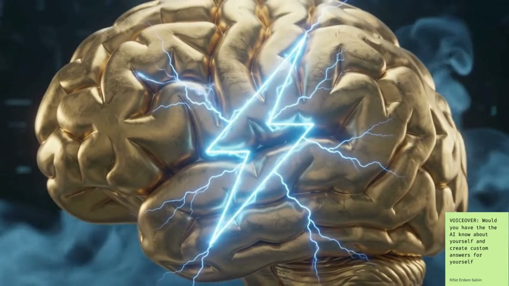

| Option | Voiceover Candidate Text | WPM | Tone |
| :--- | :--- | :--- | :--- |
| **Scratch VO** | I was drowning in 46,000 notes across Obsidian. | ~150 | Baseline |
| **⚡ AI Punchy** | 46,000 Obsidian notes. Total digital chaos. | ~165 | Energetic / Fast |
| **🧠 AI Strategic** | I had accumulated over 46,000 notes with zero structure. | ~140 | Pedagogical / Authoritative |
| **🔥 AI Conversational** | Ever felt completely buried under your own Obsidian notes? | ~145 | Direct & Relatable |

> ✍️ **[My Resonant Take]**:
> *I was drowning in 46,000 notes across Obsidian.*

---

### ⏱️ Timestamp: `00:01` (Second 1) · **Drowning in Notes**
**Visual Action**: *Dark workspace with glowing vault icon swirled by chaotic notes.*

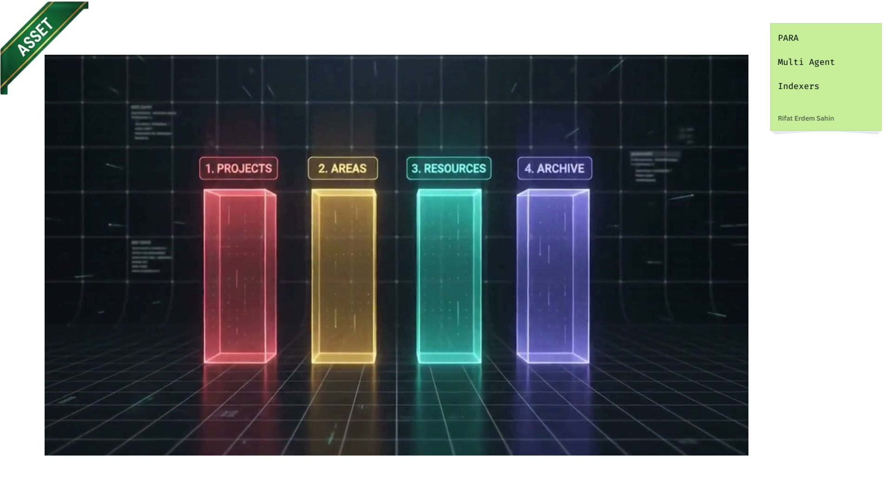

| Option | Voiceover Candidate Text | WPM | Tone |
| :--- | :--- | :--- | :--- |
| **Scratch VO** | I was drowning in 46,000 notes across Obsidian. | ~150 | Baseline |
| **⚡ AI Punchy** | 46,000 Obsidian notes. Total digital chaos. | ~165 | Energetic / Fast |
| **🧠 AI Strategic** | I had accumulated over 46,000 notes with zero structure. | ~140 | Pedagogical / Authoritative |
| **🔥 AI Conversational** | Ever felt completely buried under your own Obsidian notes? | ~145 | Direct & Relatable |

> ✍️ **[My Resonant Take]**:
> *I was drowning in 46,000 notes across Obsidian.*

---

### ⏱️ Timestamp: `00:02` (Second 2) · **Drowning in Notes**
**Visual Action**: *Dark workspace with glowing vault icon swirled by chaotic notes.*

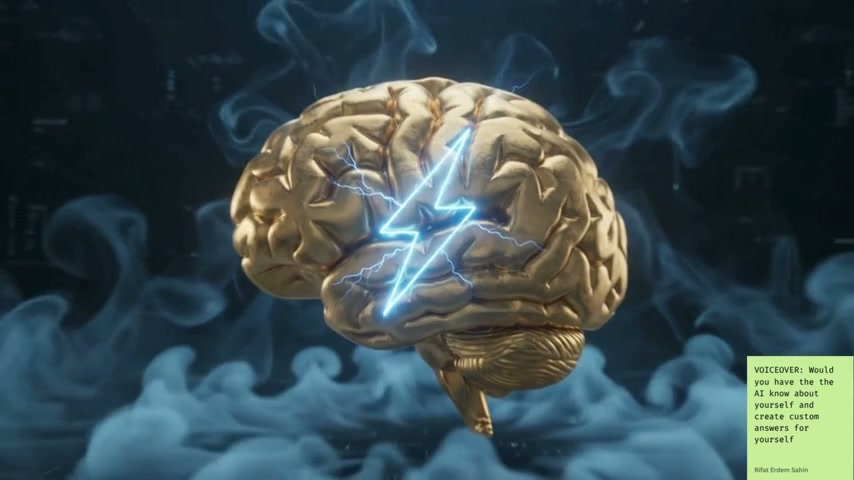

| Option | Voiceover Candidate Text | WPM | Tone |
| :--- | :--- | :--- | :--- |
| **Scratch VO** | I was drowning in 46,000 notes across Obsidian. | ~150 | Baseline |
| **⚡ AI Punchy** | 46,000 Obsidian notes. Total digital chaos. | ~165 | Energetic / Fast |
| **🧠 AI Strategic** | I had accumulated over 46,000 notes with zero structure. | ~140 | Pedagogical / Authoritative |
| **🔥 AI Conversational** | Ever felt completely buried under your own Obsidian notes? | ~145 | Direct & Relatable |

> ✍️ **[My Resonant Take]**:
> *I was drowning in 46,000 notes across Obsidian.*

---

### ⏱️ Timestamp: `00:03` (Second 3) · **Drowning in Notes**
**Visual Action**: *Dark workspace with glowing vault icon swirled by chaotic notes.*

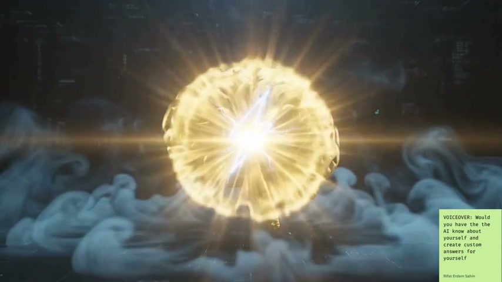

| Option | Voiceover Candidate Text | WPM | Tone |
| :--- | :--- | :--- | :--- |
| **Scratch VO** | I was drowning in 46,000 notes across Obsidian. | ~150 | Baseline |
| **⚡ AI Punchy** | 46,000 Obsidian notes. Total digital chaos. | ~165 | Energetic / Fast |
| **🧠 AI Strategic** | I had accumulated over 46,000 notes with zero structure. | ~140 | Pedagogical / Authoritative |
| **🔥 AI Conversational** | Ever felt completely buried under your own Obsidian notes? | ~145 | Direct & Relatable |

> ✍️ **[My Resonant Take]**:
> *I was drowning in 46,000 notes across Obsidian.*

---

### ⏱️ Timestamp: `00:04` (Second 4) · **Digital Haystack**
**Visual Action**: *46,000 note icons swirling into a digital vortex with search timeouts.*

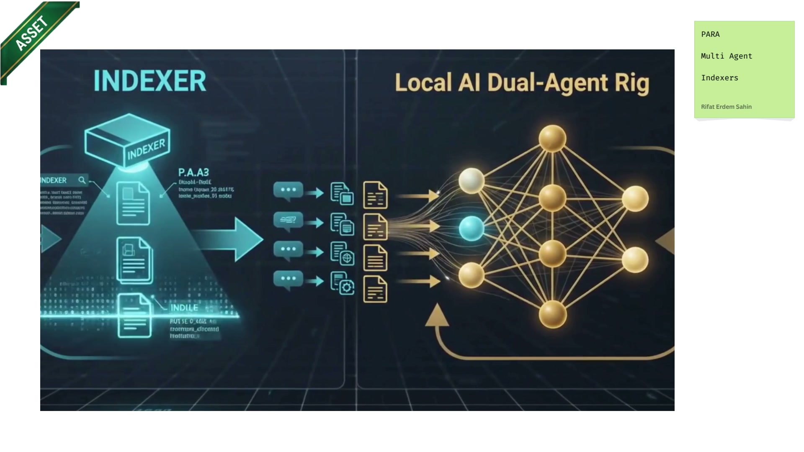

| Option | Voiceover Candidate Text | WPM | Tone |
| :--- | :--- | :--- | :--- |
| **Scratch VO** | Every search felt like looking for a needle in a digital haystack. | ~150 | Baseline |
| **⚡ AI Punchy** | Every search was a needle in a digital haystack. | ~165 | Energetic / Fast |
| **🧠 AI Strategic** | Unstructured search queries produced massive latency and noise. | ~140 | Pedagogical / Authoritative |
| **🔥 AI Conversational** | Searching for anything felt like looking for a needle in a haystack. | ~145 | Direct & Relatable |

> ✍️ **[My Resonant Take]**:
> *Every search felt like looking for a needle in a digital haystack.*

---

### ⏱️ Timestamp: `00:05` (Second 5) · **Digital Haystack**
**Visual Action**: *46,000 note icons swirling into a digital vortex with search timeouts.*

| Option | Voiceover Candidate Text | WPM | Tone |
| :--- | :--- | :--- | :--- |
| **Scratch VO** | Every search felt like looking for a needle in a digital haystack. | ~150 | Baseline |
| **⚡ AI Punchy** | Every search was a needle in a digital haystack. | ~165 | Energetic / Fast |
| **🧠 AI Strategic** | Unstructured search queries produced massive latency and noise. | ~140 | Pedagogical / Authoritative |
| **🔥 AI Conversational** | Searching for anything felt like looking for a needle in a haystack. | ~145 | Direct & Relatable |

> ✍️ **[My Resonant Take]**:
> *Every search felt like looking for a needle in a digital haystack.*

---

### ⏱️ Timestamp: `00:06` (Second 6) · **Digital Haystack**
**Visual Action**: *46,000 note icons swirling into a digital vortex with search timeouts.*

| Option | Voiceover Candidate Text | WPM | Tone |
| :--- | :--- | :--- | :--- |
| **Scratch VO** | Every search felt like looking for a needle in a digital haystack. | ~150 | Baseline |
| **⚡ AI Punchy** | Every search was a needle in a digital haystack. | ~165 | Energetic / Fast |
| **🧠 AI Strategic** | Unstructured search queries produced massive latency and noise. | ~140 | Pedagogical / Authoritative |
| **🔥 AI Conversational** | Searching for anything felt like looking for a needle in a haystack. | ~145 | Direct & Relatable |

> ✍️ **[My Resonant Take]**:
> *Every search felt like looking for a needle in a digital haystack.*

---

### ⏱️ Timestamp: `00:07` (Second 7) · **Digital Haystack**
**Visual Action**: *46,000 note icons swirling into a digital vortex with search timeouts.*

| Option | Voiceover Candidate Text | WPM | Tone |
| :--- | :--- | :--- | :--- |
| **Scratch VO** | Every search felt like looking for a needle in a digital haystack. | ~150 | Baseline |
| **⚡ AI Punchy** | Every search was a needle in a digital haystack. | ~165 | Energetic / Fast |
| **🧠 AI Strategic** | Unstructured search queries produced massive latency and noise. | ~140 | Pedagogical / Authoritative |
| **🔥 AI Conversational** | Searching for anything felt like looking for a needle in a haystack. | ~145 | Direct & Relatable |

> ✍️ **[My Resonant Take]**:
> *Every search felt like looking for a needle in a digital haystack.*

---

### ⏱️ Timestamp: `00:08` (Second 8) · **The Root Cause**
**Visual Action**: *Glitch red distortion on search bar with flashing red-X alert.*

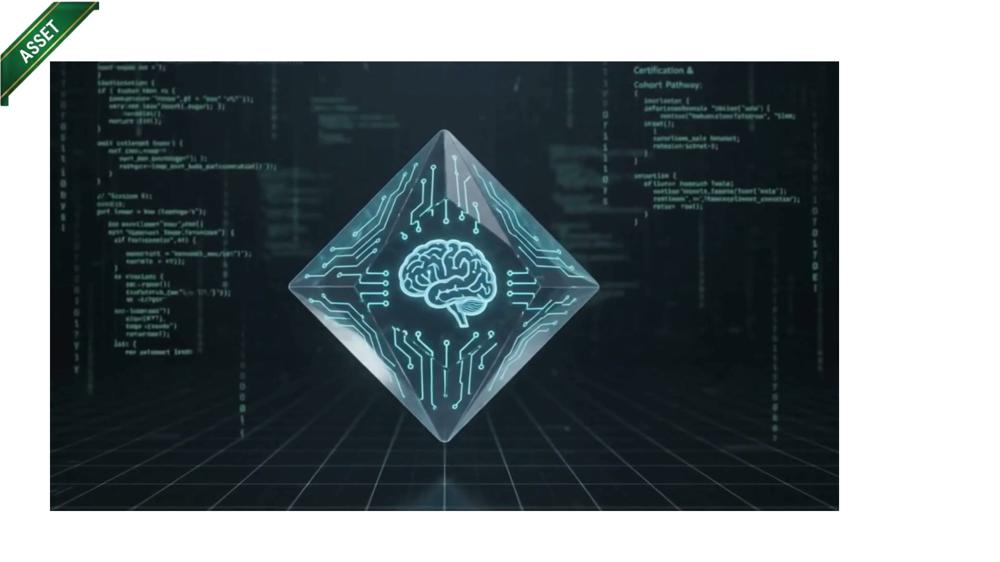

| Option | Voiceover Candidate Text | WPM | Tone |
| :--- | :--- | :--- | :--- |
| **Scratch VO** | And then I realized—the problem wasn't the number of notes. | ~150 | Baseline |
| **⚡ AI Punchy** | The problem wasn't the note count. | ~165 | Energetic / Fast |
| **🧠 AI Strategic** | The failure was architectural, not a volume limitation. | ~140 | Pedagogical / Authoritative |
| **🔥 AI Conversational** | And then it hit me: the problem wasn't having too many notes. | ~145 | Direct & Relatable |

> ✍️ **[My Resonant Take]**:
> *And then I realized—the problem wasn't the number of notes.*

---

### ⏱️ Timestamp: `00:09` (Second 9) · **The Root Cause**
**Visual Action**: *Glitch red distortion on search bar with flashing red-X alert.*

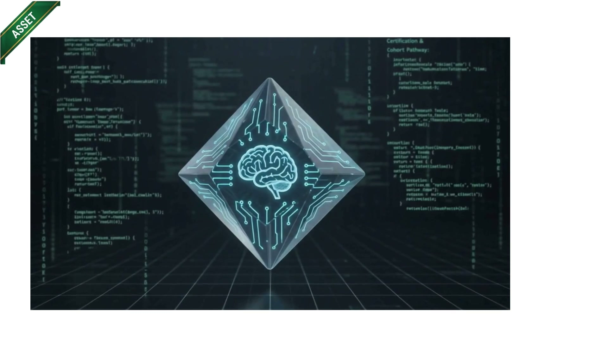

| Option | Voiceover Candidate Text | WPM | Tone |
| :--- | :--- | :--- | :--- |
| **Scratch VO** | And then I realized—the problem wasn't the number of notes. | ~150 | Baseline |
| **⚡ AI Punchy** | The problem wasn't the note count. | ~165 | Energetic / Fast |
| **🧠 AI Strategic** | The failure was architectural, not a volume limitation. | ~140 | Pedagogical / Authoritative |
| **🔥 AI Conversational** | And then it hit me: the problem wasn't having too many notes. | ~145 | Direct & Relatable |

> ✍️ **[My Resonant Take]**:
> *And then I realized—the problem wasn't the number of notes.*

---

### ⏱️ Timestamp: `00:10` (Second 10) · **The Root Cause**
**Visual Action**: *Glitch red distortion on search bar with flashing red-X alert.*

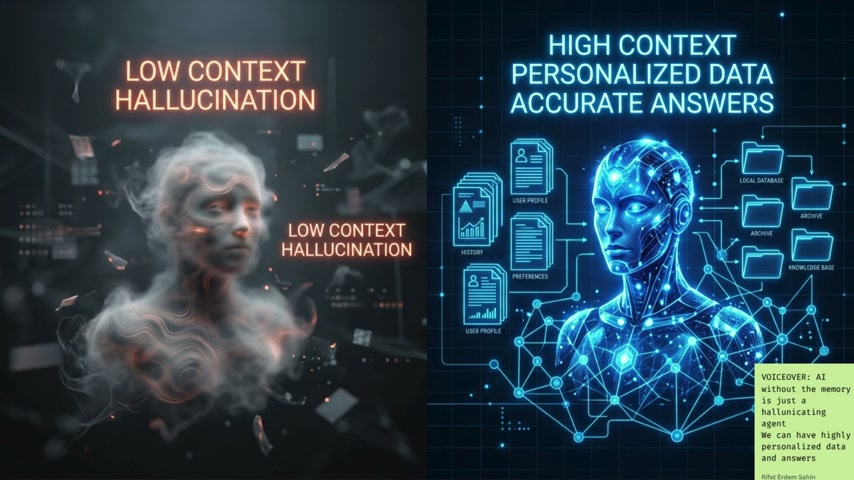

| Option | Voiceover Candidate Text | WPM | Tone |
| :--- | :--- | :--- | :--- |
| **Scratch VO** | And then I realized—the problem wasn't the number of notes. | ~150 | Baseline |
| **⚡ AI Punchy** | The problem wasn't the note count. | ~165 | Energetic / Fast |
| **🧠 AI Strategic** | The failure was architectural, not a volume limitation. | ~140 | Pedagogical / Authoritative |
| **🔥 AI Conversational** | And then it hit me: the problem wasn't having too many notes. | ~145 | Direct & Relatable |

> ✍️ **[My Resonant Take]**:
> *And then I realized—the problem wasn't the number of notes.*

---

### ⏱️ Timestamp: `00:11` (Second 11) · **The Root Cause**
**Visual Action**: *Glitch red distortion on search bar with flashing red-X alert.*

| Option | Voiceover Candidate Text | WPM | Tone |
| :--- | :--- | :--- | :--- |
| **Scratch VO** | And then I realized—the problem wasn't the number of notes. | ~150 | Baseline |
| **⚡ AI Punchy** | The problem wasn't the note count. | ~165 | Energetic / Fast |
| **🧠 AI Strategic** | The failure was architectural, not a volume limitation. | ~140 | Pedagogical / Authoritative |
| **🔥 AI Conversational** | And then it hit me: the problem wasn't having too many notes. | ~145 | Direct & Relatable |

> ✍️ **[My Resonant Take]**:
> *And then I realized—the problem wasn't the number of notes.*

---

### ⏱️ Timestamp: `00:12` (Second 12) · **The Root Cause**
**Visual Action**: *Glitch red distortion on search bar with flashing red-X alert.*

| Option | Voiceover Candidate Text | WPM | Tone |
| :--- | :--- | :--- | :--- |
| **Scratch VO** | And then I realized—the problem wasn't the number of notes. | ~150 | Baseline |
| **⚡ AI Punchy** | The problem wasn't the note count. | ~165 | Energetic / Fast |
| **🧠 AI Strategic** | The failure was architectural, not a volume limitation. | ~140 | Pedagogical / Authoritative |
| **🔥 AI Conversational** | And then it hit me: the problem wasn't having too many notes. | ~145 | Direct & Relatable |

> ✍️ **[My Resonant Take]**:
> *And then I realized—the problem wasn't the number of notes.*

---

### ⏱️ Timestamp: `00:13` (Second 13) · **Notes Working For You**
**Visual Action**: *Camera zooms into locked vault core with red accent transition.*

| Option | Voiceover Candidate Text | WPM | Tone |
| :--- | :--- | :--- | :--- |
| **Scratch VO** | It was that they weren't working for me. | ~150 | Baseline |
| **⚡ AI Punchy** | They just weren't working for me. | ~165 | Energetic / Fast |
| **🧠 AI Strategic** | Static notes generate zero leverage without active synthesis. | ~140 | Pedagogical / Authoritative |
| **🔥 AI Conversational** | It was that my notes simply weren't working for me. | ~145 | Direct & Relatable |

> ✍️ **[My Resonant Take]**:
> *It was that they weren't working for me.*

---

### ⏱️ Timestamp: `00:14` (Second 14) · **Notes Working For You**
**Visual Action**: *Camera zooms into locked vault core with red accent transition.*

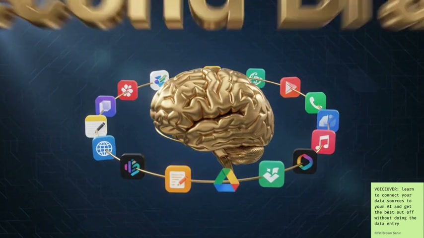

| Option | Voiceover Candidate Text | WPM | Tone |
| :--- | :--- | :--- | :--- |
| **Scratch VO** | It was that they weren't working for me. | ~150 | Baseline |
| **⚡ AI Punchy** | They just weren't working for me. | ~165 | Energetic / Fast |
| **🧠 AI Strategic** | Static notes generate zero leverage without active synthesis. | ~140 | Pedagogical / Authoritative |
| **🔥 AI Conversational** | It was that my notes simply weren't working for me. | ~145 | Direct & Relatable |

> ✍️ **[My Resonant Take]**:
> *It was that they weren't working for me.*

---

### ⏱️ Timestamp: `00:15` (Second 15) · **Notes Working For You**
**Visual Action**: *Camera zooms into locked vault core with red accent transition.*

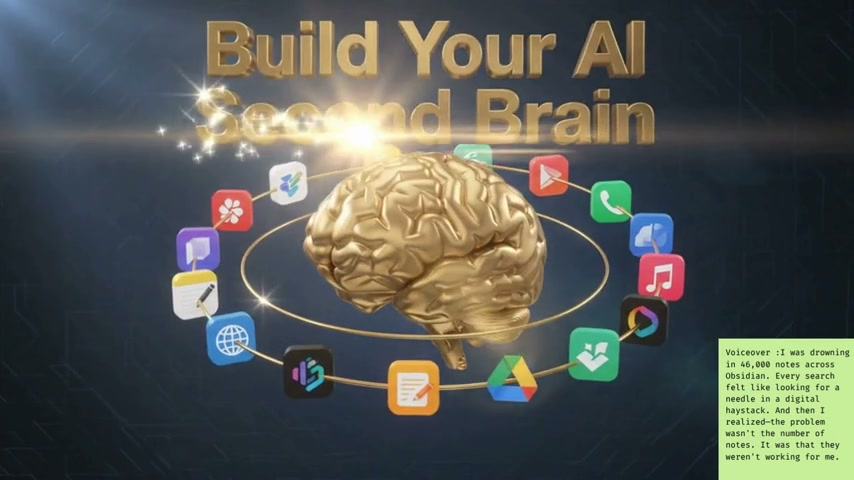

| Option | Voiceover Candidate Text | WPM | Tone |
| :--- | :--- | :--- | :--- |
| **Scratch VO** | It was that they weren't working for me. | ~150 | Baseline |
| **⚡ AI Punchy** | They just weren't working for me. | ~165 | Energetic / Fast |
| **🧠 AI Strategic** | Static notes generate zero leverage without active synthesis. | ~140 | Pedagogical / Authoritative |
| **🔥 AI Conversational** | It was that my notes simply weren't working for me. | ~145 | Direct & Relatable |

> ✍️ **[My Resonant Take]**:
> *It was that they weren't working for me.*

---

### ⏱️ Timestamp: `00:16` (Second 16) · **Notes Working For You**
**Visual Action**: *Camera zooms into locked vault core with red accent transition.*

| Option | Voiceover Candidate Text | WPM | Tone |
| :--- | :--- | :--- | :--- |
| **Scratch VO** | It was that they weren't working for me. | ~150 | Baseline |
| **⚡ AI Punchy** | They just weren't working for me. | ~165 | Energetic / Fast |
| **🧠 AI Strategic** | Static notes generate zero leverage without active synthesis. | ~140 | Pedagogical / Authoritative |
| **🔥 AI Conversational** | It was that my notes simply weren't working for me. | ~145 | Direct & Relatable |

> ✍️ **[My Resonant Take]**:
> *It was that they weren't working for me.*

---

### ⏱️ Timestamp: `00:17` (Second 17) · **Notes Working For You**
**Visual Action**: *Camera zooms into locked vault core with red accent transition.*

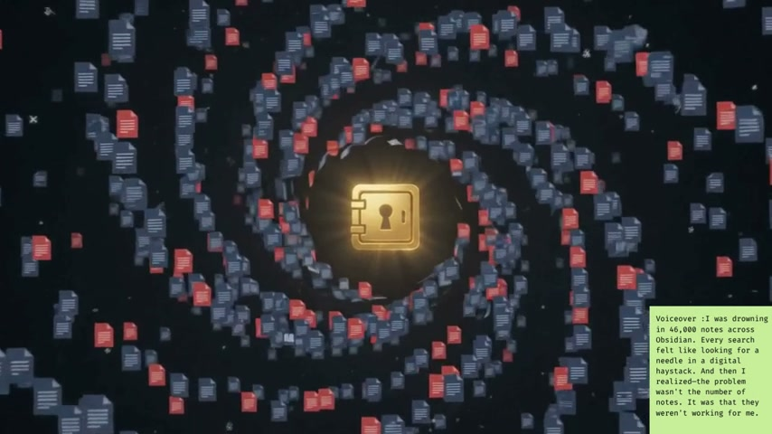

| Option | Voiceover Candidate Text | WPM | Tone |
| :--- | :--- | :--- | :--- |
| **Scratch VO** | It was that they weren't working for me. | ~150 | Baseline |
| **⚡ AI Punchy** | They just weren't working for me. | ~165 | Energetic / Fast |
| **🧠 AI Strategic** | Static notes generate zero leverage without active synthesis. | ~140 | Pedagogical / Authoritative |
| **🔥 AI Conversational** | It was that my notes simply weren't working for me. | ~145 | Direct & Relatable |

> ✍️ **[My Resonant Take]**:
> *It was that they weren't working for me.*

---

### ⏱️ Timestamp: `00:18` (Second 18) · **Notes Working For You**
**Visual Action**: *Camera zooms into locked vault core with red accent transition.*

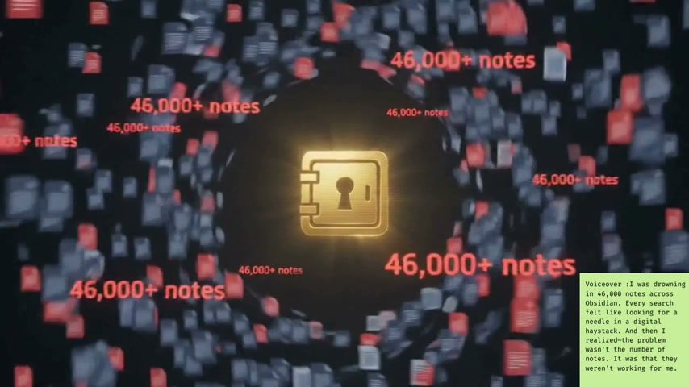

| Option | Voiceover Candidate Text | WPM | Tone |
| :--- | :--- | :--- | :--- |
| **Scratch VO** | It was that they weren't working for me. | ~150 | Baseline |
| **⚡ AI Punchy** | They just weren't working for me. | ~165 | Energetic / Fast |
| **🧠 AI Strategic** | Static notes generate zero leverage without active synthesis. | ~140 | Pedagogical / Authoritative |
| **🔥 AI Conversational** | It was that my notes simply weren't working for me. | ~145 | Direct & Relatable |

> ✍️ **[My Resonant Take]**:
> *It was that they weren't working for me.*

---

## 🎬 Scene 2: The Realization Moment `[00:19]`
**Baseline Script Reference**: *"So I engineered something different: an AI-native knowledge engine."*

### ⏱️ Timestamp: `00:19` (Second 19) · **Engineering The Breakthrough**
**Visual Action**: *Vault flashes gold as cybernetic graph network connects active nodes.*

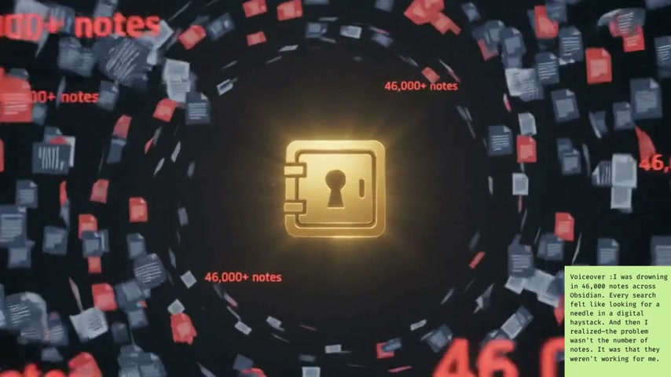

| Option | Voiceover Candidate Text | WPM | Tone |
| :--- | :--- | :--- | :--- |
| **Scratch VO** | So I engineered something different: an AI-native knowledge engine. | ~150 | Baseline |
| **⚡ AI Punchy** | So I built an AI-native second brain. | ~165 | Energetic / Fast |
| **🧠 AI Strategic** | I engineered a deterministic, machine-readable graph topology. | ~140 | Pedagogical / Authoritative |
| **🔥 AI Conversational** | So I engineered something new: an AI-native knowledge engine. | ~145 | Direct & Relatable |

> ✍️ **[My Resonant Take]**:
> *So I engineered something different: an AI-native knowledge engine.*

---

### ⏱️ Timestamp: `00:20` (Second 20) · **Engineering The Breakthrough**
**Visual Action**: *Vault flashes gold as cybernetic graph network connects active nodes.*

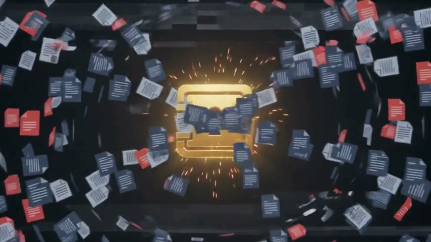

| Option | Voiceover Candidate Text | WPM | Tone |
| :--- | :--- | :--- | :--- |
| **Scratch VO** | So I engineered something different: an AI-native knowledge engine. | ~150 | Baseline |
| **⚡ AI Punchy** | So I built an AI-native second brain. | ~165 | Energetic / Fast |
| **🧠 AI Strategic** | I engineered a deterministic, machine-readable graph topology. | ~140 | Pedagogical / Authoritative |
| **🔥 AI Conversational** | So I engineered something new: an AI-native knowledge engine. | ~145 | Direct & Relatable |

> ✍️ **[My Resonant Take]**:
> *So I engineered something different: an AI-native knowledge engine.*

---

### ⏱️ Timestamp: `00:21` (Second 21) · **Engineering The Breakthrough**
**Visual Action**: *Vault flashes gold as cybernetic graph network connects active nodes.*

| Option | Voiceover Candidate Text | WPM | Tone |
| :--- | :--- | :--- | :--- |
| **Scratch VO** | So I engineered something different: an AI-native knowledge engine. | ~150 | Baseline |
| **⚡ AI Punchy** | So I built an AI-native second brain. | ~165 | Energetic / Fast |
| **🧠 AI Strategic** | I engineered a deterministic, machine-readable graph topology. | ~140 | Pedagogical / Authoritative |
| **🔥 AI Conversational** | So I engineered something new: an AI-native knowledge engine. | ~145 | Direct & Relatable |

> ✍️ **[My Resonant Take]**:
> *So I engineered something different: an AI-native knowledge engine.*

---

### ⏱️ Timestamp: `00:22` (Second 22) · **Engineering The Breakthrough**
**Visual Action**: *Vault flashes gold as cybernetic graph network connects active nodes.*

| Option | Voiceover Candidate Text | WPM | Tone |
| :--- | :--- | :--- | :--- |
| **Scratch VO** | So I engineered something different: an AI-native knowledge engine. | ~150 | Baseline |
| **⚡ AI Punchy** | So I built an AI-native second brain. | ~165 | Energetic / Fast |
| **🧠 AI Strategic** | I engineered a deterministic, machine-readable graph topology. | ~140 | Pedagogical / Authoritative |
| **🔥 AI Conversational** | So I engineered something new: an AI-native knowledge engine. | ~145 | Direct & Relatable |

> ✍️ **[My Resonant Take]**:
> *So I engineered something different: an AI-native knowledge engine.*

---

### ⏱️ Timestamp: `00:23` (Second 23) · **Engineering The Breakthrough**
**Visual Action**: *Vault flashes gold as cybernetic graph network connects active nodes.*

| Option | Voiceover Candidate Text | WPM | Tone |
| :--- | :--- | :--- | :--- |
| **Scratch VO** | So I engineered something different: an AI-native knowledge engine. | ~150 | Baseline |
| **⚡ AI Punchy** | So I built an AI-native second brain. | ~165 | Energetic / Fast |
| **🧠 AI Strategic** | I engineered a deterministic, machine-readable graph topology. | ~140 | Pedagogical / Authoritative |
| **🔥 AI Conversational** | So I engineered something new: an AI-native knowledge engine. | ~145 | Direct & Relatable |

> ✍️ **[My Resonant Take]**:
> *So I engineered something different: an AI-native knowledge engine.*

---

### ⏱️ Timestamp: `00:24` (Second 24) · **No More Manual Digging**
**Visual Action**: *Red chaos nodes snap cleanly into synchronized cyan clusters.*

| Option | Voiceover Candidate Text | WPM | Tone |
| :--- | :--- | :--- | :--- |
| **Scratch VO** | No more chaos. No more manual digging. | ~150 | Baseline |
| **⚡ AI Punchy** | No more manual digging. No more chaos. | ~165 | Energetic / Fast |
| **🧠 AI Strategic** | Manual folder hierarchies are completely eliminated. | ~140 | Pedagogical / Authoritative |
| **🔥 AI Conversational** | No more endless digging or messy folder searching. | ~145 | Direct & Relatable |

> ✍️ **[My Resonant Take]**:
> *No more chaos. No more manual digging.*

---

### ⏱️ Timestamp: `00:25` (Second 25) · **No More Manual Digging**
**Visual Action**: *Red chaos nodes snap cleanly into synchronized cyan clusters.*

| Option | Voiceover Candidate Text | WPM | Tone |
| :--- | :--- | :--- | :--- |
| **Scratch VO** | No more chaos. No more manual digging. | ~150 | Baseline |
| **⚡ AI Punchy** | No more manual digging. No more chaos. | ~165 | Energetic / Fast |
| **🧠 AI Strategic** | Manual folder hierarchies are completely eliminated. | ~140 | Pedagogical / Authoritative |
| **🔥 AI Conversational** | No more endless digging or messy folder searching. | ~145 | Direct & Relatable |

> ✍️ **[My Resonant Take]**:
> *No more chaos. No more manual digging.*

---

### ⏱️ Timestamp: `00:26` (Second 26) · **No More Manual Digging**
**Visual Action**: *Red chaos nodes snap cleanly into synchronized cyan clusters.*

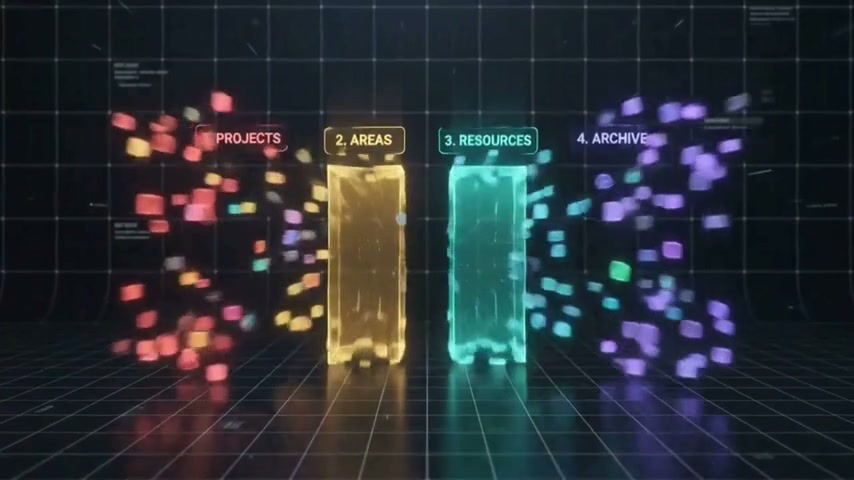

| Option | Voiceover Candidate Text | WPM | Tone |
| :--- | :--- | :--- | :--- |
| **Scratch VO** | No more chaos. No more manual digging. | ~150 | Baseline |
| **⚡ AI Punchy** | No more manual digging. No more chaos. | ~165 | Energetic / Fast |
| **🧠 AI Strategic** | Manual folder hierarchies are completely eliminated. | ~140 | Pedagogical / Authoritative |
| **🔥 AI Conversational** | No more endless digging or messy folder searching. | ~145 | Direct & Relatable |

> ✍️ **[My Resonant Take]**:
> *No more chaos. No more manual digging.*

---

### ⏱️ Timestamp: `00:27` (Second 27) · **No More Manual Digging**
**Visual Action**: *Red chaos nodes snap cleanly into synchronized cyan clusters.*

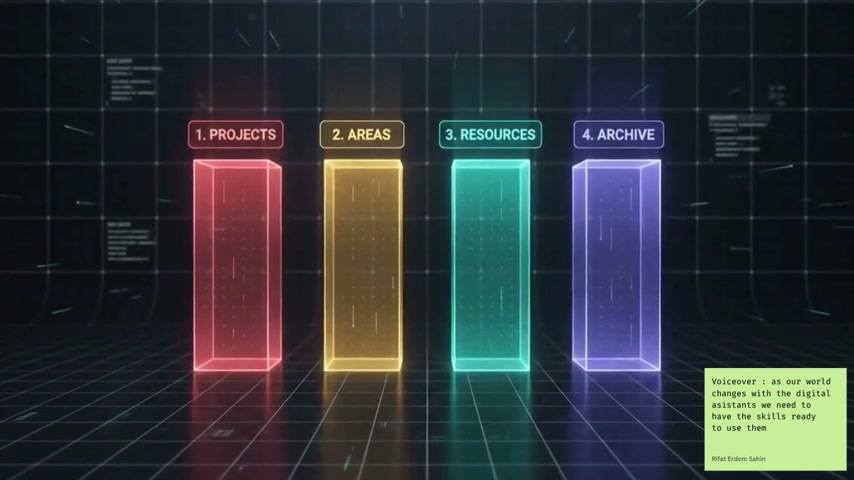

| Option | Voiceover Candidate Text | WPM | Tone |
| :--- | :--- | :--- | :--- |
| **Scratch VO** | No more chaos. No more manual digging. | ~150 | Baseline |
| **⚡ AI Punchy** | No more manual digging. No more chaos. | ~165 | Energetic / Fast |
| **🧠 AI Strategic** | Manual folder hierarchies are completely eliminated. | ~140 | Pedagogical / Authoritative |
| **🔥 AI Conversational** | No more endless digging or messy folder searching. | ~145 | Direct & Relatable |

> ✍️ **[My Resonant Take]**:
> *No more chaos. No more manual digging.*

---

### ⏱️ Timestamp: `00:28` (Second 28) · **No More Manual Digging**
**Visual Action**: *Red chaos nodes snap cleanly into synchronized cyan clusters.*

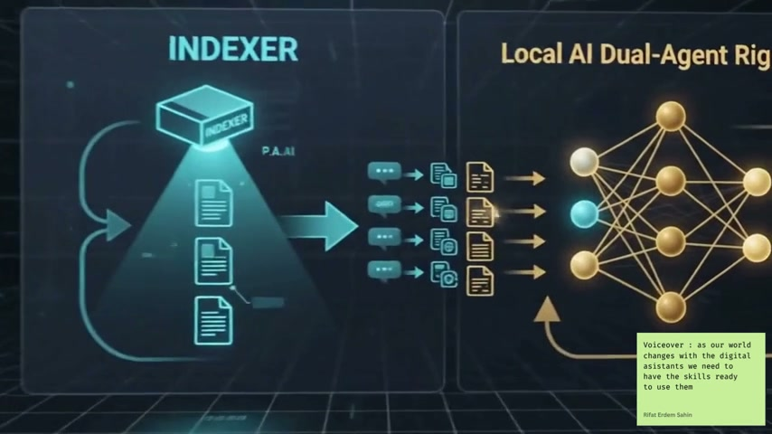

| Option | Voiceover Candidate Text | WPM | Tone |
| :--- | :--- | :--- | :--- |
| **Scratch VO** | No more chaos. No more manual digging. | ~150 | Baseline |
| **⚡ AI Punchy** | No more manual digging. No more chaos. | ~165 | Energetic / Fast |
| **🧠 AI Strategic** | Manual folder hierarchies are completely eliminated. | ~140 | Pedagogical / Authoritative |
| **🔥 AI Conversational** | No more endless digging or messy folder searching. | ~145 | Direct & Relatable |

> ✍️ **[My Resonant Take]**:
> *No more chaos. No more manual digging.*

---

### ⏱️ Timestamp: `00:29` (Second 29) · **No More Manual Digging**
**Visual Action**: *Red chaos nodes snap cleanly into synchronized cyan clusters.*

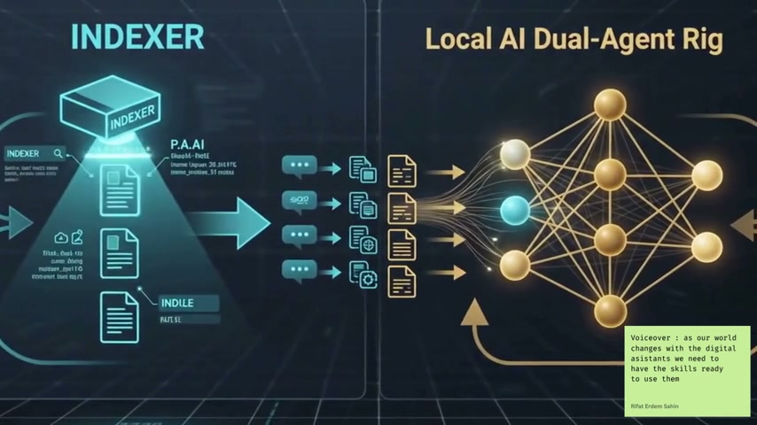

| Option | Voiceover Candidate Text | WPM | Tone |
| :--- | :--- | :--- | :--- |
| **Scratch VO** | No more chaos. No more manual digging. | ~150 | Baseline |
| **⚡ AI Punchy** | No more manual digging. No more chaos. | ~165 | Energetic / Fast |
| **🧠 AI Strategic** | Manual folder hierarchies are completely eliminated. | ~140 | Pedagogical / Authoritative |
| **🔥 AI Conversational** | No more endless digging or messy folder searching. | ~145 | Direct & Relatable |

> ✍️ **[My Resonant Take]**:
> *No more chaos. No more manual digging.*

---

### ⏱️ Timestamp: `00:30` (Second 30) · **Autonomous Agent Queries**
**Visual Action**: *Dual agent cursors query, synthesize, and tag markdown files live.*

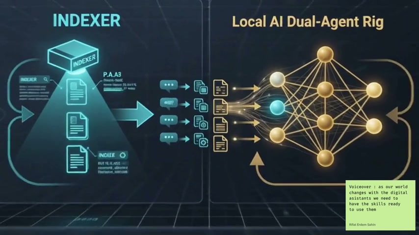

| Option | Voiceover Candidate Text | WPM | Tone |
| :--- | :--- | :--- | :--- |
| **Scratch VO** | Instead, AI agents query, synthesize, and update my entire vault. | ~150 | Baseline |
| **⚡ AI Punchy** | AI agents query and synthesize everything automatically. | ~165 | Energetic / Fast |
| **🧠 AI Strategic** | Autonomous LLM agents continuously index and summarize knowledge. | ~140 | Pedagogical / Authoritative |
| **🔥 AI Conversational** | Now AI agents query and synthesize all my notes automatically. | ~145 | Direct & Relatable |

> ✍️ **[My Resonant Take]**:
> *Instead, AI agents query, synthesize, and update my entire vault.*

---

### ⏱️ Timestamp: `00:31` (Second 31) · **Autonomous Agent Queries**
**Visual Action**: *Dual agent cursors query, synthesize, and tag markdown files live.*

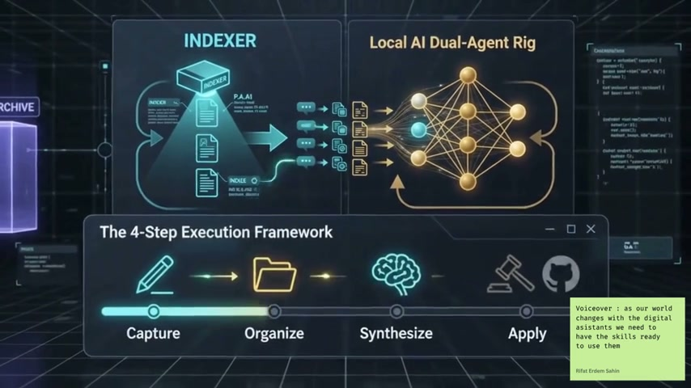

| Option | Voiceover Candidate Text | WPM | Tone |
| :--- | :--- | :--- | :--- |
| **Scratch VO** | Instead, AI agents query, synthesize, and update my entire vault. | ~150 | Baseline |
| **⚡ AI Punchy** | AI agents query and synthesize everything automatically. | ~165 | Energetic / Fast |
| **🧠 AI Strategic** | Autonomous LLM agents continuously index and summarize knowledge. | ~140 | Pedagogical / Authoritative |
| **🔥 AI Conversational** | Now AI agents query and synthesize all my notes automatically. | ~145 | Direct & Relatable |

> ✍️ **[My Resonant Take]**:
> *Instead, AI agents query, synthesize, and update my entire vault.*

---

### ⏱️ Timestamp: `00:32` (Second 32) · **Autonomous Agent Queries**
**Visual Action**: *Dual agent cursors query, synthesize, and tag markdown files live.*

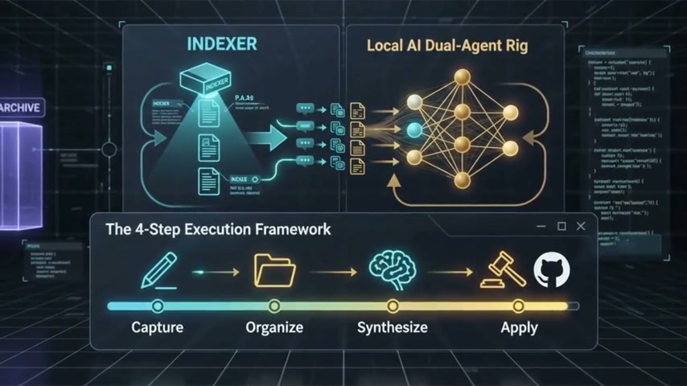

| Option | Voiceover Candidate Text | WPM | Tone |
| :--- | :--- | :--- | :--- |
| **Scratch VO** | Instead, AI agents query, synthesize, and update my entire vault. | ~150 | Baseline |
| **⚡ AI Punchy** | AI agents query and synthesize everything automatically. | ~165 | Energetic / Fast |
| **🧠 AI Strategic** | Autonomous LLM agents continuously index and summarize knowledge. | ~140 | Pedagogical / Authoritative |
| **🔥 AI Conversational** | Now AI agents query and synthesize all my notes automatically. | ~145 | Direct & Relatable |

> ✍️ **[My Resonant Take]**:
> *Instead, AI agents query, synthesize, and update my entire vault.*

---

### ⏱️ Timestamp: `00:33` (Second 33) · **Autonomous Agent Queries**
**Visual Action**: *Dual agent cursors query, synthesize, and tag markdown files live.*

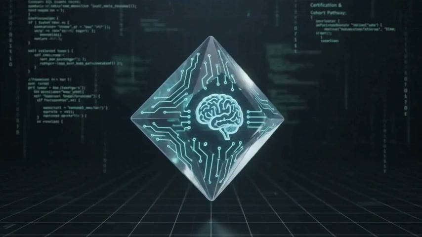

| Option | Voiceover Candidate Text | WPM | Tone |
| :--- | :--- | :--- | :--- |
| **Scratch VO** | Instead, AI agents query, synthesize, and update my entire vault. | ~150 | Baseline |
| **⚡ AI Punchy** | AI agents query and synthesize everything automatically. | ~165 | Energetic / Fast |
| **🧠 AI Strategic** | Autonomous LLM agents continuously index and summarize knowledge. | ~140 | Pedagogical / Authoritative |
| **🔥 AI Conversational** | Now AI agents query and synthesize all my notes automatically. | ~145 | Direct & Relatable |

> ✍️ **[My Resonant Take]**:
> *Instead, AI agents query, synthesize, and update my entire vault.*

---

### ⏱️ Timestamp: `00:34` (Second 34) · **Autonomous Agent Queries**
**Visual Action**: *Dual agent cursors query, synthesize, and tag markdown files live.*

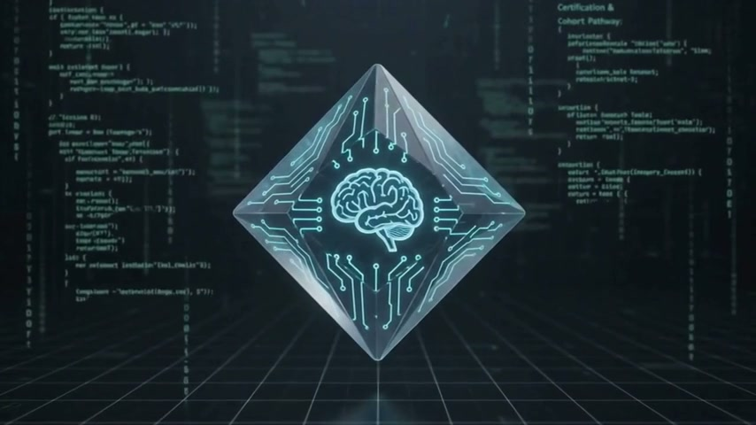

| Option | Voiceover Candidate Text | WPM | Tone |
| :--- | :--- | :--- | :--- |
| **Scratch VO** | Instead, AI agents query, synthesize, and update my entire vault. | ~150 | Baseline |
| **⚡ AI Punchy** | AI agents query and synthesize everything automatically. | ~165 | Energetic / Fast |
| **🧠 AI Strategic** | Autonomous LLM agents continuously index and summarize knowledge. | ~140 | Pedagogical / Authoritative |
| **🔥 AI Conversational** | Now AI agents query and synthesize all my notes automatically. | ~145 | Direct & Relatable |

> ✍️ **[My Resonant Take]**:
> *Instead, AI agents query, synthesize, and update my entire vault.*

---

### ⏱️ Timestamp: `00:35` (Second 35) · **Autonomous Agent Queries**
**Visual Action**: *Dual agent cursors query, synthesize, and tag markdown files live.*

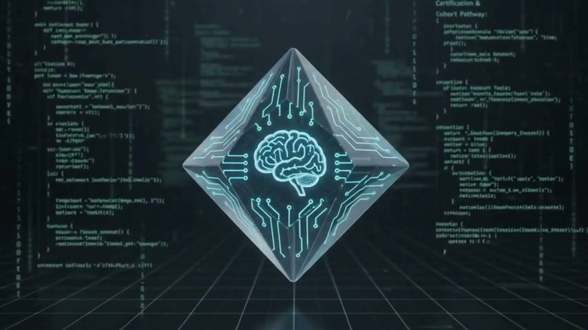

| Option | Voiceover Candidate Text | WPM | Tone |
| :--- | :--- | :--- | :--- |
| **Scratch VO** | Instead, AI agents query, synthesize, and update my entire vault. | ~150 | Baseline |
| **⚡ AI Punchy** | AI agents query and synthesize everything automatically. | ~165 | Energetic / Fast |
| **🧠 AI Strategic** | Autonomous LLM agents continuously index and summarize knowledge. | ~140 | Pedagogical / Authoritative |
| **🔥 AI Conversational** | Now AI agents query and synthesize all my notes automatically. | ~145 | Direct & Relatable |

> ✍️ **[My Resonant Take]**:
> *Instead, AI agents query, synthesize, and update my entire vault.*

---

### ⏱️ Timestamp: `00:36` (Second 36) · **Autonomous Agent Queries**
**Visual Action**: *Dual agent cursors query, synthesize, and tag markdown files live.*

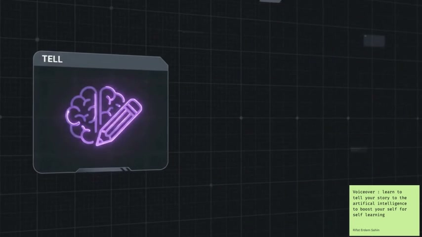

| Option | Voiceover Candidate Text | WPM | Tone |
| :--- | :--- | :--- | :--- |
| **Scratch VO** | Instead, AI agents query, synthesize, and update my entire vault. | ~150 | Baseline |
| **⚡ AI Punchy** | AI agents query and synthesize everything automatically. | ~165 | Energetic / Fast |
| **🧠 AI Strategic** | Autonomous LLM agents continuously index and summarize knowledge. | ~140 | Pedagogical / Authoritative |
| **🔥 AI Conversational** | Now AI agents query and synthesize all my notes automatically. | ~145 | Direct & Relatable |

> ✍️ **[My Resonant Take]**:
> *Instead, AI agents query, synthesize, and update my entire vault.*

---

### ⏱️ Timestamp: `00:37` (Second 37) · **Automatic Background Sync**
**Visual Action**: *Automated sync status bar reaches 100% with gold checkmark.*

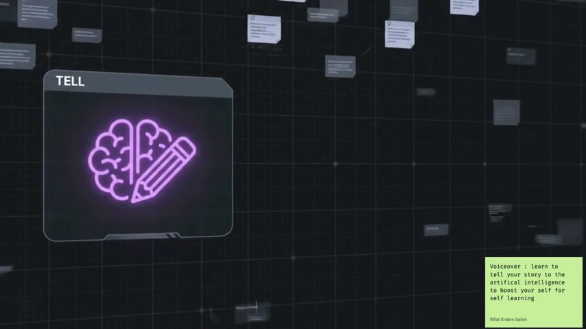

| Option | Voiceover Candidate Text | WPM | Tone |
| :--- | :--- | :--- | :--- |
| **Scratch VO** | Everything updates automatically in the background. | ~150 | Baseline |
| **⚡ AI Punchy** | Everything updates silently while you sleep. | ~165 | Energetic / Fast |
| **🧠 AI Strategic** | Background workers ensure eventual consistency across all storage nodes. | ~140 | Pedagogical / Authoritative |
| **🔥 AI Conversational** | It all updates automatically in the background while I work. | ~145 | Direct & Relatable |

> ✍️ **[My Resonant Take]**:
> *Everything updates automatically in the background.*

---

### ⏱️ Timestamp: `00:38` (Second 38) · **Automatic Background Sync**
**Visual Action**: *Automated sync status bar reaches 100% with gold checkmark.*

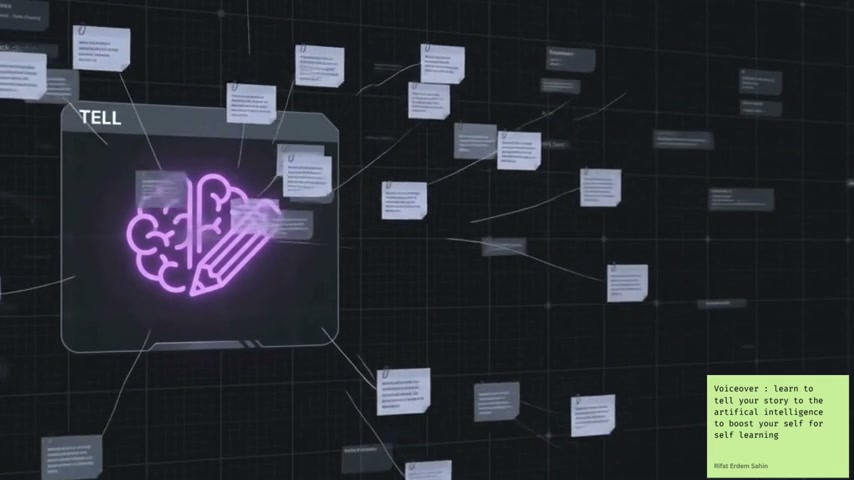

| Option | Voiceover Candidate Text | WPM | Tone |
| :--- | :--- | :--- | :--- |
| **Scratch VO** | Everything updates automatically in the background. | ~150 | Baseline |
| **⚡ AI Punchy** | Everything updates silently while you sleep. | ~165 | Energetic / Fast |
| **🧠 AI Strategic** | Background workers ensure eventual consistency across all storage nodes. | ~140 | Pedagogical / Authoritative |
| **🔥 AI Conversational** | It all updates automatically in the background while I work. | ~145 | Direct & Relatable |

> ✍️ **[My Resonant Take]**:
> *Everything updates automatically in the background.*

---

### ⏱️ Timestamp: `00:39` (Second 39) · **Automatic Background Sync**
**Visual Action**: *Automated sync status bar reaches 100% with gold checkmark.*

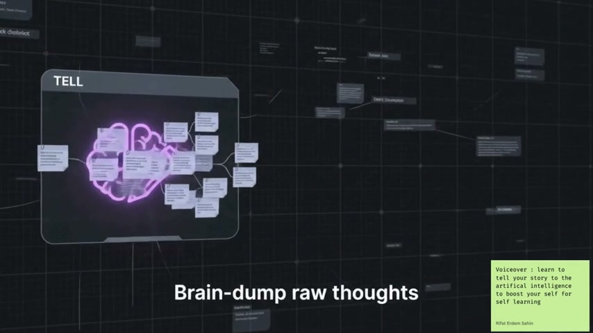

| Option | Voiceover Candidate Text | WPM | Tone |
| :--- | :--- | :--- | :--- |
| **Scratch VO** | Everything updates automatically in the background. | ~150 | Baseline |
| **⚡ AI Punchy** | Everything updates silently while you sleep. | ~165 | Energetic / Fast |
| **🧠 AI Strategic** | Background workers ensure eventual consistency across all storage nodes. | ~140 | Pedagogical / Authoritative |
| **🔥 AI Conversational** | It all updates automatically in the background while I work. | ~145 | Direct & Relatable |

> ✍️ **[My Resonant Take]**:
> *Everything updates automatically in the background.*

---

### ⏱️ Timestamp: `00:40` (Second 40) · **Automatic Background Sync**
**Visual Action**: *Automated sync status bar reaches 100% with gold checkmark.*

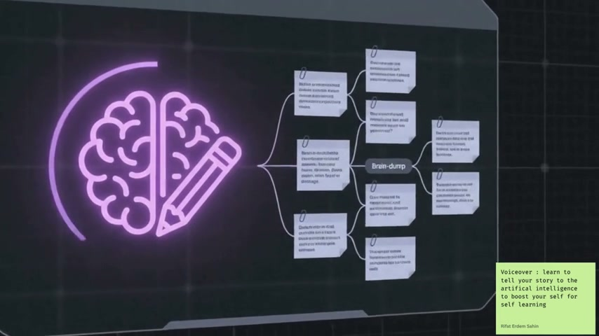

| Option | Voiceover Candidate Text | WPM | Tone |
| :--- | :--- | :--- | :--- |
| **Scratch VO** | Everything updates automatically in the background. | ~150 | Baseline |
| **⚡ AI Punchy** | Everything updates silently while you sleep. | ~165 | Energetic / Fast |
| **🧠 AI Strategic** | Background workers ensure eventual consistency across all storage nodes. | ~140 | Pedagogical / Authoritative |
| **🔥 AI Conversational** | It all updates automatically in the background while I work. | ~145 | Direct & Relatable |

> ✍️ **[My Resonant Take]**:
> *Everything updates automatically in the background.*

---

### ⏱️ Timestamp: `00:41` (Second 41) · **Automatic Background Sync**
**Visual Action**: *Automated sync status bar reaches 100% with gold checkmark.*

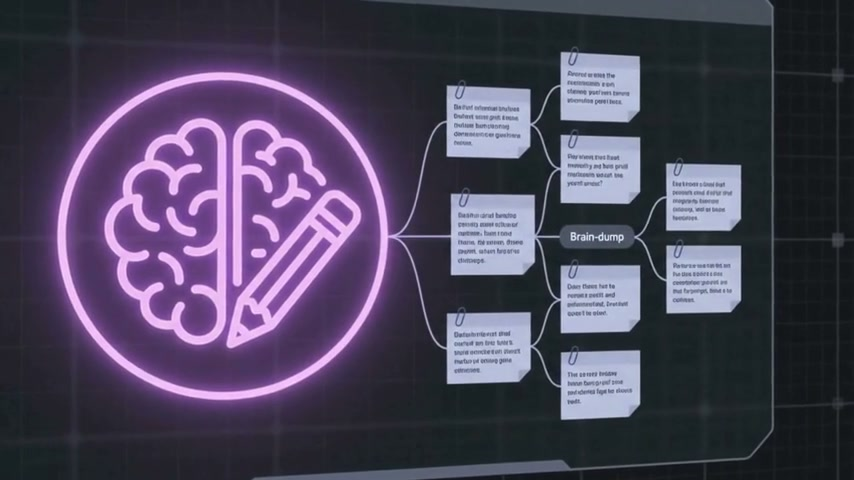

| Option | Voiceover Candidate Text | WPM | Tone |
| :--- | :--- | :--- | :--- |
| **Scratch VO** | Everything updates automatically in the background. | ~150 | Baseline |
| **⚡ AI Punchy** | Everything updates silently while you sleep. | ~165 | Energetic / Fast |
| **🧠 AI Strategic** | Background workers ensure eventual consistency across all storage nodes. | ~140 | Pedagogical / Authoritative |
| **🔥 AI Conversational** | It all updates automatically in the background while I work. | ~145 | Direct & Relatable |

> ✍️ **[My Resonant Take]**:
> *Everything updates automatically in the background.*

---

### ⏱️ Timestamp: `00:42` (Second 42) · **Automatic Background Sync**
**Visual Action**: *Automated sync status bar reaches 100% with gold checkmark.*

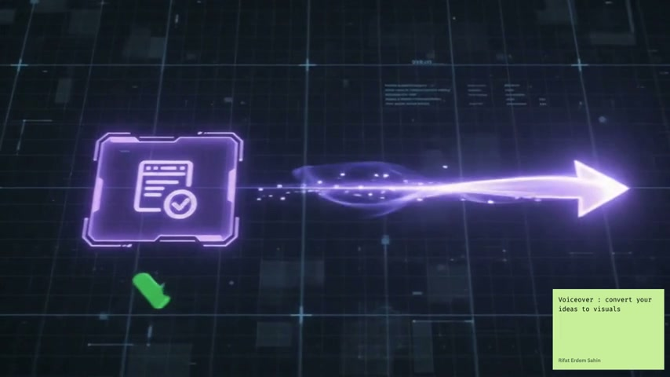

| Option | Voiceover Candidate Text | WPM | Tone |
| :--- | :--- | :--- | :--- |
| **Scratch VO** | Everything updates automatically in the background. | ~150 | Baseline |
| **⚡ AI Punchy** | Everything updates silently while you sleep. | ~165 | Energetic / Fast |
| **🧠 AI Strategic** | Background workers ensure eventual consistency across all storage nodes. | ~140 | Pedagogical / Authoritative |
| **🔥 AI Conversational** | It all updates automatically in the background while I work. | ~145 | Direct & Relatable |

> ✍️ **[My Resonant Take]**:
> *Everything updates automatically in the background.*

---

### ⏱️ Timestamp: `00:43` (Second 43) · **AI Certification Blueprint**
**Visual Action**: *Claude Certified Architect badge and exam readiness blueprint glow.*

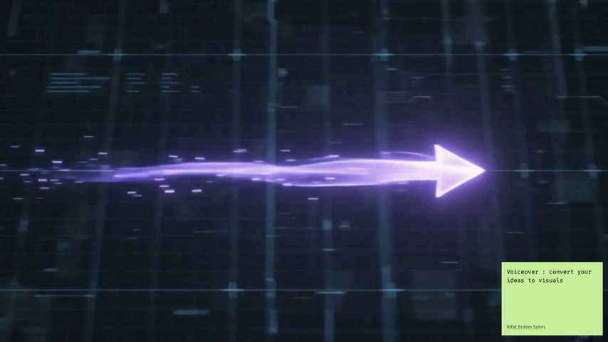

| Option | Voiceover Candidate Text | WPM | Tone |
| :--- | :--- | :--- | :--- |
| **Scratch VO** | And it prepares you for modern AI certifications like Claude Architect. | ~150 | Baseline |
| **⚡ AI Punchy** | Prepping you for top AI certifications like Claude Architect. | ~165 | Energetic / Fast |
| **🧠 AI Strategic** | Designed around the Claude Certified Architect Professional competency model. | ~140 | Pedagogical / Authoritative |
| **🔥 AI Conversational** | Plus it's built to prep you for top AI certs like Claude Architect. | ~145 | Direct & Relatable |

> ✍️ **[My Resonant Take]**:
> *And it prepares you for modern AI certifications like Claude Architect.*

---

### ⏱️ Timestamp: `00:44` (Second 44) · **AI Certification Blueprint**
**Visual Action**: *Claude Certified Architect badge and exam readiness blueprint glow.*

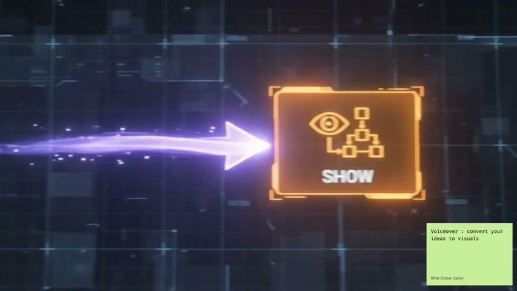

| Option | Voiceover Candidate Text | WPM | Tone |
| :--- | :--- | :--- | :--- |
| **Scratch VO** | And it prepares you for modern AI certifications like Claude Architect. | ~150 | Baseline |
| **⚡ AI Punchy** | Prepping you for top AI certifications like Claude Architect. | ~165 | Energetic / Fast |
| **🧠 AI Strategic** | Designed around the Claude Certified Architect Professional competency model. | ~140 | Pedagogical / Authoritative |
| **🔥 AI Conversational** | Plus it's built to prep you for top AI certs like Claude Architect. | ~145 | Direct & Relatable |

> ✍️ **[My Resonant Take]**:
> *And it prepares you for modern AI certifications like Claude Architect.*

---

### ⏱️ Timestamp: `00:45` (Second 45) · **AI Certification Blueprint**
**Visual Action**: *Claude Certified Architect badge and exam readiness blueprint glow.*

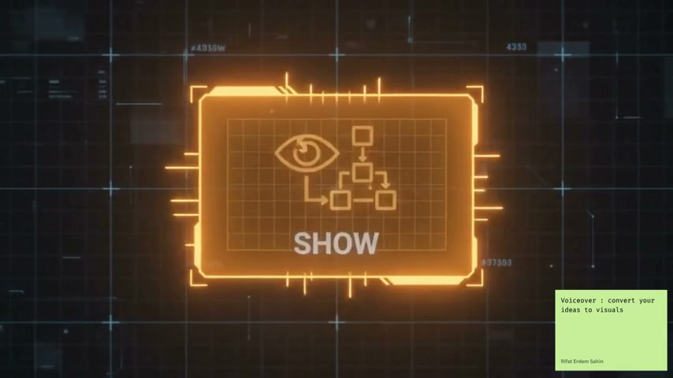

| Option | Voiceover Candidate Text | WPM | Tone |
| :--- | :--- | :--- | :--- |
| **Scratch VO** | And it prepares you for modern AI certifications like Claude Architect. | ~150 | Baseline |
| **⚡ AI Punchy** | Prepping you for top AI certifications like Claude Architect. | ~165 | Energetic / Fast |
| **🧠 AI Strategic** | Designed around the Claude Certified Architect Professional competency model. | ~140 | Pedagogical / Authoritative |
| **🔥 AI Conversational** | Plus it's built to prep you for top AI certs like Claude Architect. | ~145 | Direct & Relatable |

> ✍️ **[My Resonant Take]**:
> *And it prepares you for modern AI certifications like Claude Architect.*

---

### ⏱️ Timestamp: `00:46` (Second 46) · **AI Certification Blueprint**
**Visual Action**: *Claude Certified Architect badge and exam readiness blueprint glow.*

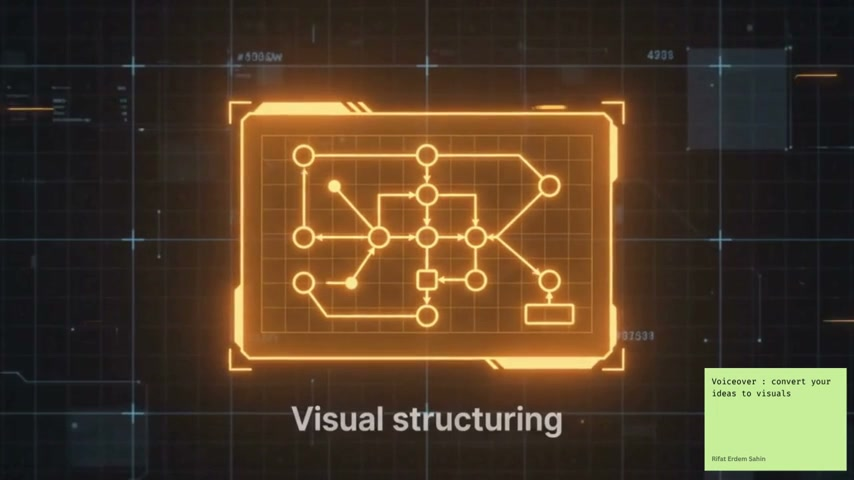

| Option | Voiceover Candidate Text | WPM | Tone |
| :--- | :--- | :--- | :--- |
| **Scratch VO** | And it prepares you for modern AI certifications like Claude Architect. | ~150 | Baseline |
| **⚡ AI Punchy** | Prepping you for top AI certifications like Claude Architect. | ~165 | Energetic / Fast |
| **🧠 AI Strategic** | Designed around the Claude Certified Architect Professional competency model. | ~140 | Pedagogical / Authoritative |
| **🔥 AI Conversational** | Plus it's built to prep you for top AI certs like Claude Architect. | ~145 | Direct & Relatable |

> ✍️ **[My Resonant Take]**:
> *And it prepares you for modern AI certifications like Claude Architect.*

---

### ⏱️ Timestamp: `00:47` (Second 47) · **AI Certification Blueprint**
**Visual Action**: *Claude Certified Architect badge and exam readiness blueprint glow.*

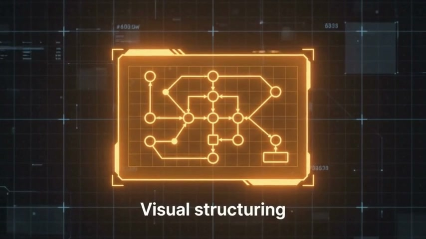

| Option | Voiceover Candidate Text | WPM | Tone |
| :--- | :--- | :--- | :--- |
| **Scratch VO** | And it prepares you for modern AI certifications like Claude Architect. | ~150 | Baseline |
| **⚡ AI Punchy** | Prepping you for top AI certifications like Claude Architect. | ~165 | Energetic / Fast |
| **🧠 AI Strategic** | Designed around the Claude Certified Architect Professional competency model. | ~140 | Pedagogical / Authoritative |
| **🔥 AI Conversational** | Plus it's built to prep you for top AI certs like Claude Architect. | ~145 | Direct & Relatable |

> ✍️ **[My Resonant Take]**:
> *And it prepares you for modern AI certifications like Claude Architect.*

---

### ⏱️ Timestamp: `00:48` (Second 48) · **AI Certification Blueprint**
**Visual Action**: *Claude Certified Architect badge and exam readiness blueprint glow.*

| Option | Voiceover Candidate Text | WPM | Tone |
| :--- | :--- | :--- | :--- |
| **Scratch VO** | And it prepares you for modern AI certifications like Claude Architect. | ~150 | Baseline |
| **⚡ AI Punchy** | Prepping you for top AI certifications like Claude Architect. | ~165 | Energetic / Fast |
| **🧠 AI Strategic** | Designed around the Claude Certified Architect Professional competency model. | ~140 | Pedagogical / Authoritative |
| **🔥 AI Conversational** | Plus it's built to prep you for top AI certs like Claude Architect. | ~145 | Direct & Relatable |

> ✍️ **[My Resonant Take]**:
> *And it prepares you for modern AI certifications like Claude Architect.*

---

## 🎬 Scene 3: P.A.R.A. Method Framework `[00:49]`
**Baseline Script Reference**: *"The foundation is the P.A.R.A. method—four zones AI understands instantly."*

### ⏱️ Timestamp: `00:49` (Second 49) · **Four Deterministic Zones**
**Visual Action**: *Screen splits into 4 clean colored zone containers (Projects, Areas, Resources, Archive).*

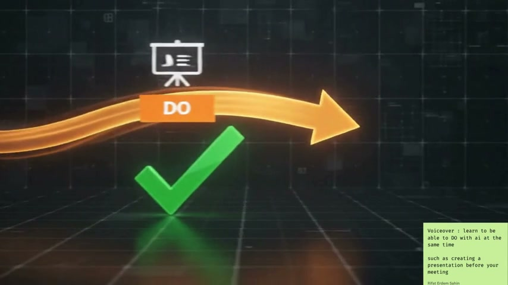

| Option | Voiceover Candidate Text | WPM | Tone |
| :--- | :--- | :--- | :--- |
| **Scratch VO** | The foundation is the P.A.R.A. method—four zones AI understands instantly. | ~150 | Baseline |
| **⚡ AI Punchy** | The backbone is P.A.R.A: four clean AI zones. | ~165 | Energetic / Fast |
| **🧠 AI Strategic** | P.A.R.A establishes deterministic boundaries for LLM context retrieval. | ~140 | Pedagogical / Authoritative |
| **🔥 AI Conversational** | The foundation is simple: four zones that AI understands instantly. | ~145 | Direct & Relatable |

> ✍️ **[My Resonant Take]**:
> *The foundation is the P.A.R.A. method—four zones AI understands instantly.*

---

### ⏱️ Timestamp: `00:50` (Second 50) · **Four Deterministic Zones**
**Visual Action**: *Screen splits into 4 clean colored zone containers (Projects, Areas, Resources, Archive).*

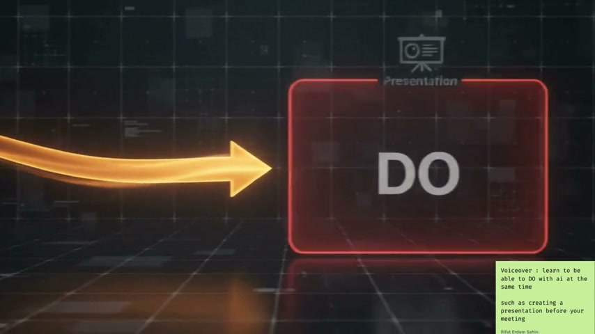

| Option | Voiceover Candidate Text | WPM | Tone |
| :--- | :--- | :--- | :--- |
| **Scratch VO** | The foundation is the P.A.R.A. method—four zones AI understands instantly. | ~150 | Baseline |
| **⚡ AI Punchy** | The backbone is P.A.R.A: four clean AI zones. | ~165 | Energetic / Fast |
| **🧠 AI Strategic** | P.A.R.A establishes deterministic boundaries for LLM context retrieval. | ~140 | Pedagogical / Authoritative |
| **🔥 AI Conversational** | The foundation is simple: four zones that AI understands instantly. | ~145 | Direct & Relatable |

> ✍️ **[My Resonant Take]**:
> *The foundation is the P.A.R.A. method—four zones AI understands instantly.*

---

### ⏱️ Timestamp: `00:51` (Second 51) · **Four Deterministic Zones**
**Visual Action**: *Screen splits into 4 clean colored zone containers (Projects, Areas, Resources, Archive).*

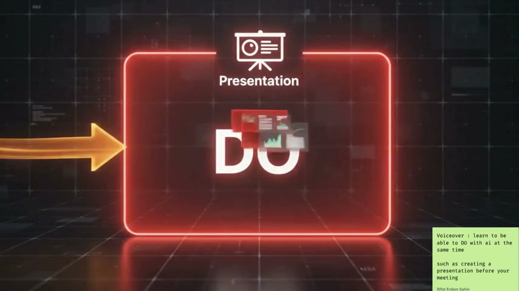

| Option | Voiceover Candidate Text | WPM | Tone |
| :--- | :--- | :--- | :--- |
| **Scratch VO** | The foundation is the P.A.R.A. method—four zones AI understands instantly. | ~150 | Baseline |
| **⚡ AI Punchy** | The backbone is P.A.R.A: four clean AI zones. | ~165 | Energetic / Fast |
| **🧠 AI Strategic** | P.A.R.A establishes deterministic boundaries for LLM context retrieval. | ~140 | Pedagogical / Authoritative |
| **🔥 AI Conversational** | The foundation is simple: four zones that AI understands instantly. | ~145 | Direct & Relatable |

> ✍️ **[My Resonant Take]**:
> *The foundation is the P.A.R.A. method—four zones AI understands instantly.*

---

### ⏱️ Timestamp: `00:52` (Second 52) · **Four Deterministic Zones**
**Visual Action**: *Screen splits into 4 clean colored zone containers (Projects, Areas, Resources, Archive).*

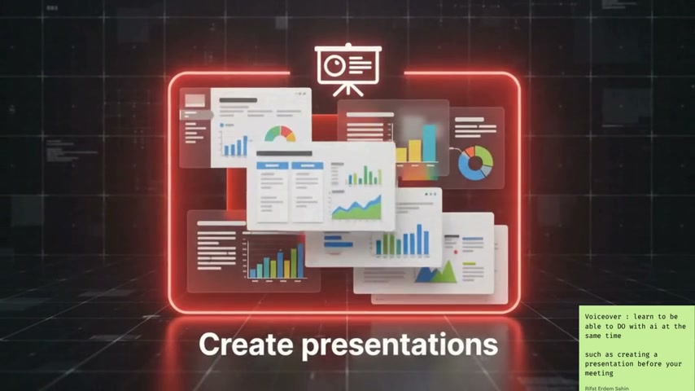

| Option | Voiceover Candidate Text | WPM | Tone |
| :--- | :--- | :--- | :--- |
| **Scratch VO** | The foundation is the P.A.R.A. method—four zones AI understands instantly. | ~150 | Baseline |
| **⚡ AI Punchy** | The backbone is P.A.R.A: four clean AI zones. | ~165 | Energetic / Fast |
| **🧠 AI Strategic** | P.A.R.A establishes deterministic boundaries for LLM context retrieval. | ~140 | Pedagogical / Authoritative |
| **🔥 AI Conversational** | The foundation is simple: four zones that AI understands instantly. | ~145 | Direct & Relatable |

> ✍️ **[My Resonant Take]**:
> *The foundation is the P.A.R.A. method—four zones AI understands instantly.*

---

### ⏱️ Timestamp: `00:53` (Second 53) · **Four Deterministic Zones**
**Visual Action**: *Screen splits into 4 clean colored zone containers (Projects, Areas, Resources, Archive).*

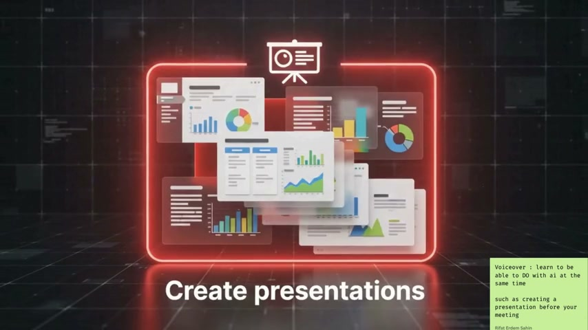

| Option | Voiceover Candidate Text | WPM | Tone |
| :--- | :--- | :--- | :--- |
| **Scratch VO** | The foundation is the P.A.R.A. method—four zones AI understands instantly. | ~150 | Baseline |
| **⚡ AI Punchy** | The backbone is P.A.R.A: four clean AI zones. | ~165 | Energetic / Fast |
| **🧠 AI Strategic** | P.A.R.A establishes deterministic boundaries for LLM context retrieval. | ~140 | Pedagogical / Authoritative |
| **🔥 AI Conversational** | The foundation is simple: four zones that AI understands instantly. | ~145 | Direct & Relatable |

> ✍️ **[My Resonant Take]**:
> *The foundation is the P.A.R.A. method—four zones AI understands instantly.*

---

### ⏱️ Timestamp: `00:54` (Second 54) · **Projects Zone (Red)**
**Visual Action**: *Red container #e74c3c populating active tasks and sprint deadlines.*

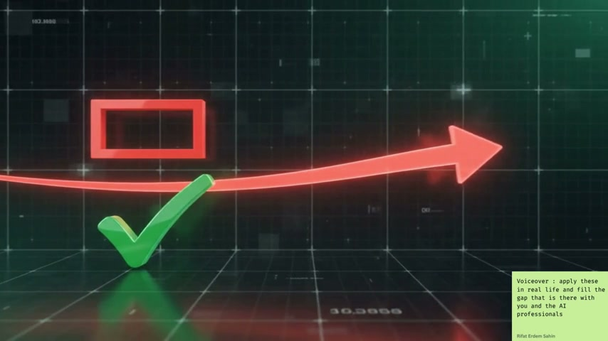

| Option | Voiceover Candidate Text | WPM | Tone |
| :--- | :--- | :--- | :--- |
| **Scratch VO** | Projects: short-term efforts with strict deadlines. | ~150 | Baseline |
| **⚡ AI Punchy** | Projects: active work with deadlines. | ~165 | Energetic / Fast |
| **🧠 AI Strategic** | Projects zone houses time-bounded execution objectives. | ~140 | Pedagogical / Authoritative |
| **🔥 AI Conversational** | Projects are your short-term goals with clear deadlines. | ~145 | Direct & Relatable |

> ✍️ **[My Resonant Take]**:
> *Projects: short-term efforts with strict deadlines.*

---

### ⏱️ Timestamp: `00:55` (Second 55) · **Projects Zone (Red)**
**Visual Action**: *Red container #e74c3c populating active tasks and sprint deadlines.*

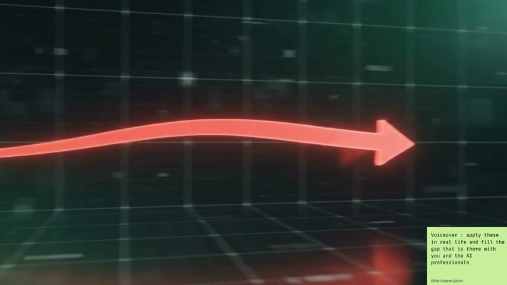

| Option | Voiceover Candidate Text | WPM | Tone |
| :--- | :--- | :--- | :--- |
| **Scratch VO** | Projects: short-term efforts with strict deadlines. | ~150 | Baseline |
| **⚡ AI Punchy** | Projects: active work with deadlines. | ~165 | Energetic / Fast |
| **🧠 AI Strategic** | Projects zone houses time-bounded execution objectives. | ~140 | Pedagogical / Authoritative |
| **🔥 AI Conversational** | Projects are your short-term goals with clear deadlines. | ~145 | Direct & Relatable |

> ✍️ **[My Resonant Take]**:
> *Projects: short-term efforts with strict deadlines.*

---

### ⏱️ Timestamp: `00:56` (Second 56) · **Projects Zone (Red)**
**Visual Action**: *Red container #e74c3c populating active tasks and sprint deadlines.*

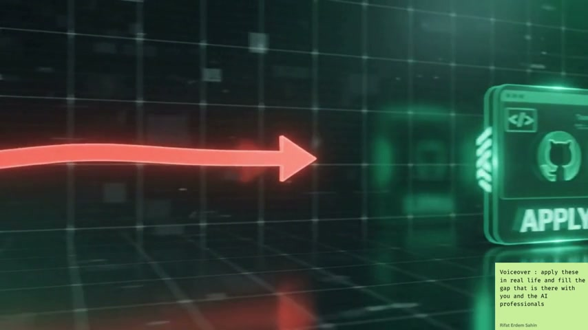

| Option | Voiceover Candidate Text | WPM | Tone |
| :--- | :--- | :--- | :--- |
| **Scratch VO** | Projects: short-term efforts with strict deadlines. | ~150 | Baseline |
| **⚡ AI Punchy** | Projects: active work with deadlines. | ~165 | Energetic / Fast |
| **🧠 AI Strategic** | Projects zone houses time-bounded execution objectives. | ~140 | Pedagogical / Authoritative |
| **🔥 AI Conversational** | Projects are your short-term goals with clear deadlines. | ~145 | Direct & Relatable |

> ✍️ **[My Resonant Take]**:
> *Projects: short-term efforts with strict deadlines.*

---

### ⏱️ Timestamp: `00:57` (Second 57) · **Projects Zone (Red)**
**Visual Action**: *Red container #e74c3c populating active tasks and sprint deadlines.*

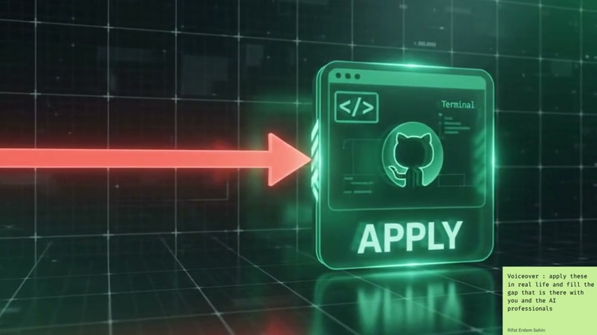

| Option | Voiceover Candidate Text | WPM | Tone |
| :--- | :--- | :--- | :--- |
| **Scratch VO** | Projects: short-term efforts with strict deadlines. | ~150 | Baseline |
| **⚡ AI Punchy** | Projects: active work with deadlines. | ~165 | Energetic / Fast |
| **🧠 AI Strategic** | Projects zone houses time-bounded execution objectives. | ~140 | Pedagogical / Authoritative |
| **🔥 AI Conversational** | Projects are your short-term goals with clear deadlines. | ~145 | Direct & Relatable |

> ✍️ **[My Resonant Take]**:
> *Projects: short-term efforts with strict deadlines.*

---

### ⏱️ Timestamp: `00:58` (Second 58) · **Projects Zone (Red)**
**Visual Action**: *Red container #e74c3c populating active tasks and sprint deadlines.*

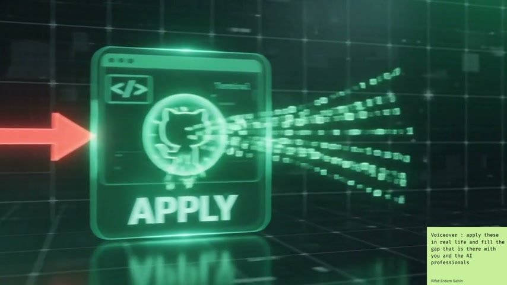

| Option | Voiceover Candidate Text | WPM | Tone |
| :--- | :--- | :--- | :--- |
| **Scratch VO** | Projects: short-term efforts with strict deadlines. | ~150 | Baseline |
| **⚡ AI Punchy** | Projects: active work with deadlines. | ~165 | Energetic / Fast |
| **🧠 AI Strategic** | Projects zone houses time-bounded execution objectives. | ~140 | Pedagogical / Authoritative |
| **🔥 AI Conversational** | Projects are your short-term goals with clear deadlines. | ~145 | Direct & Relatable |

> ✍️ **[My Resonant Take]**:
> *Projects: short-term efforts with strict deadlines.*

---

### ⏱️ Timestamp: `00:59` (Second 59) · **Projects Zone (Red)**
**Visual Action**: *Red container #e74c3c populating active tasks and sprint deadlines.*

| Option | Voiceover Candidate Text | WPM | Tone |
| :--- | :--- | :--- | :--- |
| **Scratch VO** | Projects: short-term efforts with strict deadlines. | ~150 | Baseline |
| **⚡ AI Punchy** | Projects: active work with deadlines. | ~165 | Energetic / Fast |
| **🧠 AI Strategic** | Projects zone houses time-bounded execution objectives. | ~140 | Pedagogical / Authoritative |
| **🔥 AI Conversational** | Projects are your short-term goals with clear deadlines. | ~145 | Direct & Relatable |

> ✍️ **[My Resonant Take]**:
> *Projects: short-term efforts with strict deadlines.*

---

### ⏱️ Timestamp: `01:00` (Second 60) · **Areas Zone (Blue)**
**Visual Action**: *Blue container #3498db with systems, infrastructure, and ops records.*

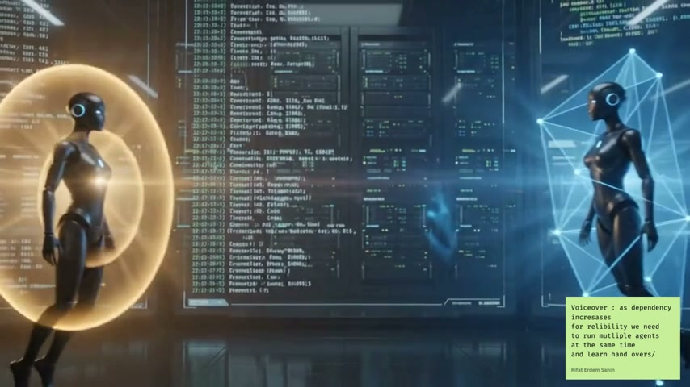

| Option | Voiceover Candidate Text | WPM | Tone |
| :--- | :--- | :--- | :--- |
| **Scratch VO** | Areas: long-term responsibilities you own continuously. | ~150 | Baseline |
| **⚡ AI Punchy** | Areas: permanent responsibilities you own. | ~165 | Energetic / Fast |
| **🧠 AI Strategic** | Areas zone manages continuous operational domain standards. | ~140 | Pedagogical / Authoritative |
| **🔥 AI Conversational** | Areas are ongoing responsibilities you manage every day. | ~145 | Direct & Relatable |

> ✍️ **[My Resonant Take]**:
> *Areas: long-term responsibilities you own continuously.*

---

### ⏱️ Timestamp: `01:01` (Second 61) · **Areas Zone (Blue)**
**Visual Action**: *Blue container #3498db with systems, infrastructure, and ops records.*

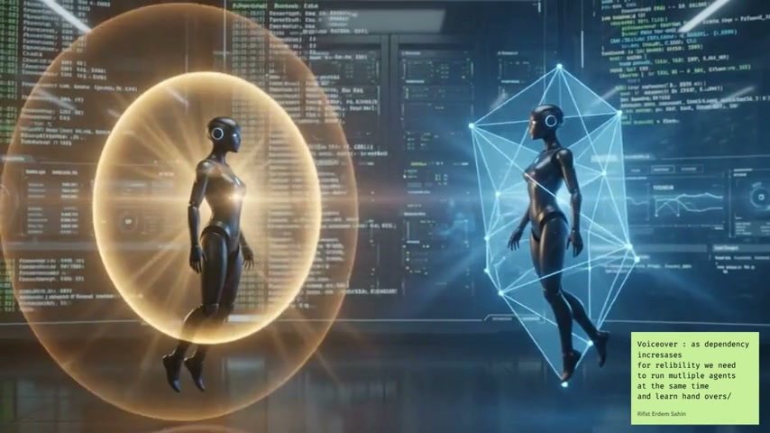

| Option | Voiceover Candidate Text | WPM | Tone |
| :--- | :--- | :--- | :--- |
| **Scratch VO** | Areas: long-term responsibilities you own continuously. | ~150 | Baseline |
| **⚡ AI Punchy** | Areas: permanent responsibilities you own. | ~165 | Energetic / Fast |
| **🧠 AI Strategic** | Areas zone manages continuous operational domain standards. | ~140 | Pedagogical / Authoritative |
| **🔥 AI Conversational** | Areas are ongoing responsibilities you manage every day. | ~145 | Direct & Relatable |

> ✍️ **[My Resonant Take]**:
> *Areas: long-term responsibilities you own continuously.*

---

### ⏱️ Timestamp: `01:02` (Second 62) · **Areas Zone (Blue)**
**Visual Action**: *Blue container #3498db with systems, infrastructure, and ops records.*

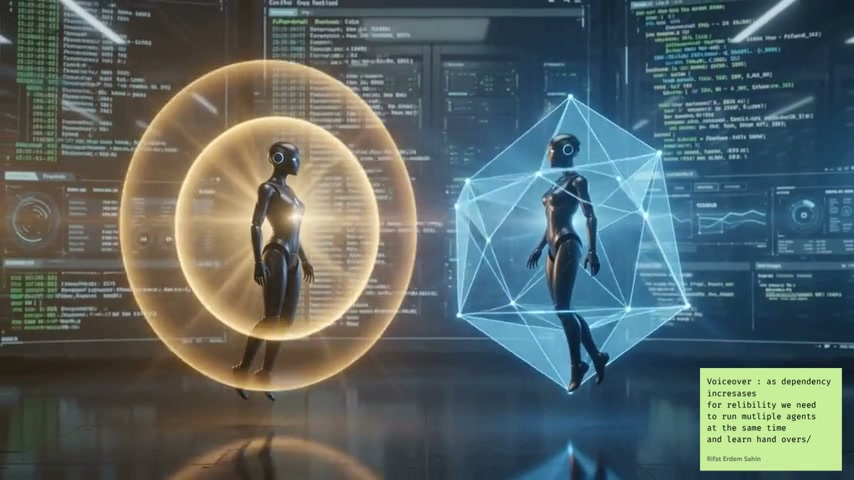

| Option | Voiceover Candidate Text | WPM | Tone |
| :--- | :--- | :--- | :--- |
| **Scratch VO** | Areas: long-term responsibilities you own continuously. | ~150 | Baseline |
| **⚡ AI Punchy** | Areas: permanent responsibilities you own. | ~165 | Energetic / Fast |
| **🧠 AI Strategic** | Areas zone manages continuous operational domain standards. | ~140 | Pedagogical / Authoritative |
| **🔥 AI Conversational** | Areas are ongoing responsibilities you manage every day. | ~145 | Direct & Relatable |

> ✍️ **[My Resonant Take]**:
> *Areas: long-term responsibilities you own continuously.*

---

### ⏱️ Timestamp: `01:03` (Second 63) · **Areas Zone (Blue)**
**Visual Action**: *Blue container #3498db with systems, infrastructure, and ops records.*

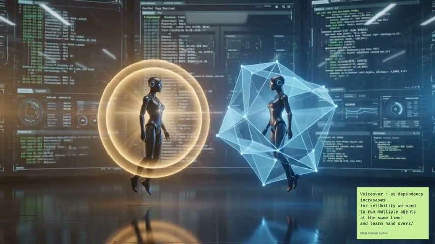

| Option | Voiceover Candidate Text | WPM | Tone |
| :--- | :--- | :--- | :--- |
| **Scratch VO** | Areas: long-term responsibilities you own continuously. | ~150 | Baseline |
| **⚡ AI Punchy** | Areas: permanent responsibilities you own. | ~165 | Energetic / Fast |
| **🧠 AI Strategic** | Areas zone manages continuous operational domain standards. | ~140 | Pedagogical / Authoritative |
| **🔥 AI Conversational** | Areas are ongoing responsibilities you manage every day. | ~145 | Direct & Relatable |

> ✍️ **[My Resonant Take]**:
> *Areas: long-term responsibilities you own continuously.*

---

### ⏱️ Timestamp: `01:04` (Second 64) · **Areas Zone (Blue)**
**Visual Action**: *Blue container #3498db with systems, infrastructure, and ops records.*

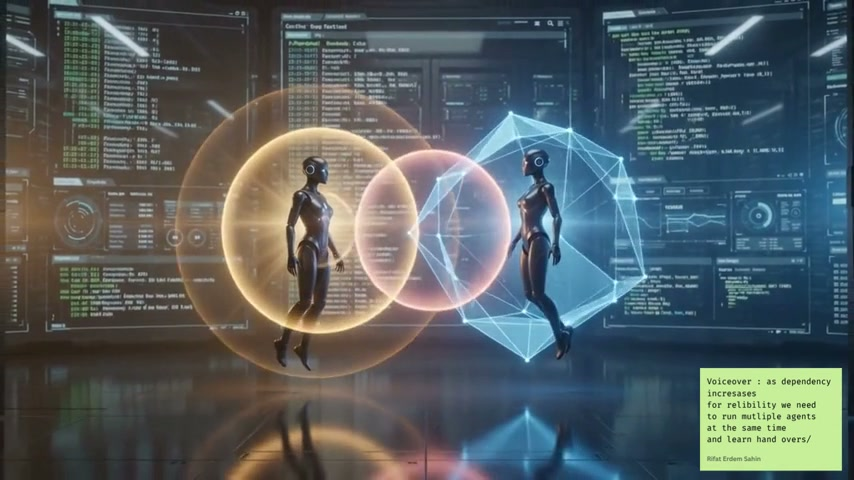

| Option | Voiceover Candidate Text | WPM | Tone |
| :--- | :--- | :--- | :--- |
| **Scratch VO** | Areas: long-term responsibilities you own continuously. | ~150 | Baseline |
| **⚡ AI Punchy** | Areas: permanent responsibilities you own. | ~165 | Energetic / Fast |
| **🧠 AI Strategic** | Areas zone manages continuous operational domain standards. | ~140 | Pedagogical / Authoritative |
| **🔥 AI Conversational** | Areas are ongoing responsibilities you manage every day. | ~145 | Direct & Relatable |

> ✍️ **[My Resonant Take]**:
> *Areas: long-term responsibilities you own continuously.*

---

### ⏱️ Timestamp: `01:05` (Second 65) · **Areas Zone (Blue)**
**Visual Action**: *Blue container #3498db with systems, infrastructure, and ops records.*

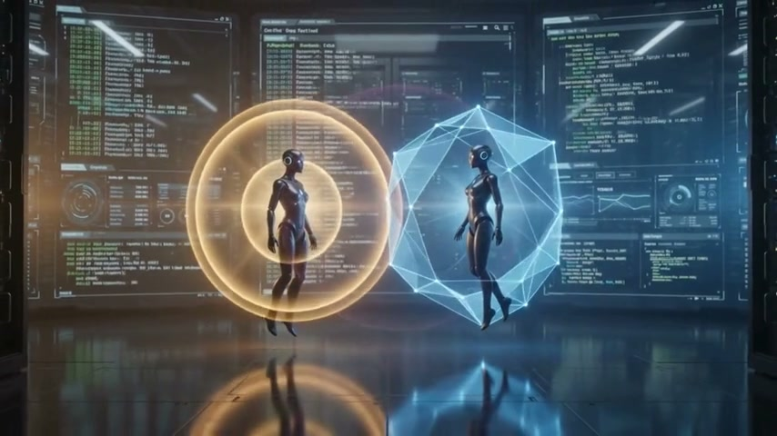

| Option | Voiceover Candidate Text | WPM | Tone |
| :--- | :--- | :--- | :--- |
| **Scratch VO** | Areas: long-term responsibilities you own continuously. | ~150 | Baseline |
| **⚡ AI Punchy** | Areas: permanent responsibilities you own. | ~165 | Energetic / Fast |
| **🧠 AI Strategic** | Areas zone manages continuous operational domain standards. | ~140 | Pedagogical / Authoritative |
| **🔥 AI Conversational** | Areas are ongoing responsibilities you manage every day. | ~145 | Direct & Relatable |

> ✍️ **[My Resonant Take]**:
> *Areas: long-term responsibilities you own continuously.*

---

### ⏱️ Timestamp: `01:06` (Second 66) · **Resources Zone (Green)**
**Visual Action**: *Green container #27ae60 with study material, research, and prompt templates.*

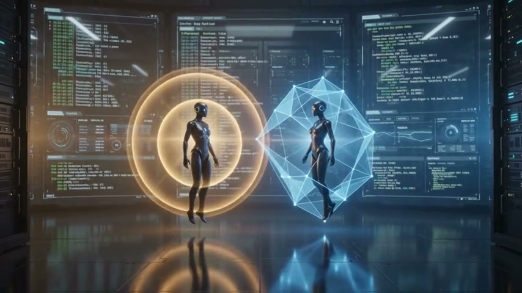

| Option | Voiceover Candidate Text | WPM | Tone |
| :--- | :--- | :--- | :--- |
| **Scratch VO** | Resources: reference guides and topics of interest. | ~150 | Baseline |
| **⚡ AI Punchy** | Resources: curated references and research. | ~165 | Energetic / Fast |
| **🧠 AI Strategic** | Resources contain reusable prompt engineering and reference artifacts. | ~140 | Pedagogical / Authoritative |
| **🔥 AI Conversational** | Resources are your reference guides, cheat sheets, and research. | ~145 | Direct & Relatable |

> ✍️ **[My Resonant Take]**:
> *Resources: reference guides and topics of interest.*

---

### ⏱️ Timestamp: `01:07` (Second 67) · **Resources Zone (Green)**
**Visual Action**: *Green container #27ae60 with study material, research, and prompt templates.*

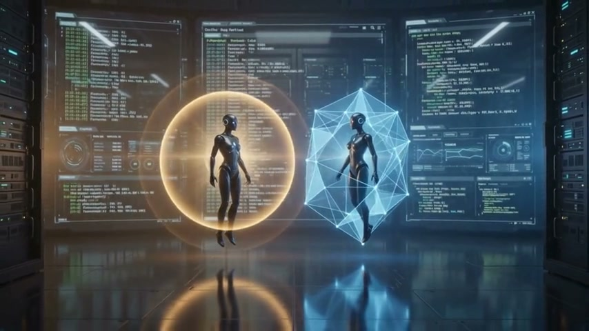

| Option | Voiceover Candidate Text | WPM | Tone |
| :--- | :--- | :--- | :--- |
| **Scratch VO** | Resources: reference guides and topics of interest. | ~150 | Baseline |
| **⚡ AI Punchy** | Resources: curated references and research. | ~165 | Energetic / Fast |
| **🧠 AI Strategic** | Resources contain reusable prompt engineering and reference artifacts. | ~140 | Pedagogical / Authoritative |
| **🔥 AI Conversational** | Resources are your reference guides, cheat sheets, and research. | ~145 | Direct & Relatable |

> ✍️ **[My Resonant Take]**:
> *Resources: reference guides and topics of interest.*

---

### ⏱️ Timestamp: `01:08` (Second 68) · **Resources Zone (Green)**
**Visual Action**: *Green container #27ae60 with study material, research, and prompt templates.*

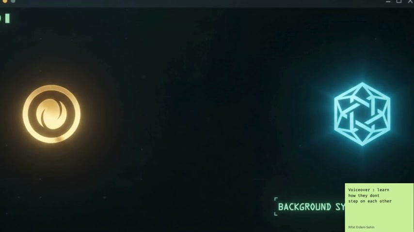

| Option | Voiceover Candidate Text | WPM | Tone |
| :--- | :--- | :--- | :--- |
| **Scratch VO** | Resources: reference guides and topics of interest. | ~150 | Baseline |
| **⚡ AI Punchy** | Resources: curated references and research. | ~165 | Energetic / Fast |
| **🧠 AI Strategic** | Resources contain reusable prompt engineering and reference artifacts. | ~140 | Pedagogical / Authoritative |
| **🔥 AI Conversational** | Resources are your reference guides, cheat sheets, and research. | ~145 | Direct & Relatable |

> ✍️ **[My Resonant Take]**:
> *Resources: reference guides and topics of interest.*

---

### ⏱️ Timestamp: `01:09` (Second 69) · **Resources Zone (Green)**
**Visual Action**: *Green container #27ae60 with study material, research, and prompt templates.*

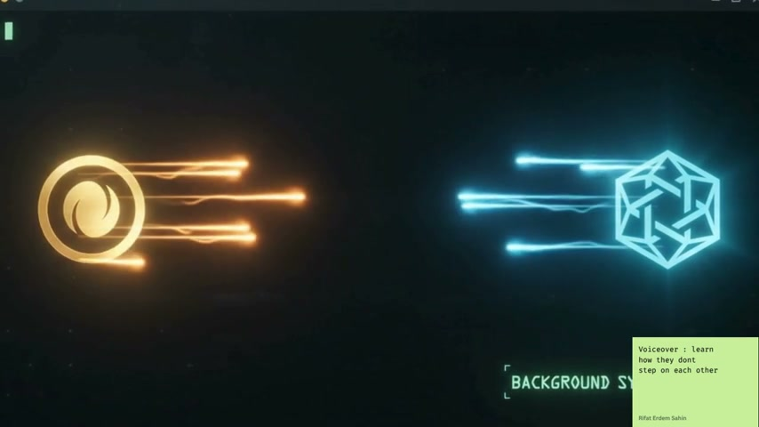

| Option | Voiceover Candidate Text | WPM | Tone |
| :--- | :--- | :--- | :--- |
| **Scratch VO** | Resources: reference guides and topics of interest. | ~150 | Baseline |
| **⚡ AI Punchy** | Resources: curated references and research. | ~165 | Energetic / Fast |
| **🧠 AI Strategic** | Resources contain reusable prompt engineering and reference artifacts. | ~140 | Pedagogical / Authoritative |
| **🔥 AI Conversational** | Resources are your reference guides, cheat sheets, and research. | ~145 | Direct & Relatable |

> ✍️ **[My Resonant Take]**:
> *Resources: reference guides and topics of interest.*

---

### ⏱️ Timestamp: `01:10` (Second 70) · **Resources Zone (Green)**
**Visual Action**: *Green container #27ae60 with study material, research, and prompt templates.*

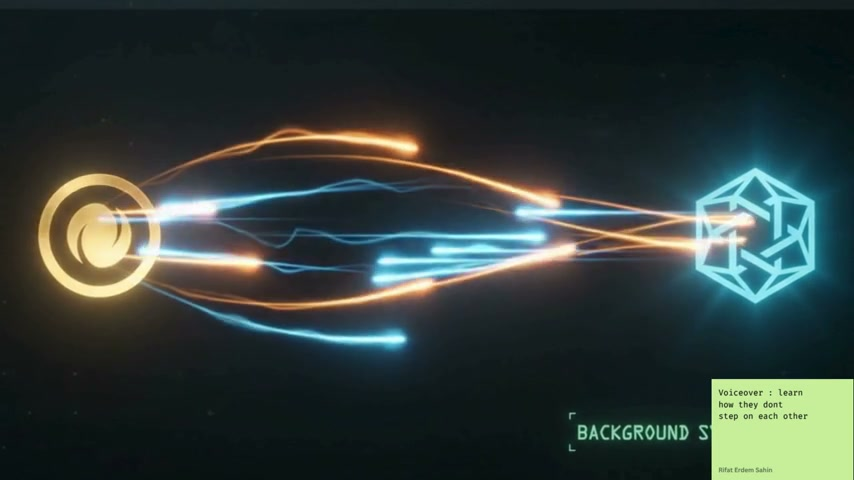

| Option | Voiceover Candidate Text | WPM | Tone |
| :--- | :--- | :--- | :--- |
| **Scratch VO** | Resources: reference guides and topics of interest. | ~150 | Baseline |
| **⚡ AI Punchy** | Resources: curated references and research. | ~165 | Energetic / Fast |
| **🧠 AI Strategic** | Resources contain reusable prompt engineering and reference artifacts. | ~140 | Pedagogical / Authoritative |
| **🔥 AI Conversational** | Resources are your reference guides, cheat sheets, and research. | ~145 | Direct & Relatable |

> ✍️ **[My Resonant Take]**:
> *Resources: reference guides and topics of interest.*

---

### ⏱️ Timestamp: `01:11` (Second 71) · **Resources Zone (Green)**
**Visual Action**: *Green container #27ae60 with study material, research, and prompt templates.*

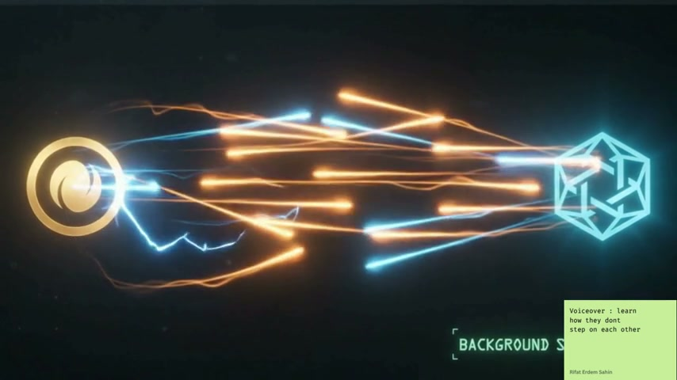

| Option | Voiceover Candidate Text | WPM | Tone |
| :--- | :--- | :--- | :--- |
| **Scratch VO** | Resources: reference guides and topics of interest. | ~150 | Baseline |
| **⚡ AI Punchy** | Resources: curated references and research. | ~165 | Energetic / Fast |
| **🧠 AI Strategic** | Resources contain reusable prompt engineering and reference artifacts. | ~140 | Pedagogical / Authoritative |
| **🔥 AI Conversational** | Resources are your reference guides, cheat sheets, and research. | ~145 | Direct & Relatable |

> ✍️ **[My Resonant Take]**:
> *Resources: reference guides and topics of interest.*

---

### ⏱️ Timestamp: `01:12` (Second 72) · **Archive Zone (Gray)**
**Visual Action**: *Gray container #95a5a6 with historical records indexed for fast retrieval.*

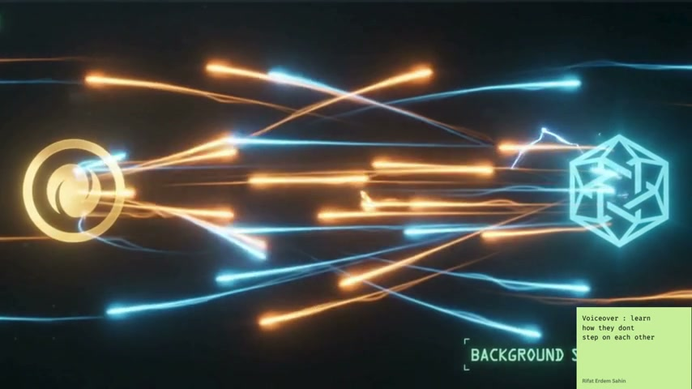

| Option | Voiceover Candidate Text | WPM | Tone |
| :--- | :--- | :--- | :--- |
| **Scratch VO** | And Archive: everything inactive, perfectly indexed. | ~150 | Baseline |
| **⚡ AI Punchy** | Archive: inactive history, perfectly indexed. | ~165 | Energetic / Fast |
| **🧠 AI Strategic** | Archive provides cold storage with deterministic semantic indexing. | ~140 | Pedagogical / Authoritative |
| **🔥 AI Conversational** | And Archive holds past projects, indexed so you never lose context. | ~145 | Direct & Relatable |

> ✍️ **[My Resonant Take]**:
> *And Archive: everything inactive, perfectly indexed.*

---

### ⏱️ Timestamp: `01:13` (Second 73) · **Archive Zone (Gray)**
**Visual Action**: *Gray container #95a5a6 with historical records indexed for fast retrieval.*

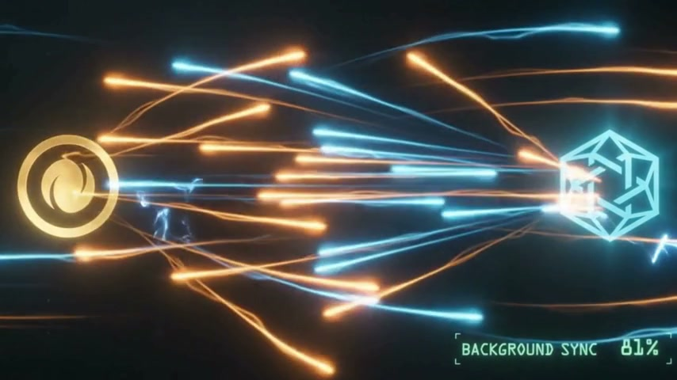

| Option | Voiceover Candidate Text | WPM | Tone |
| :--- | :--- | :--- | :--- |
| **Scratch VO** | And Archive: everything inactive, perfectly indexed. | ~150 | Baseline |
| **⚡ AI Punchy** | Archive: inactive history, perfectly indexed. | ~165 | Energetic / Fast |
| **🧠 AI Strategic** | Archive provides cold storage with deterministic semantic indexing. | ~140 | Pedagogical / Authoritative |
| **🔥 AI Conversational** | And Archive holds past projects, indexed so you never lose context. | ~145 | Direct & Relatable |

> ✍️ **[My Resonant Take]**:
> *And Archive: everything inactive, perfectly indexed.*

---

### ⏱️ Timestamp: `01:14` (Second 74) · **Archive Zone (Gray)**
**Visual Action**: *Gray container #95a5a6 with historical records indexed for fast retrieval.*

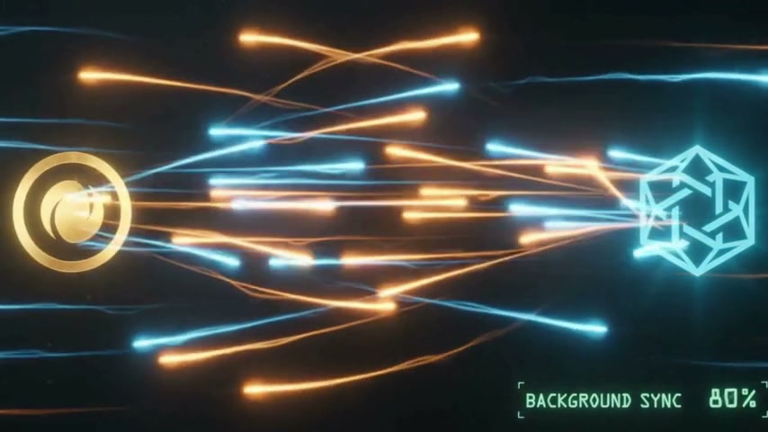

| Option | Voiceover Candidate Text | WPM | Tone |
| :--- | :--- | :--- | :--- |
| **Scratch VO** | And Archive: everything inactive, perfectly indexed. | ~150 | Baseline |
| **⚡ AI Punchy** | Archive: inactive history, perfectly indexed. | ~165 | Energetic / Fast |
| **🧠 AI Strategic** | Archive provides cold storage with deterministic semantic indexing. | ~140 | Pedagogical / Authoritative |
| **🔥 AI Conversational** | And Archive holds past projects, indexed so you never lose context. | ~145 | Direct & Relatable |

> ✍️ **[My Resonant Take]**:
> *And Archive: everything inactive, perfectly indexed.*

---

### ⏱️ Timestamp: `01:15` (Second 75) · **Archive Zone (Gray)**
**Visual Action**: *Gray container #95a5a6 with historical records indexed for fast retrieval.*

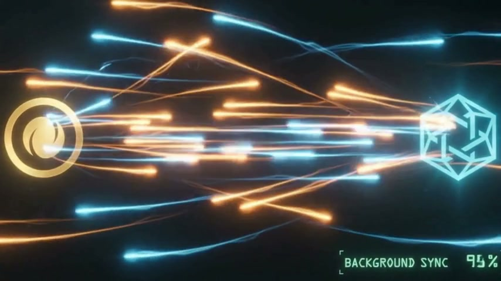

| Option | Voiceover Candidate Text | WPM | Tone |
| :--- | :--- | :--- | :--- |
| **Scratch VO** | And Archive: everything inactive, perfectly indexed. | ~150 | Baseline |
| **⚡ AI Punchy** | Archive: inactive history, perfectly indexed. | ~165 | Energetic / Fast |
| **🧠 AI Strategic** | Archive provides cold storage with deterministic semantic indexing. | ~140 | Pedagogical / Authoritative |
| **🔥 AI Conversational** | And Archive holds past projects, indexed so you never lose context. | ~145 | Direct & Relatable |

> ✍️ **[My Resonant Take]**:
> *And Archive: everything inactive, perfectly indexed.*

---

### ⏱️ Timestamp: `01:16` (Second 76) · **Archive Zone (Gray)**
**Visual Action**: *Gray container #95a5a6 with historical records indexed for fast retrieval.*

| Option | Voiceover Candidate Text | WPM | Tone |
| :--- | :--- | :--- | :--- |
| **Scratch VO** | And Archive: everything inactive, perfectly indexed. | ~150 | Baseline |
| **⚡ AI Punchy** | Archive: inactive history, perfectly indexed. | ~165 | Energetic / Fast |
| **🧠 AI Strategic** | Archive provides cold storage with deterministic semantic indexing. | ~140 | Pedagogical / Authoritative |
| **🔥 AI Conversational** | And Archive holds past projects, indexed so you never lose context. | ~145 | Direct & Relatable |

> ✍️ **[My Resonant Take]**:
> *And Archive: everything inactive, perfectly indexed.*

---

### ⏱️ Timestamp: `01:17` (Second 77) · **Archive Zone (Gray)**
**Visual Action**: *Gray container #95a5a6 with historical records indexed for fast retrieval.*

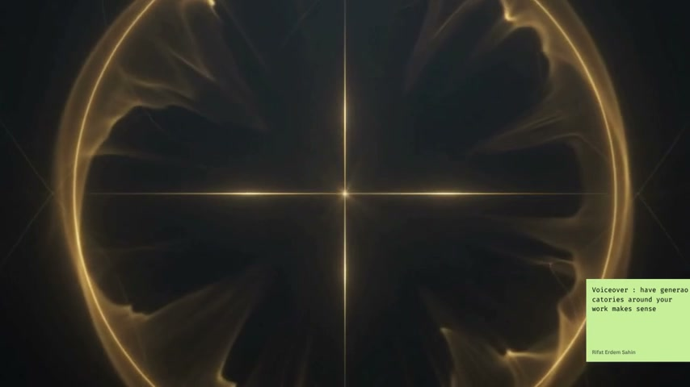

| Option | Voiceover Candidate Text | WPM | Tone |
| :--- | :--- | :--- | :--- |
| **Scratch VO** | And Archive: everything inactive, perfectly indexed. | ~150 | Baseline |
| **⚡ AI Punchy** | Archive: inactive history, perfectly indexed. | ~165 | Energetic / Fast |
| **🧠 AI Strategic** | Archive provides cold storage with deterministic semantic indexing. | ~140 | Pedagogical / Authoritative |
| **🔥 AI Conversational** | And Archive holds past projects, indexed so you never lose context. | ~145 | Direct & Relatable |

> ✍️ **[My Resonant Take]**:
> *And Archive: everything inactive, perfectly indexed.*

---

### ⏱️ Timestamp: `01:18` (Second 78) · **100x AI Speed Multiplier**
**Visual Action**: *AI search benchmark radar graph shows 100x retrieval acceleration.*

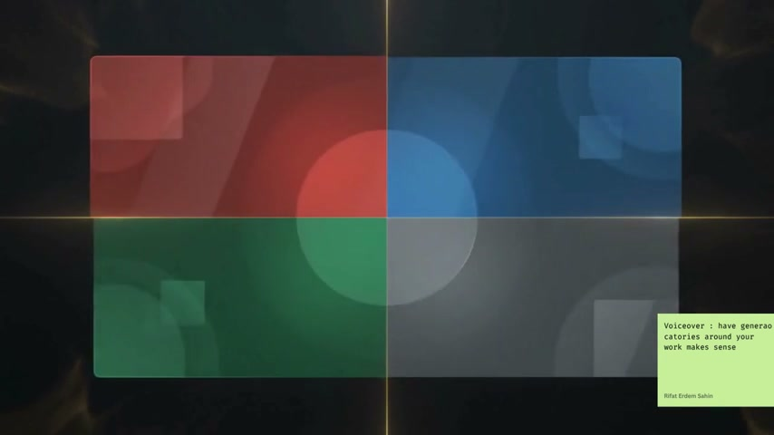

| Option | Voiceover Candidate Text | WPM | Tone |
| :--- | :--- | :--- | :--- |
| **Scratch VO** | AI agents navigate structured vaults 100x faster than messy folders. | ~150 | Baseline |
| **⚡ AI Punchy** | AI navigates clean structure 100x faster. | ~165 | Energetic / Fast |
| **🧠 AI Strategic** | Structured taxonomy cuts vector search latency by 99%. | ~140 | Pedagogical / Authoritative |
| **🔥 AI Conversational** | Clean structure means your AI agents find answers in seconds. | ~145 | Direct & Relatable |

> ✍️ **[My Resonant Take]**:
> *AI agents navigate structured vaults 100x faster than messy folders.*

---

### ⏱️ Timestamp: `01:19` (Second 79) · **100x AI Speed Multiplier**
**Visual Action**: *AI search benchmark radar graph shows 100x retrieval acceleration.*

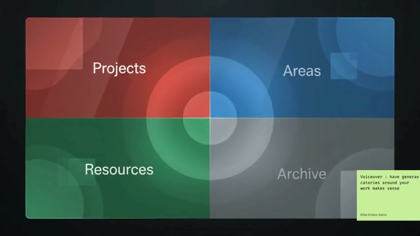

| Option | Voiceover Candidate Text | WPM | Tone |
| :--- | :--- | :--- | :--- |
| **Scratch VO** | AI agents navigate structured vaults 100x faster than messy folders. | ~150 | Baseline |
| **⚡ AI Punchy** | AI navigates clean structure 100x faster. | ~165 | Energetic / Fast |
| **🧠 AI Strategic** | Structured taxonomy cuts vector search latency by 99%. | ~140 | Pedagogical / Authoritative |
| **🔥 AI Conversational** | Clean structure means your AI agents find answers in seconds. | ~145 | Direct & Relatable |

> ✍️ **[My Resonant Take]**:
> *AI agents navigate structured vaults 100x faster than messy folders.*

---

### ⏱️ Timestamp: `01:20` (Second 80) · **100x AI Speed Multiplier**
**Visual Action**: *AI search benchmark radar graph shows 100x retrieval acceleration.*

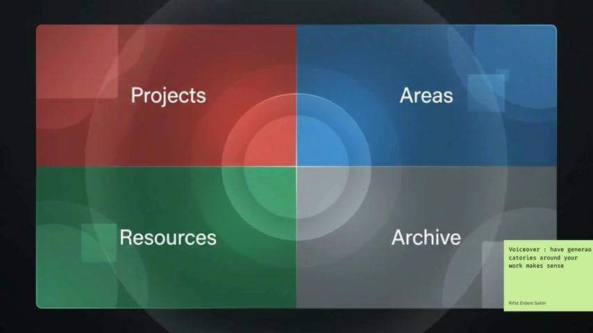

| Option | Voiceover Candidate Text | WPM | Tone |
| :--- | :--- | :--- | :--- |
| **Scratch VO** | AI agents navigate structured vaults 100x faster than messy folders. | ~150 | Baseline |
| **⚡ AI Punchy** | AI navigates clean structure 100x faster. | ~165 | Energetic / Fast |
| **🧠 AI Strategic** | Structured taxonomy cuts vector search latency by 99%. | ~140 | Pedagogical / Authoritative |
| **🔥 AI Conversational** | Clean structure means your AI agents find answers in seconds. | ~145 | Direct & Relatable |

> ✍️ **[My Resonant Take]**:
> *AI agents navigate structured vaults 100x faster than messy folders.*

---

### ⏱️ Timestamp: `01:21` (Second 81) · **100x AI Speed Multiplier**
**Visual Action**: *AI search benchmark radar graph shows 100x retrieval acceleration.*

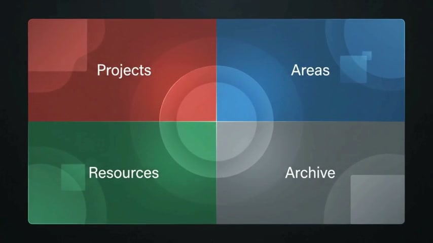

| Option | Voiceover Candidate Text | WPM | Tone |
| :--- | :--- | :--- | :--- |
| **Scratch VO** | AI agents navigate structured vaults 100x faster than messy folders. | ~150 | Baseline |
| **⚡ AI Punchy** | AI navigates clean structure 100x faster. | ~165 | Energetic / Fast |
| **🧠 AI Strategic** | Structured taxonomy cuts vector search latency by 99%. | ~140 | Pedagogical / Authoritative |
| **🔥 AI Conversational** | Clean structure means your AI agents find answers in seconds. | ~145 | Direct & Relatable |

> ✍️ **[My Resonant Take]**:
> *AI agents navigate structured vaults 100x faster than messy folders.*

---

### ⏱️ Timestamp: `01:22` (Second 82) · **100x AI Speed Multiplier**
**Visual Action**: *AI search benchmark radar graph shows 100x retrieval acceleration.*

| Option | Voiceover Candidate Text | WPM | Tone |
| :--- | :--- | :--- | :--- |
| **Scratch VO** | AI agents navigate structured vaults 100x faster than messy folders. | ~150 | Baseline |
| **⚡ AI Punchy** | AI navigates clean structure 100x faster. | ~165 | Energetic / Fast |
| **🧠 AI Strategic** | Structured taxonomy cuts vector search latency by 99%. | ~140 | Pedagogical / Authoritative |
| **🔥 AI Conversational** | Clean structure means your AI agents find answers in seconds. | ~145 | Direct & Relatable |

> ✍️ **[My Resonant Take]**:
> *AI agents navigate structured vaults 100x faster than messy folders.*

---

### ⏱️ Timestamp: `01:23` (Second 83) · **100x AI Speed Multiplier**
**Visual Action**: *AI search benchmark radar graph shows 100x retrieval acceleration.*

| Option | Voiceover Candidate Text | WPM | Tone |
| :--- | :--- | :--- | :--- |
| **Scratch VO** | AI agents navigate structured vaults 100x faster than messy folders. | ~150 | Baseline |
| **⚡ AI Punchy** | AI navigates clean structure 100x faster. | ~165 | Energetic / Fast |
| **🧠 AI Strategic** | Structured taxonomy cuts vector search latency by 99%. | ~140 | Pedagogical / Authoritative |
| **🔥 AI Conversational** | Clean structure means your AI agents find answers in seconds. | ~145 | Direct & Relatable |

> ✍️ **[My Resonant Take]**:
> *AI agents navigate structured vaults 100x faster than messy folders.*

---

### ⏱️ Timestamp: `01:24` (Second 84) · **100x AI Speed Multiplier**
**Visual Action**: *AI search benchmark radar graph shows 100x retrieval acceleration.*

| Option | Voiceover Candidate Text | WPM | Tone |
| :--- | :--- | :--- | :--- |
| **Scratch VO** | AI agents navigate structured vaults 100x faster than messy folders. | ~150 | Baseline |
| **⚡ AI Punchy** | AI navigates clean structure 100x faster. | ~165 | Energetic / Fast |
| **🧠 AI Strategic** | Structured taxonomy cuts vector search latency by 99%. | ~140 | Pedagogical / Authoritative |
| **🔥 AI Conversational** | Clean structure means your AI agents find answers in seconds. | ~145 | Direct & Relatable |

> ✍️ **[My Resonant Take]**:
> *AI agents navigate structured vaults 100x faster than messy folders.*

---

## 🎬 Scene 4: The Engine: Dual-Agent System `[01:25]`
**Baseline Script Reference**: *"Then comes the engine: a local dual-agent orchestration rig."*

### ⏱️ Timestamp: `01:25` (Second 85) · **The Local Orchestration Rig**
**Visual Action**: *Terminal dashboard boots at localhost:8899 with dual agent avatars.*

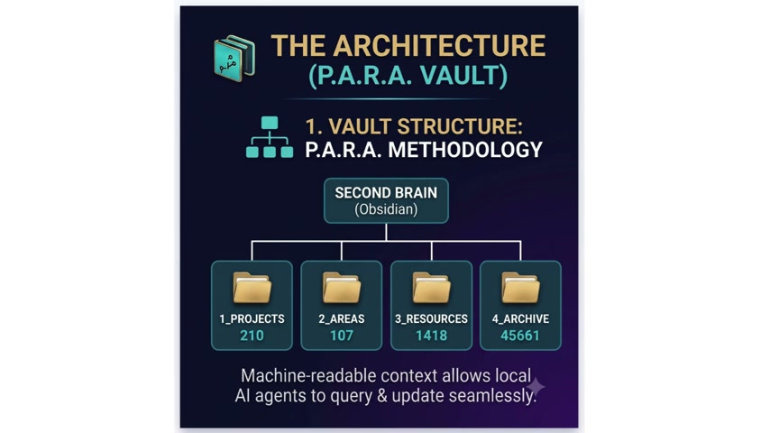

| Option | Voiceover Candidate Text | WPM | Tone |
| :--- | :--- | :--- | :--- |
| **Scratch VO** | Then comes the engine: a local dual-agent orchestration rig. | ~150 | Baseline |
| **⚡ AI Punchy** | The engine: a local dual-agent orchestration rig. | ~165 | Energetic / Fast |
| **🧠 AI Strategic** | A resilient multi-agent architecture executing locally. | ~140 | Pedagogical / Authoritative |
| **🔥 AI Conversational** | Here is the engine: a local dual-agent rig running on your machine. | ~145 | Direct & Relatable |

> ✍️ **[My Resonant Take]**:
> *Then comes the engine: a local dual-agent orchestration rig.*

---

### ⏱️ Timestamp: `01:26` (Second 86) · **The Local Orchestration Rig**
**Visual Action**: *Terminal dashboard boots at localhost:8899 with dual agent avatars.*

| Option | Voiceover Candidate Text | WPM | Tone |
| :--- | :--- | :--- | :--- |
| **Scratch VO** | Then comes the engine: a local dual-agent orchestration rig. | ~150 | Baseline |
| **⚡ AI Punchy** | The engine: a local dual-agent orchestration rig. | ~165 | Energetic / Fast |
| **🧠 AI Strategic** | A resilient multi-agent architecture executing locally. | ~140 | Pedagogical / Authoritative |
| **🔥 AI Conversational** | Here is the engine: a local dual-agent rig running on your machine. | ~145 | Direct & Relatable |

> ✍️ **[My Resonant Take]**:
> *Then comes the engine: a local dual-agent orchestration rig.*

---

### ⏱️ Timestamp: `01:27` (Second 87) · **The Local Orchestration Rig**
**Visual Action**: *Terminal dashboard boots at localhost:8899 with dual agent avatars.*

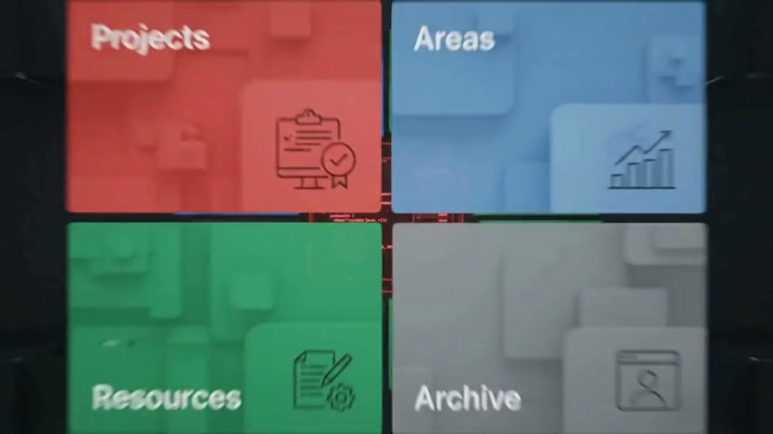

| Option | Voiceover Candidate Text | WPM | Tone |
| :--- | :--- | :--- | :--- |
| **Scratch VO** | Then comes the engine: a local dual-agent orchestration rig. | ~150 | Baseline |
| **⚡ AI Punchy** | The engine: a local dual-agent orchestration rig. | ~165 | Energetic / Fast |
| **🧠 AI Strategic** | A resilient multi-agent architecture executing locally. | ~140 | Pedagogical / Authoritative |
| **🔥 AI Conversational** | Here is the engine: a local dual-agent rig running on your machine. | ~145 | Direct & Relatable |

> ✍️ **[My Resonant Take]**:
> *Then comes the engine: a local dual-agent orchestration rig.*

---

### ⏱️ Timestamp: `01:28` (Second 88) · **The Local Orchestration Rig**
**Visual Action**: *Terminal dashboard boots at localhost:8899 with dual agent avatars.*

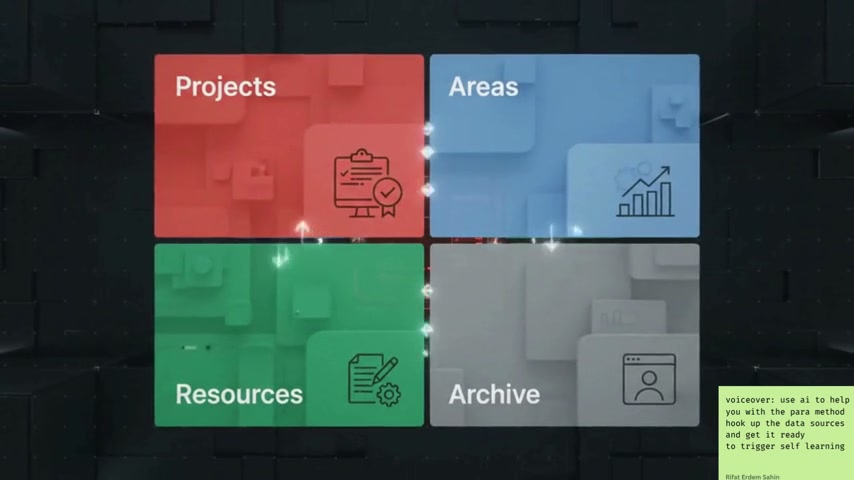

| Option | Voiceover Candidate Text | WPM | Tone |
| :--- | :--- | :--- | :--- |
| **Scratch VO** | Then comes the engine: a local dual-agent orchestration rig. | ~150 | Baseline |
| **⚡ AI Punchy** | The engine: a local dual-agent orchestration rig. | ~165 | Energetic / Fast |
| **🧠 AI Strategic** | A resilient multi-agent architecture executing locally. | ~140 | Pedagogical / Authoritative |
| **🔥 AI Conversational** | Here is the engine: a local dual-agent rig running on your machine. | ~145 | Direct & Relatable |

> ✍️ **[My Resonant Take]**:
> *Then comes the engine: a local dual-agent orchestration rig.*

---

### ⏱️ Timestamp: `01:29` (Second 89) · **The Local Orchestration Rig**
**Visual Action**: *Terminal dashboard boots at localhost:8899 with dual agent avatars.*

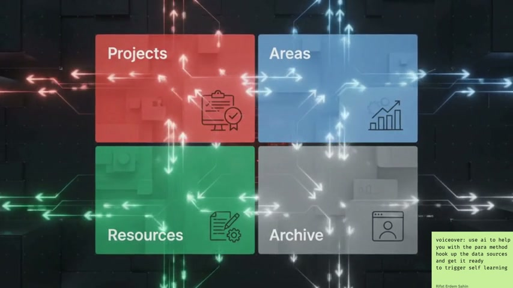

| Option | Voiceover Candidate Text | WPM | Tone |
| :--- | :--- | :--- | :--- |
| **Scratch VO** | Then comes the engine: a local dual-agent orchestration rig. | ~150 | Baseline |
| **⚡ AI Punchy** | The engine: a local dual-agent orchestration rig. | ~165 | Energetic / Fast |
| **🧠 AI Strategic** | A resilient multi-agent architecture executing locally. | ~140 | Pedagogical / Authoritative |
| **🔥 AI Conversational** | Here is the engine: a local dual-agent rig running on your machine. | ~145 | Direct & Relatable |

> ✍️ **[My Resonant Take]**:
> *Then comes the engine: a local dual-agent orchestration rig.*

---

### ⏱️ Timestamp: `01:30` (Second 90) · **Gemini Gold & Claude Blue**
**Visual Action**: *Gemini Gold and Claude Blue avatars exchange structured JSON payloads.*

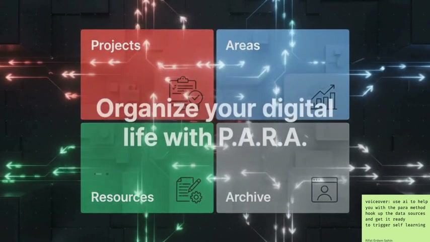

| Option | Voiceover Candidate Text | WPM | Tone |
| :--- | :--- | :--- | :--- |
| **Scratch VO** | Running Gemini and Claude in parallel tandem. | ~150 | Baseline |
| **⚡ AI Punchy** | Gemini Gold and Claude Blue working in tandem. | ~165 | Energetic / Fast |
| **🧠 AI Strategic** | Dual frontier models operate concurrently for verification and synthesis. | ~140 | Pedagogical / Authoritative |
| **🔥 AI Conversational** | Gemini and Claude work together in real-time tandem. | ~145 | Direct & Relatable |

> ✍️ **[My Resonant Take]**:
> *Running Gemini and Claude in parallel tandem.*

---

### ⏱️ Timestamp: `01:31` (Second 91) · **Gemini Gold & Claude Blue**
**Visual Action**: *Gemini Gold and Claude Blue avatars exchange structured JSON payloads.*

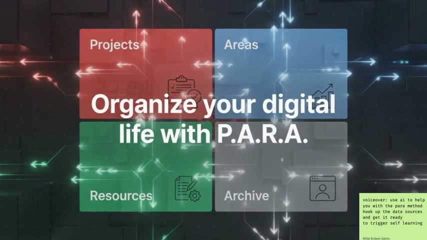

| Option | Voiceover Candidate Text | WPM | Tone |
| :--- | :--- | :--- | :--- |
| **Scratch VO** | Running Gemini and Claude in parallel tandem. | ~150 | Baseline |
| **⚡ AI Punchy** | Gemini Gold and Claude Blue working in tandem. | ~165 | Energetic / Fast |
| **🧠 AI Strategic** | Dual frontier models operate concurrently for verification and synthesis. | ~140 | Pedagogical / Authoritative |
| **🔥 AI Conversational** | Gemini and Claude work together in real-time tandem. | ~145 | Direct & Relatable |

> ✍️ **[My Resonant Take]**:
> *Running Gemini and Claude in parallel tandem.*

---

### ⏱️ Timestamp: `01:32` (Second 92) · **Gemini Gold & Claude Blue**
**Visual Action**: *Gemini Gold and Claude Blue avatars exchange structured JSON payloads.*

| Option | Voiceover Candidate Text | WPM | Tone |
| :--- | :--- | :--- | :--- |
| **Scratch VO** | Running Gemini and Claude in parallel tandem. | ~150 | Baseline |
| **⚡ AI Punchy** | Gemini Gold and Claude Blue working in tandem. | ~165 | Energetic / Fast |
| **🧠 AI Strategic** | Dual frontier models operate concurrently for verification and synthesis. | ~140 | Pedagogical / Authoritative |
| **🔥 AI Conversational** | Gemini and Claude work together in real-time tandem. | ~145 | Direct & Relatable |

> ✍️ **[My Resonant Take]**:
> *Running Gemini and Claude in parallel tandem.*

---

### ⏱️ Timestamp: `01:33` (Second 93) · **Gemini Gold & Claude Blue**
**Visual Action**: *Gemini Gold and Claude Blue avatars exchange structured JSON payloads.*

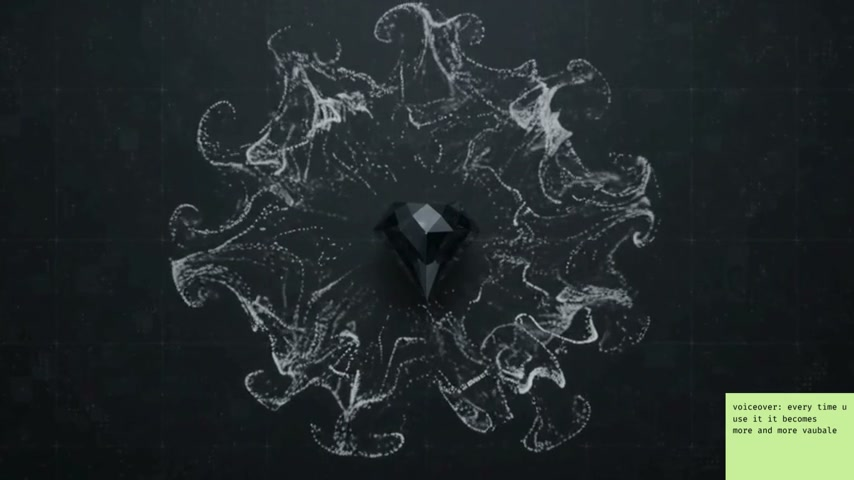

| Option | Voiceover Candidate Text | WPM | Tone |
| :--- | :--- | :--- | :--- |
| **Scratch VO** | Running Gemini and Claude in parallel tandem. | ~150 | Baseline |
| **⚡ AI Punchy** | Gemini Gold and Claude Blue working in tandem. | ~165 | Energetic / Fast |
| **🧠 AI Strategic** | Dual frontier models operate concurrently for verification and synthesis. | ~140 | Pedagogical / Authoritative |
| **🔥 AI Conversational** | Gemini and Claude work together in real-time tandem. | ~145 | Direct & Relatable |

> ✍️ **[My Resonant Take]**:
> *Running Gemini and Claude in parallel tandem.*

---

### ⏱️ Timestamp: `01:34` (Second 94) · **Gemini Gold & Claude Blue**
**Visual Action**: *Gemini Gold and Claude Blue avatars exchange structured JSON payloads.*

| Option | Voiceover Candidate Text | WPM | Tone |
| :--- | :--- | :--- | :--- |
| **Scratch VO** | Running Gemini and Claude in parallel tandem. | ~150 | Baseline |
| **⚡ AI Punchy** | Gemini Gold and Claude Blue working in tandem. | ~165 | Energetic / Fast |
| **🧠 AI Strategic** | Dual frontier models operate concurrently for verification and synthesis. | ~140 | Pedagogical / Authoritative |
| **🔥 AI Conversational** | Gemini and Claude work together in real-time tandem. | ~145 | Direct & Relatable |

> ✍️ **[My Resonant Take]**:
> *Running Gemini and Claude in parallel tandem.*

---

### ⏱️ Timestamp: `01:35` (Second 95) · **Gemini Gold & Claude Blue**
**Visual Action**: *Gemini Gold and Claude Blue avatars exchange structured JSON payloads.*

| Option | Voiceover Candidate Text | WPM | Tone |
| :--- | :--- | :--- | :--- |
| **Scratch VO** | Running Gemini and Claude in parallel tandem. | ~150 | Baseline |
| **⚡ AI Punchy** | Gemini Gold and Claude Blue working in tandem. | ~165 | Energetic / Fast |
| **🧠 AI Strategic** | Dual frontier models operate concurrently for verification and synthesis. | ~140 | Pedagogical / Authoritative |
| **🔥 AI Conversational** | Gemini and Claude work together in real-time tandem. | ~145 | Direct & Relatable |

> ✍️ **[My Resonant Take]**:
> *Running Gemini and Claude in parallel tandem.*

---

### ⏱️ Timestamp: `01:36` (Second 96) · **Background Autonomous Work**
**Visual Action**: *Background workers sync data streams silently while user writes code.*

| Option | Voiceover Candidate Text | WPM | Tone |
| :--- | :--- | :--- | :--- |
| **Scratch VO** | Running silently in the background while you focus on work. | ~150 | Baseline |
| **⚡ AI Punchy** | Running in the background while you build. | ~165 | Energetic / Fast |
| **🧠 AI Strategic** | Asynchronous event loops handle background maintenance jobs. | ~140 | Pedagogical / Authoritative |
| **🔥 AI Conversational** | They run silently in the background while you focus on shipping. | ~145 | Direct & Relatable |

> ✍️ **[My Resonant Take]**:
> *Running silently in the background while you focus on work.*

---

### ⏱️ Timestamp: `01:37` (Second 97) · **Background Autonomous Work**
**Visual Action**: *Background workers sync data streams silently while user writes code.*

| Option | Voiceover Candidate Text | WPM | Tone |
| :--- | :--- | :--- | :--- |
| **Scratch VO** | Running silently in the background while you focus on work. | ~150 | Baseline |
| **⚡ AI Punchy** | Running in the background while you build. | ~165 | Energetic / Fast |
| **🧠 AI Strategic** | Asynchronous event loops handle background maintenance jobs. | ~140 | Pedagogical / Authoritative |
| **🔥 AI Conversational** | They run silently in the background while you focus on shipping. | ~145 | Direct & Relatable |

> ✍️ **[My Resonant Take]**:
> *Running silently in the background while you focus on work.*

---

### ⏱️ Timestamp: `01:38` (Second 98) · **Background Autonomous Work**
**Visual Action**: *Background workers sync data streams silently while user writes code.*

| Option | Voiceover Candidate Text | WPM | Tone |
| :--- | :--- | :--- | :--- |
| **Scratch VO** | Running silently in the background while you focus on work. | ~150 | Baseline |
| **⚡ AI Punchy** | Running in the background while you build. | ~165 | Energetic / Fast |
| **🧠 AI Strategic** | Asynchronous event loops handle background maintenance jobs. | ~140 | Pedagogical / Authoritative |
| **🔥 AI Conversational** | They run silently in the background while you focus on shipping. | ~145 | Direct & Relatable |

> ✍️ **[My Resonant Take]**:
> *Running silently in the background while you focus on work.*

---

### ⏱️ Timestamp: `01:39` (Second 99) · **Background Autonomous Work**
**Visual Action**: *Background workers sync data streams silently while user writes code.*

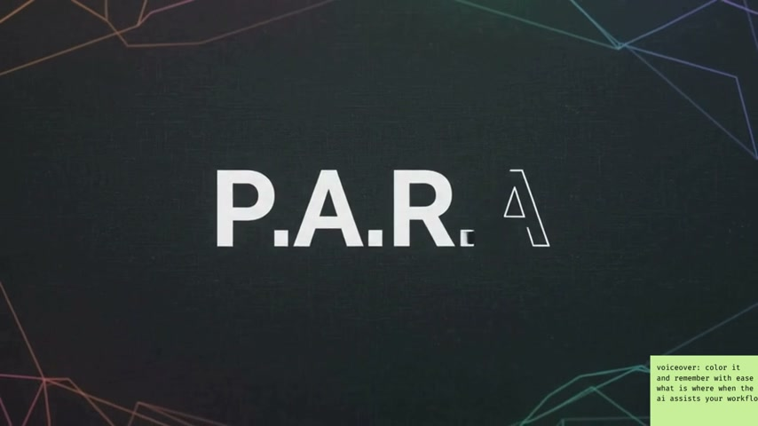

| Option | Voiceover Candidate Text | WPM | Tone |
| :--- | :--- | :--- | :--- |
| **Scratch VO** | Running silently in the background while you focus on work. | ~150 | Baseline |
| **⚡ AI Punchy** | Running in the background while you build. | ~165 | Energetic / Fast |
| **🧠 AI Strategic** | Asynchronous event loops handle background maintenance jobs. | ~140 | Pedagogical / Authoritative |
| **🔥 AI Conversational** | They run silently in the background while you focus on shipping. | ~145 | Direct & Relatable |

> ✍️ **[My Resonant Take]**:
> *Running silently in the background while you focus on work.*

---

### ⏱️ Timestamp: `01:40` (Second 100) · **Background Autonomous Work**
**Visual Action**: *Background workers sync data streams silently while user writes code.*

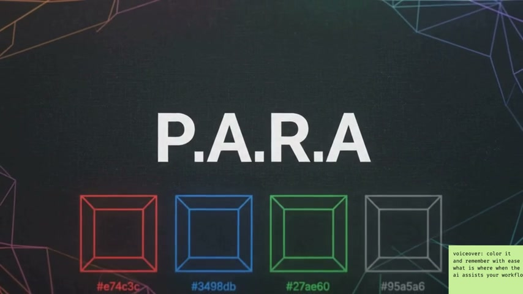

| Option | Voiceover Candidate Text | WPM | Tone |
| :--- | :--- | :--- | :--- |
| **Scratch VO** | Running silently in the background while you focus on work. | ~150 | Baseline |
| **⚡ AI Punchy** | Running in the background while you build. | ~165 | Energetic / Fast |
| **🧠 AI Strategic** | Asynchronous event loops handle background maintenance jobs. | ~140 | Pedagogical / Authoritative |
| **🔥 AI Conversational** | They run silently in the background while you focus on shipping. | ~145 | Direct & Relatable |

> ✍️ **[My Resonant Take]**:
> *Running silently in the background while you focus on work.*

---

### ⏱️ Timestamp: `01:41` (Second 101) · **Background Autonomous Work**
**Visual Action**: *Background workers sync data streams silently while user writes code.*

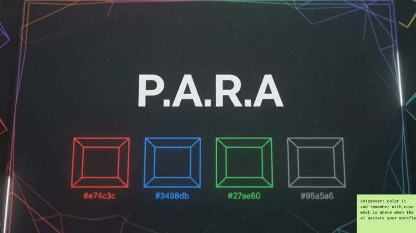

| Option | Voiceover Candidate Text | WPM | Tone |
| :--- | :--- | :--- | :--- |
| **Scratch VO** | Running silently in the background while you focus on work. | ~150 | Baseline |
| **⚡ AI Punchy** | Running in the background while you build. | ~165 | Energetic / Fast |
| **🧠 AI Strategic** | Asynchronous event loops handle background maintenance jobs. | ~140 | Pedagogical / Authoritative |
| **🔥 AI Conversational** | They run silently in the background while you focus on shipping. | ~145 | Direct & Relatable |

> ✍️ **[My Resonant Take]**:
> *Running silently in the background while you focus on work.*

---

### ⏱️ Timestamp: `01:42` (Second 102) · **Multi-Cloud Synchronization**
**Visual Action**: *Tri-directional sync streams to GitHub, Google Drive, and Proxmox icons.*

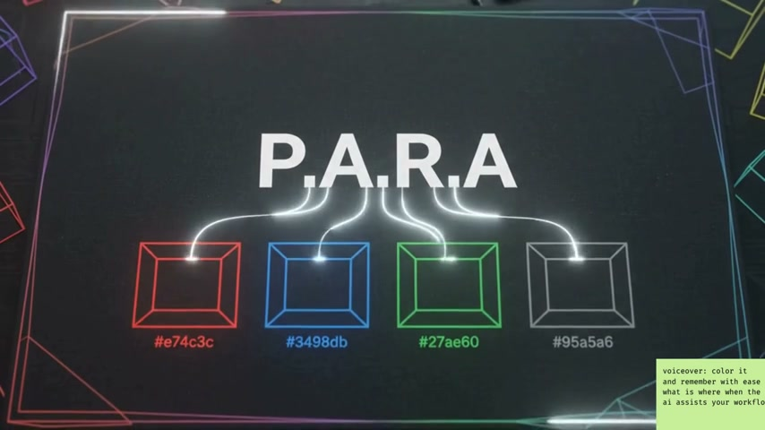

| Option | Voiceover Candidate Text | WPM | Tone |
| :--- | :--- | :--- | :--- |
| **Scratch VO** | Syncing across GitHub, Google Drive, and Proxmox. | ~150 | Baseline |
| **⚡ AI Punchy** | Syncing across GitHub, Drive, and Proxmox. | ~165 | Energetic / Fast |
| **🧠 AI Strategic** | Automated pipelines replicate state across multi-cloud infrastructure. | ~140 | Pedagogical / Authoritative |
| **🔥 AI Conversational** | Syncing all your files across GitHub, Drive, and Proxmox servers. | ~145 | Direct & Relatable |

> ✍️ **[My Resonant Take]**:
> *Syncing across GitHub, Google Drive, and Proxmox.*

---

### ⏱️ Timestamp: `01:43` (Second 103) · **Multi-Cloud Synchronization**
**Visual Action**: *Tri-directional sync streams to GitHub, Google Drive, and Proxmox icons.*

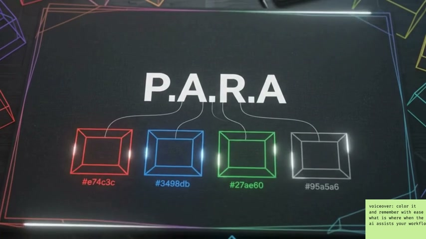

| Option | Voiceover Candidate Text | WPM | Tone |
| :--- | :--- | :--- | :--- |
| **Scratch VO** | Syncing across GitHub, Google Drive, and Proxmox. | ~150 | Baseline |
| **⚡ AI Punchy** | Syncing across GitHub, Drive, and Proxmox. | ~165 | Energetic / Fast |
| **🧠 AI Strategic** | Automated pipelines replicate state across multi-cloud infrastructure. | ~140 | Pedagogical / Authoritative |
| **🔥 AI Conversational** | Syncing all your files across GitHub, Drive, and Proxmox servers. | ~145 | Direct & Relatable |

> ✍️ **[My Resonant Take]**:
> *Syncing across GitHub, Google Drive, and Proxmox.*

---

### ⏱️ Timestamp: `01:44` (Second 104) · **Multi-Cloud Synchronization**
**Visual Action**: *Tri-directional sync streams to GitHub, Google Drive, and Proxmox icons.*

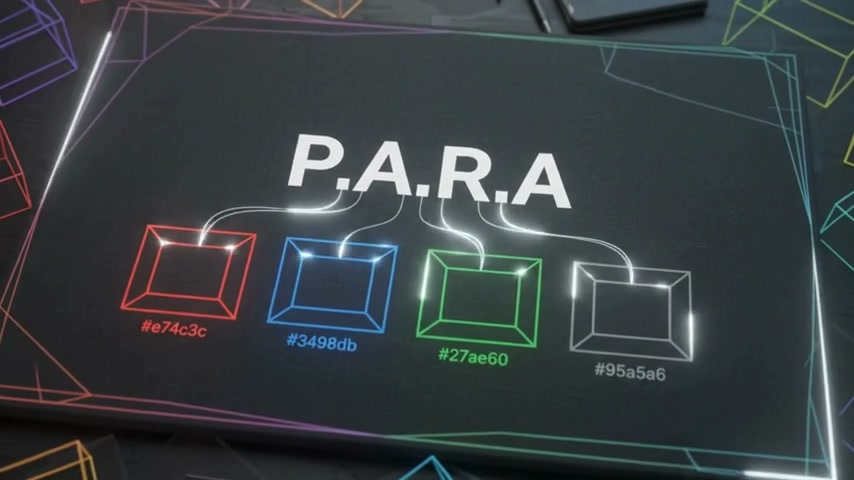

| Option | Voiceover Candidate Text | WPM | Tone |
| :--- | :--- | :--- | :--- |
| **Scratch VO** | Syncing across GitHub, Google Drive, and Proxmox. | ~150 | Baseline |
| **⚡ AI Punchy** | Syncing across GitHub, Drive, and Proxmox. | ~165 | Energetic / Fast |
| **🧠 AI Strategic** | Automated pipelines replicate state across multi-cloud infrastructure. | ~140 | Pedagogical / Authoritative |
| **🔥 AI Conversational** | Syncing all your files across GitHub, Drive, and Proxmox servers. | ~145 | Direct & Relatable |

> ✍️ **[My Resonant Take]**:
> *Syncing across GitHub, Google Drive, and Proxmox.*

---

### ⏱️ Timestamp: `01:45` (Second 105) · **Multi-Cloud Synchronization**
**Visual Action**: *Tri-directional sync streams to GitHub, Google Drive, and Proxmox icons.*

| Option | Voiceover Candidate Text | WPM | Tone |
| :--- | :--- | :--- | :--- |
| **Scratch VO** | Syncing across GitHub, Google Drive, and Proxmox. | ~150 | Baseline |
| **⚡ AI Punchy** | Syncing across GitHub, Drive, and Proxmox. | ~165 | Energetic / Fast |
| **🧠 AI Strategic** | Automated pipelines replicate state across multi-cloud infrastructure. | ~140 | Pedagogical / Authoritative |
| **🔥 AI Conversational** | Syncing all your files across GitHub, Drive, and Proxmox servers. | ~145 | Direct & Relatable |

> ✍️ **[My Resonant Take]**:
> *Syncing across GitHub, Google Drive, and Proxmox.*

---

### ⏱️ Timestamp: `01:46` (Second 106) · **Multi-Cloud Synchronization**
**Visual Action**: *Tri-directional sync streams to GitHub, Google Drive, and Proxmox icons.*

| Option | Voiceover Candidate Text | WPM | Tone |
| :--- | :--- | :--- | :--- |
| **Scratch VO** | Syncing across GitHub, Google Drive, and Proxmox. | ~150 | Baseline |
| **⚡ AI Punchy** | Syncing across GitHub, Drive, and Proxmox. | ~165 | Energetic / Fast |
| **🧠 AI Strategic** | Automated pipelines replicate state across multi-cloud infrastructure. | ~140 | Pedagogical / Authoritative |
| **🔥 AI Conversational** | Syncing all your files across GitHub, Drive, and Proxmox servers. | ~145 | Direct & Relatable |

> ✍️ **[My Resonant Take]**:
> *Syncing across GitHub, Google Drive, and Proxmox.*

---

### ⏱️ Timestamp: `01:47` (Second 107) · **Multi-Cloud Synchronization**
**Visual Action**: *Tri-directional sync streams to GitHub, Google Drive, and Proxmox icons.*

| Option | Voiceover Candidate Text | WPM | Tone |
| :--- | :--- | :--- | :--- |
| **Scratch VO** | Syncing across GitHub, Google Drive, and Proxmox. | ~150 | Baseline |
| **⚡ AI Punchy** | Syncing across GitHub, Drive, and Proxmox. | ~165 | Energetic / Fast |
| **🧠 AI Strategic** | Automated pipelines replicate state across multi-cloud infrastructure. | ~140 | Pedagogical / Authoritative |
| **🔥 AI Conversational** | Syncing all your files across GitHub, Drive, and Proxmox servers. | ~145 | Direct & Relatable |

> ✍️ **[My Resonant Take]**:
> *Syncing across GitHub, Google Drive, and Proxmox.*

---

### ⏱️ Timestamp: `01:48` (Second 108) · **Changelogs & Maintenance**
**Visual Action**: *Automated git commit diffs, vault changelogs, and audit logs render live.*

| Option | Voiceover Candidate Text | WPM | Tone |
| :--- | :--- | :--- | :--- |
| **Scratch VO** | Generating changelogs and maintaining folder integrity. | ~150 | Baseline |
| **⚡ AI Punchy** | Writing changelogs and keeping structures clean. | ~165 | Energetic / Fast |
| **🧠 AI Strategic** | Autonomous auditing guarantees zero drift across documentation repositories. | ~140 | Pedagogical / Authoritative |
| **🔥 AI Conversational** | Generating clean changelogs and keeping your structure spotless. | ~145 | Direct & Relatable |

> ✍️ **[My Resonant Take]**:
> *Generating changelogs and maintaining folder integrity.*

---

### ⏱️ Timestamp: `01:49` (Second 109) · **Changelogs & Maintenance**
**Visual Action**: *Automated git commit diffs, vault changelogs, and audit logs render live.*

| Option | Voiceover Candidate Text | WPM | Tone |
| :--- | :--- | :--- | :--- |
| **Scratch VO** | Generating changelogs and maintaining folder integrity. | ~150 | Baseline |
| **⚡ AI Punchy** | Writing changelogs and keeping structures clean. | ~165 | Energetic / Fast |
| **🧠 AI Strategic** | Autonomous auditing guarantees zero drift across documentation repositories. | ~140 | Pedagogical / Authoritative |
| **🔥 AI Conversational** | Generating clean changelogs and keeping your structure spotless. | ~145 | Direct & Relatable |

> ✍️ **[My Resonant Take]**:
> *Generating changelogs and maintaining folder integrity.*

---

### ⏱️ Timestamp: `01:50` (Second 110) · **Changelogs & Maintenance**
**Visual Action**: *Automated git commit diffs, vault changelogs, and audit logs render live.*

| Option | Voiceover Candidate Text | WPM | Tone |
| :--- | :--- | :--- | :--- |
| **Scratch VO** | Generating changelogs and maintaining folder integrity. | ~150 | Baseline |
| **⚡ AI Punchy** | Writing changelogs and keeping structures clean. | ~165 | Energetic / Fast |
| **🧠 AI Strategic** | Autonomous auditing guarantees zero drift across documentation repositories. | ~140 | Pedagogical / Authoritative |
| **🔥 AI Conversational** | Generating clean changelogs and keeping your structure spotless. | ~145 | Direct & Relatable |

> ✍️ **[My Resonant Take]**:
> *Generating changelogs and maintaining folder integrity.*

---

### ⏱️ Timestamp: `01:51` (Second 111) · **Changelogs & Maintenance**
**Visual Action**: *Automated git commit diffs, vault changelogs, and audit logs render live.*

| Option | Voiceover Candidate Text | WPM | Tone |
| :--- | :--- | :--- | :--- |
| **Scratch VO** | Generating changelogs and maintaining folder integrity. | ~150 | Baseline |
| **⚡ AI Punchy** | Writing changelogs and keeping structures clean. | ~165 | Energetic / Fast |
| **🧠 AI Strategic** | Autonomous auditing guarantees zero drift across documentation repositories. | ~140 | Pedagogical / Authoritative |
| **🔥 AI Conversational** | Generating clean changelogs and keeping your structure spotless. | ~145 | Direct & Relatable |

> ✍️ **[My Resonant Take]**:
> *Generating changelogs and maintaining folder integrity.*

---

### ⏱️ Timestamp: `01:52` (Second 112) · **Changelogs & Maintenance**
**Visual Action**: *Automated git commit diffs, vault changelogs, and audit logs render live.*

| Option | Voiceover Candidate Text | WPM | Tone |
| :--- | :--- | :--- | :--- |
| **Scratch VO** | Generating changelogs and maintaining folder integrity. | ~150 | Baseline |
| **⚡ AI Punchy** | Writing changelogs and keeping structures clean. | ~165 | Energetic / Fast |
| **🧠 AI Strategic** | Autonomous auditing guarantees zero drift across documentation repositories. | ~140 | Pedagogical / Authoritative |
| **🔥 AI Conversational** | Generating clean changelogs and keeping your structure spotless. | ~145 | Direct & Relatable |

> ✍️ **[My Resonant Take]**:
> *Generating changelogs and maintaining folder integrity.*

---

### ⏱️ Timestamp: `01:53` (Second 113) · **Changelogs & Maintenance**
**Visual Action**: *Automated git commit diffs, vault changelogs, and audit logs render live.*

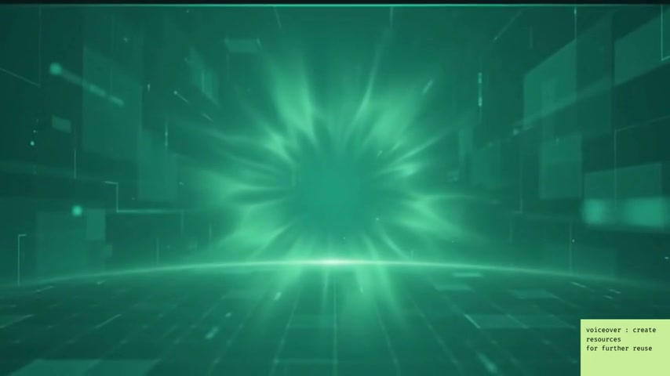

| Option | Voiceover Candidate Text | WPM | Tone |
| :--- | :--- | :--- | :--- |
| **Scratch VO** | Generating changelogs and maintaining folder integrity. | ~150 | Baseline |
| **⚡ AI Punchy** | Writing changelogs and keeping structures clean. | ~165 | Energetic / Fast |
| **🧠 AI Strategic** | Autonomous auditing guarantees zero drift across documentation repositories. | ~140 | Pedagogical / Authoritative |
| **🔥 AI Conversational** | Generating clean changelogs and keeping your structure spotless. | ~145 | Direct & Relatable |

> ✍️ **[My Resonant Take]**:
> *Generating changelogs and maintaining folder integrity.*

---

### ⏱️ Timestamp: `01:54` (Second 114) · **Execution Over Busywork**
**Visual Action**: *Productivity chart spikes upward as manual busywork drops to zero.*

| Option | Voiceover Candidate Text | WPM | Tone |
| :--- | :--- | :--- | :--- |
| **Scratch VO** | You focus on execution. They handle the busywork. | ~150 | Baseline |
| **⚡ AI Punchy** | You execute. They handle the busywork. | ~165 | Energetic / Fast |
| **🧠 AI Strategic** | Decouples high-leverage engineering from repetitive clerical tasks. | ~140 | Pedagogical / Authoritative |
| **🔥 AI Conversational** | You focus on high-impact work—they handle all the busywork. | ~145 | Direct & Relatable |

> ✍️ **[My Resonant Take]**:
> *You focus on execution. They handle the busywork.*

---

### ⏱️ Timestamp: `01:55` (Second 115) · **Execution Over Busywork**
**Visual Action**: *Productivity chart spikes upward as manual busywork drops to zero.*

| Option | Voiceover Candidate Text | WPM | Tone |
| :--- | :--- | :--- | :--- |
| **Scratch VO** | You focus on execution. They handle the busywork. | ~150 | Baseline |
| **⚡ AI Punchy** | You execute. They handle the busywork. | ~165 | Energetic / Fast |
| **🧠 AI Strategic** | Decouples high-leverage engineering from repetitive clerical tasks. | ~140 | Pedagogical / Authoritative |
| **🔥 AI Conversational** | You focus on high-impact work—they handle all the busywork. | ~145 | Direct & Relatable |

> ✍️ **[My Resonant Take]**:
> *You focus on execution. They handle the busywork.*

---

### ⏱️ Timestamp: `01:56` (Second 116) · **Execution Over Busywork**
**Visual Action**: *Productivity chart spikes upward as manual busywork drops to zero.*

| Option | Voiceover Candidate Text | WPM | Tone |
| :--- | :--- | :--- | :--- |
| **Scratch VO** | You focus on execution. They handle the busywork. | ~150 | Baseline |
| **⚡ AI Punchy** | You execute. They handle the busywork. | ~165 | Energetic / Fast |
| **🧠 AI Strategic** | Decouples high-leverage engineering from repetitive clerical tasks. | ~140 | Pedagogical / Authoritative |
| **🔥 AI Conversational** | You focus on high-impact work—they handle all the busywork. | ~145 | Direct & Relatable |

> ✍️ **[My Resonant Take]**:
> *You focus on execution. They handle the busywork.*

---

### ⏱️ Timestamp: `01:57` (Second 117) · **Execution Over Busywork**
**Visual Action**: *Productivity chart spikes upward as manual busywork drops to zero.*

| Option | Voiceover Candidate Text | WPM | Tone |
| :--- | :--- | :--- | :--- |
| **Scratch VO** | You focus on execution. They handle the busywork. | ~150 | Baseline |
| **⚡ AI Punchy** | You execute. They handle the busywork. | ~165 | Energetic / Fast |
| **🧠 AI Strategic** | Decouples high-leverage engineering from repetitive clerical tasks. | ~140 | Pedagogical / Authoritative |
| **🔥 AI Conversational** | You focus on high-impact work—they handle all the busywork. | ~145 | Direct & Relatable |

> ✍️ **[My Resonant Take]**:
> *You focus on execution. They handle the busywork.*

---

### ⏱️ Timestamp: `01:58` (Second 118) · **Execution Over Busywork**
**Visual Action**: *Productivity chart spikes upward as manual busywork drops to zero.*

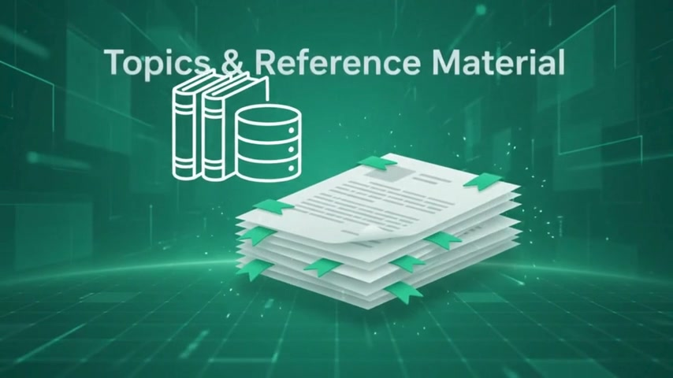

| Option | Voiceover Candidate Text | WPM | Tone |
| :--- | :--- | :--- | :--- |
| **Scratch VO** | You focus on execution. They handle the busywork. | ~150 | Baseline |
| **⚡ AI Punchy** | You execute. They handle the busywork. | ~165 | Energetic / Fast |
| **🧠 AI Strategic** | Decouples high-leverage engineering from repetitive clerical tasks. | ~140 | Pedagogical / Authoritative |
| **🔥 AI Conversational** | You focus on high-impact work—they handle all the busywork. | ~145 | Direct & Relatable |

> ✍️ **[My Resonant Take]**:
> *You focus on execution. They handle the busywork.*

---

## 🎬 Scene 5: The 4-Step Workflow `[01:59]`
**Baseline Script Reference**: *"Raw knowledge isn't power—applied knowledge is."*

### ⏱️ Timestamp: `01:59` (Second 119) · **Applied Knowledge Principle**
**Visual Action**: *4-step conveyor assembly line appears with vibrant colored boxes.*

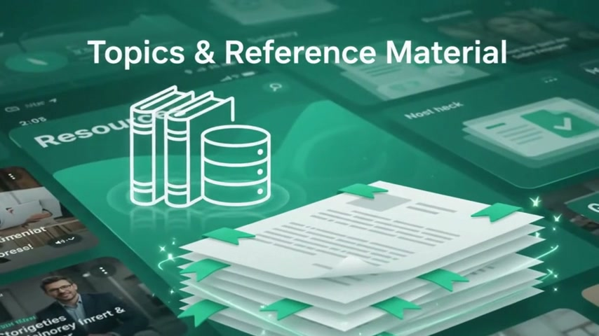

| Option | Voiceover Candidate Text | WPM | Tone |
| :--- | :--- | :--- | :--- |
| **Scratch VO** | Raw knowledge isn't power—applied knowledge is. | ~150 | Baseline |
| **⚡ AI Punchy** | Raw knowledge isn't power—applied knowledge is. | ~165 | Energetic / Fast |
| **🧠 AI Strategic** | Information retrieval without production output yields zero value. | ~140 | Pedagogical / Authoritative |
| **🔥 AI Conversational** | Raw knowledge isn't power—only applied knowledge is. | ~145 | Direct & Relatable |

> ✍️ **[My Resonant Take]**:
> *Raw knowledge isn't power—applied knowledge is.*

---

### ⏱️ Timestamp: `02:00` (Second 120) · **Applied Knowledge Principle**
**Visual Action**: *4-step conveyor assembly line appears with vibrant colored boxes.*

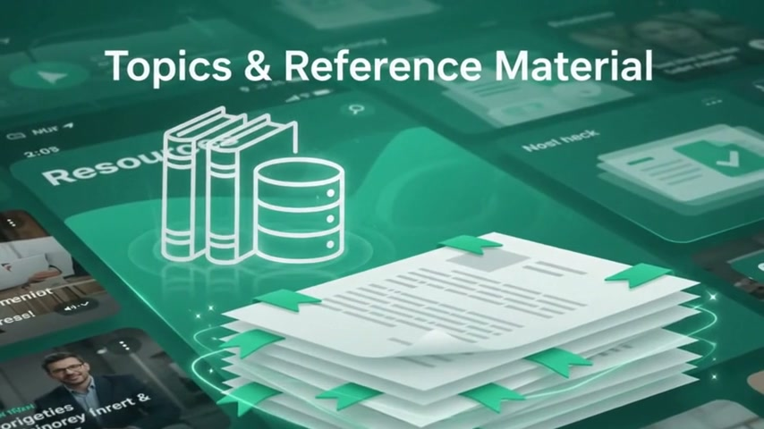

| Option | Voiceover Candidate Text | WPM | Tone |
| :--- | :--- | :--- | :--- |
| **Scratch VO** | Raw knowledge isn't power—applied knowledge is. | ~150 | Baseline |
| **⚡ AI Punchy** | Raw knowledge isn't power—applied knowledge is. | ~165 | Energetic / Fast |
| **🧠 AI Strategic** | Information retrieval without production output yields zero value. | ~140 | Pedagogical / Authoritative |
| **🔥 AI Conversational** | Raw knowledge isn't power—only applied knowledge is. | ~145 | Direct & Relatable |

> ✍️ **[My Resonant Take]**:
> *Raw knowledge isn't power—applied knowledge is.*

---

### ⏱️ Timestamp: `02:01` (Second 121) · **Applied Knowledge Principle**
**Visual Action**: *4-step conveyor assembly line appears with vibrant colored boxes.*

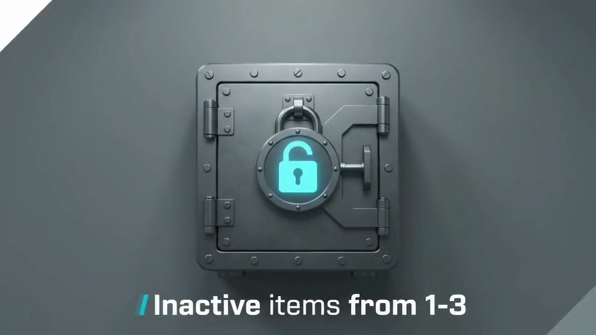

| Option | Voiceover Candidate Text | WPM | Tone |
| :--- | :--- | :--- | :--- |
| **Scratch VO** | Raw knowledge isn't power—applied knowledge is. | ~150 | Baseline |
| **⚡ AI Punchy** | Raw knowledge isn't power—applied knowledge is. | ~165 | Energetic / Fast |
| **🧠 AI Strategic** | Information retrieval without production output yields zero value. | ~140 | Pedagogical / Authoritative |
| **🔥 AI Conversational** | Raw knowledge isn't power—only applied knowledge is. | ~145 | Direct & Relatable |

> ✍️ **[My Resonant Take]**:
> *Raw knowledge isn't power—applied knowledge is.*

---

### ⏱️ Timestamp: `02:02` (Second 122) · **Applied Knowledge Principle**
**Visual Action**: *4-step conveyor assembly line appears with vibrant colored boxes.*

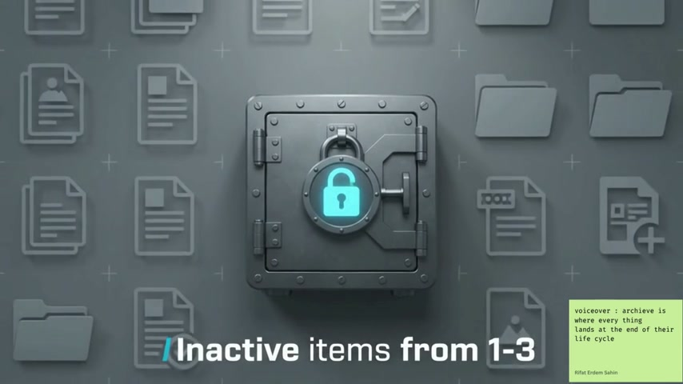

| Option | Voiceover Candidate Text | WPM | Tone |
| :--- | :--- | :--- | :--- |
| **Scratch VO** | Raw knowledge isn't power—applied knowledge is. | ~150 | Baseline |
| **⚡ AI Punchy** | Raw knowledge isn't power—applied knowledge is. | ~165 | Energetic / Fast |
| **🧠 AI Strategic** | Information retrieval without production output yields zero value. | ~140 | Pedagogical / Authoritative |
| **🔥 AI Conversational** | Raw knowledge isn't power—only applied knowledge is. | ~145 | Direct & Relatable |

> ✍️ **[My Resonant Take]**:
> *Raw knowledge isn't power—applied knowledge is.*

---

### ⏱️ Timestamp: `02:03` (Second 123) · **Applied Knowledge Principle**
**Visual Action**: *4-step conveyor assembly line appears with vibrant colored boxes.*

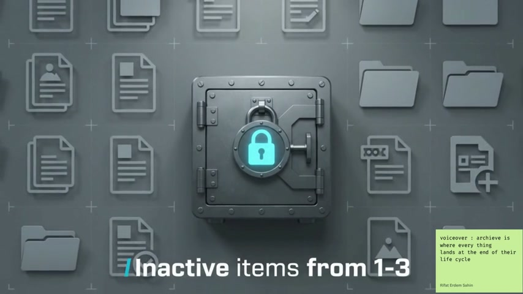

| Option | Voiceover Candidate Text | WPM | Tone |
| :--- | :--- | :--- | :--- |
| **Scratch VO** | Raw knowledge isn't power—applied knowledge is. | ~150 | Baseline |
| **⚡ AI Punchy** | Raw knowledge isn't power—applied knowledge is. | ~165 | Energetic / Fast |
| **🧠 AI Strategic** | Information retrieval without production output yields zero value. | ~140 | Pedagogical / Authoritative |
| **🔥 AI Conversational** | Raw knowledge isn't power—only applied knowledge is. | ~145 | Direct & Relatable |

> ✍️ **[My Resonant Take]**:
> *Raw knowledge isn't power—applied knowledge is.*

---

### ⏱️ Timestamp: `02:04` (Second 124) · **Step 1: Tell (Obsidian)**
**Visual Action**: *Box 1 (Purple #9b59b6): Raw markdown brain-dump and voice transcription.*

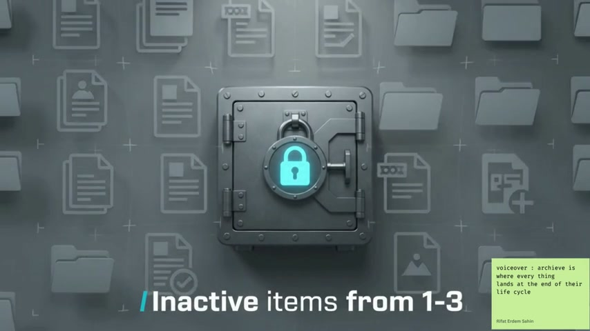

| Option | Voiceover Candidate Text | WPM | Tone |
| :--- | :--- | :--- | :--- |
| **Scratch VO** | Tell: dump your raw thoughts directly into Obsidian. | ~150 | Baseline |
| **⚡ AI Punchy** | Tell: brain-dump raw thoughts into Obsidian. | ~165 | Energetic / Fast |
| **🧠 AI Strategic** | Stage 1 captures unstructured cognitive context in Obsidian. | ~140 | Pedagogical / Authoritative |
| **🔥 AI Conversational** | Step 1 is Tell: brain-dump your thoughts into Obsidian. | ~145 | Direct & Relatable |

> ✍️ **[My Resonant Take]**:
> *Tell: dump your raw thoughts directly into Obsidian.*

---

### ⏱️ Timestamp: `02:05` (Second 125) · **Step 1: Tell (Obsidian)**
**Visual Action**: *Box 1 (Purple #9b59b6): Raw markdown brain-dump and voice transcription.*

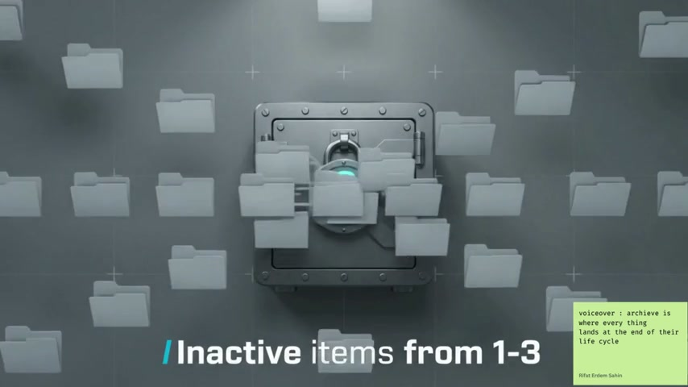

| Option | Voiceover Candidate Text | WPM | Tone |
| :--- | :--- | :--- | :--- |
| **Scratch VO** | Tell: dump your raw thoughts directly into Obsidian. | ~150 | Baseline |
| **⚡ AI Punchy** | Tell: brain-dump raw thoughts into Obsidian. | ~165 | Energetic / Fast |
| **🧠 AI Strategic** | Stage 1 captures unstructured cognitive context in Obsidian. | ~140 | Pedagogical / Authoritative |
| **🔥 AI Conversational** | Step 1 is Tell: brain-dump your thoughts into Obsidian. | ~145 | Direct & Relatable |

> ✍️ **[My Resonant Take]**:
> *Tell: dump your raw thoughts directly into Obsidian.*

---

### ⏱️ Timestamp: `02:06` (Second 126) · **Step 1: Tell (Obsidian)**
**Visual Action**: *Box 1 (Purple #9b59b6): Raw markdown brain-dump and voice transcription.*

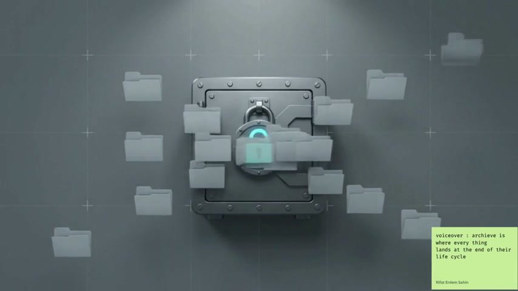

| Option | Voiceover Candidate Text | WPM | Tone |
| :--- | :--- | :--- | :--- |
| **Scratch VO** | Tell: dump your raw thoughts directly into Obsidian. | ~150 | Baseline |
| **⚡ AI Punchy** | Tell: brain-dump raw thoughts into Obsidian. | ~165 | Energetic / Fast |
| **🧠 AI Strategic** | Stage 1 captures unstructured cognitive context in Obsidian. | ~140 | Pedagogical / Authoritative |
| **🔥 AI Conversational** | Step 1 is Tell: brain-dump your thoughts into Obsidian. | ~145 | Direct & Relatable |

> ✍️ **[My Resonant Take]**:
> *Tell: dump your raw thoughts directly into Obsidian.*

---

### ⏱️ Timestamp: `02:07` (Second 127) · **Step 1: Tell (Obsidian)**
**Visual Action**: *Box 1 (Purple #9b59b6): Raw markdown brain-dump and voice transcription.*

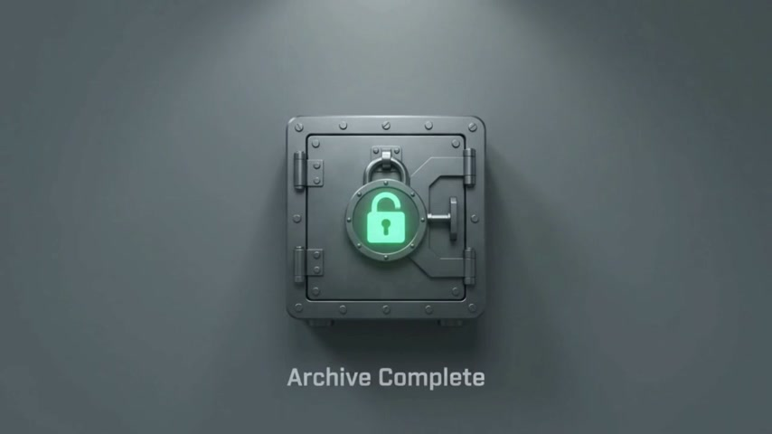

| Option | Voiceover Candidate Text | WPM | Tone |
| :--- | :--- | :--- | :--- |
| **Scratch VO** | Tell: dump your raw thoughts directly into Obsidian. | ~150 | Baseline |
| **⚡ AI Punchy** | Tell: brain-dump raw thoughts into Obsidian. | ~165 | Energetic / Fast |
| **🧠 AI Strategic** | Stage 1 captures unstructured cognitive context in Obsidian. | ~140 | Pedagogical / Authoritative |
| **🔥 AI Conversational** | Step 1 is Tell: brain-dump your thoughts into Obsidian. | ~145 | Direct & Relatable |

> ✍️ **[My Resonant Take]**:
> *Tell: dump your raw thoughts directly into Obsidian.*

---

### ⏱️ Timestamp: `02:08` (Second 128) · **Step 1: Tell (Obsidian)**
**Visual Action**: *Box 1 (Purple #9b59b6): Raw markdown brain-dump and voice transcription.*

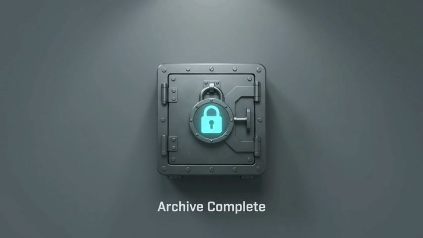

| Option | Voiceover Candidate Text | WPM | Tone |
| :--- | :--- | :--- | :--- |
| **Scratch VO** | Tell: dump your raw thoughts directly into Obsidian. | ~150 | Baseline |
| **⚡ AI Punchy** | Tell: brain-dump raw thoughts into Obsidian. | ~165 | Energetic / Fast |
| **🧠 AI Strategic** | Stage 1 captures unstructured cognitive context in Obsidian. | ~140 | Pedagogical / Authoritative |
| **🔥 AI Conversational** | Step 1 is Tell: brain-dump your thoughts into Obsidian. | ~145 | Direct & Relatable |

> ✍️ **[My Resonant Take]**:
> *Tell: dump your raw thoughts directly into Obsidian.*

---

### ⏱️ Timestamp: `02:09` (Second 129) · **Step 2: Show (Canva)**
**Visual Action**: *Box 2 (Orange #e67e22): Visual canvas maps relationships and sticky notes.*

| Option | Voiceover Candidate Text | WPM | Tone |
| :--- | :--- | :--- | :--- |
| **Scratch VO** | Show: map visual relationships in Canva. | ~150 | Baseline |
| **⚡ AI Punchy** | Show: visualize concepts and structure in Canva. | ~165 | Energetic / Fast |
| **🧠 AI Strategic** | Stage 2 models visual representations and spatial flow in Canva. | ~140 | Pedagogical / Authoritative |
| **🔥 AI Conversational** | Step 2 is Show: map your visual structure in Canva. | ~145 | Direct & Relatable |

> ✍️ **[My Resonant Take]**:
> *Show: map visual relationships in Canva.*

---

### ⏱️ Timestamp: `02:10` (Second 130) · **Step 2: Show (Canva)**
**Visual Action**: *Box 2 (Orange #e67e22): Visual canvas maps relationships and sticky notes.*

| Option | Voiceover Candidate Text | WPM | Tone |
| :--- | :--- | :--- | :--- |
| **Scratch VO** | Show: map visual relationships in Canva. | ~150 | Baseline |
| **⚡ AI Punchy** | Show: visualize concepts and structure in Canva. | ~165 | Energetic / Fast |
| **🧠 AI Strategic** | Stage 2 models visual representations and spatial flow in Canva. | ~140 | Pedagogical / Authoritative |
| **🔥 AI Conversational** | Step 2 is Show: map your visual structure in Canva. | ~145 | Direct & Relatable |

> ✍️ **[My Resonant Take]**:
> *Show: map visual relationships in Canva.*

---

### ⏱️ Timestamp: `02:11` (Second 131) · **Step 2: Show (Canva)**
**Visual Action**: *Box 2 (Orange #e67e22): Visual canvas maps relationships and sticky notes.*

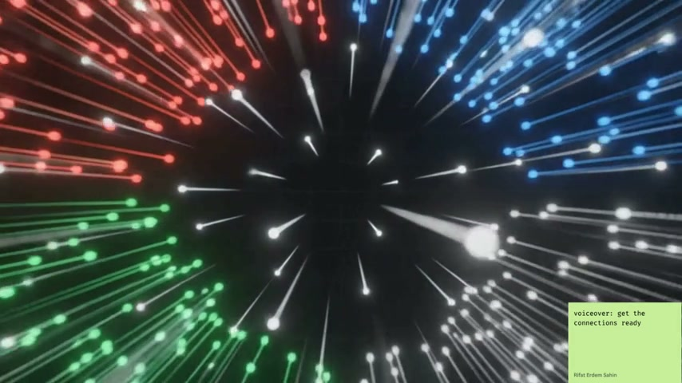

| Option | Voiceover Candidate Text | WPM | Tone |
| :--- | :--- | :--- | :--- |
| **Scratch VO** | Show: map visual relationships in Canva. | ~150 | Baseline |
| **⚡ AI Punchy** | Show: visualize concepts and structure in Canva. | ~165 | Energetic / Fast |
| **🧠 AI Strategic** | Stage 2 models visual representations and spatial flow in Canva. | ~140 | Pedagogical / Authoritative |
| **🔥 AI Conversational** | Step 2 is Show: map your visual structure in Canva. | ~145 | Direct & Relatable |

> ✍️ **[My Resonant Take]**:
> *Show: map visual relationships in Canva.*

---

### ⏱️ Timestamp: `02:12` (Second 132) · **Step 2: Show (Canva)**
**Visual Action**: *Box 2 (Orange #e67e22): Visual canvas maps relationships and sticky notes.*

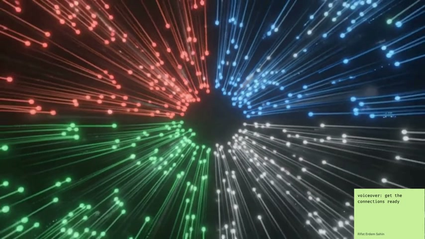

| Option | Voiceover Candidate Text | WPM | Tone |
| :--- | :--- | :--- | :--- |
| **Scratch VO** | Show: map visual relationships in Canva. | ~150 | Baseline |
| **⚡ AI Punchy** | Show: visualize concepts and structure in Canva. | ~165 | Energetic / Fast |
| **🧠 AI Strategic** | Stage 2 models visual representations and spatial flow in Canva. | ~140 | Pedagogical / Authoritative |
| **🔥 AI Conversational** | Step 2 is Show: map your visual structure in Canva. | ~145 | Direct & Relatable |

> ✍️ **[My Resonant Take]**:
> *Show: map visual relationships in Canva.*

---

### ⏱️ Timestamp: `02:13` (Second 133) · **Step 2: Show (Canva)**
**Visual Action**: *Box 2 (Orange #e67e22): Visual canvas maps relationships and sticky notes.*

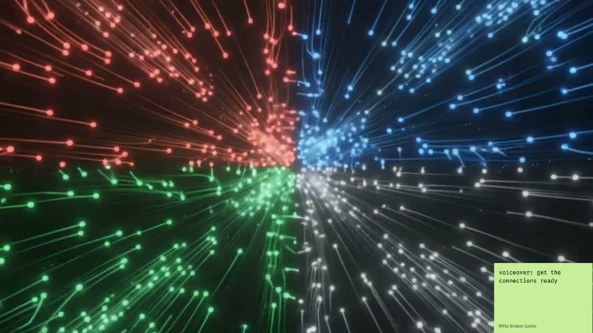

| Option | Voiceover Candidate Text | WPM | Tone |
| :--- | :--- | :--- | :--- |
| **Scratch VO** | Show: map visual relationships in Canva. | ~150 | Baseline |
| **⚡ AI Punchy** | Show: visualize concepts and structure in Canva. | ~165 | Energetic / Fast |
| **🧠 AI Strategic** | Stage 2 models visual representations and spatial flow in Canva. | ~140 | Pedagogical / Authoritative |
| **🔥 AI Conversational** | Step 2 is Show: map your visual structure in Canva. | ~145 | Direct & Relatable |

> ✍️ **[My Resonant Take]**:
> *Show: map visual relationships in Canva.*

---

### ⏱️ Timestamp: `02:14` (Second 134) · **Step 3: Do (Slide Decks)**
**Visual Action**: *Box 3 (Red #c0392b): Presentation slide layouts render into consumable decks.*

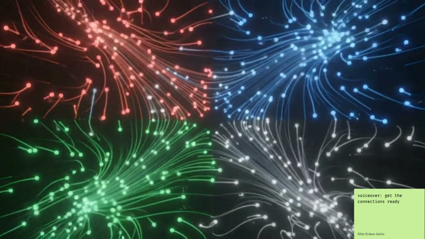

| Option | Voiceover Candidate Text | WPM | Tone |
| :--- | :--- | :--- | :--- |
| **Scratch VO** | Do: turn concepts into consumable slide decks. | ~150 | Baseline |
| **⚡ AI Punchy** | Do: turn ideas into consumable presentations. | ~165 | Energetic / Fast |
| **🧠 AI Strategic** | Stage 3 transforms architecture into pedagogical presentation decks. | ~140 | Pedagogical / Authoritative |
| **🔥 AI Conversational** | Step 3 is Do: turn those concepts into consumable slides. | ~145 | Direct & Relatable |

> ✍️ **[My Resonant Take]**:
> *Do: turn concepts into consumable slide decks.*

---

### ⏱️ Timestamp: `02:15` (Second 135) · **Step 3: Do (Slide Decks)**
**Visual Action**: *Box 3 (Red #c0392b): Presentation slide layouts render into consumable decks.*

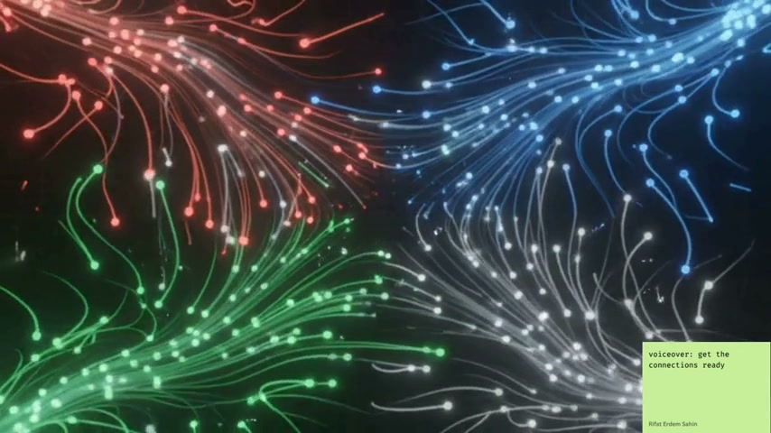

| Option | Voiceover Candidate Text | WPM | Tone |
| :--- | :--- | :--- | :--- |
| **Scratch VO** | Do: turn concepts into consumable slide decks. | ~150 | Baseline |
| **⚡ AI Punchy** | Do: turn ideas into consumable presentations. | ~165 | Energetic / Fast |
| **🧠 AI Strategic** | Stage 3 transforms architecture into pedagogical presentation decks. | ~140 | Pedagogical / Authoritative |
| **🔥 AI Conversational** | Step 3 is Do: turn those concepts into consumable slides. | ~145 | Direct & Relatable |

> ✍️ **[My Resonant Take]**:
> *Do: turn concepts into consumable slide decks.*

---

### ⏱️ Timestamp: `02:16` (Second 136) · **Step 3: Do (Slide Decks)**
**Visual Action**: *Box 3 (Red #c0392b): Presentation slide layouts render into consumable decks.*

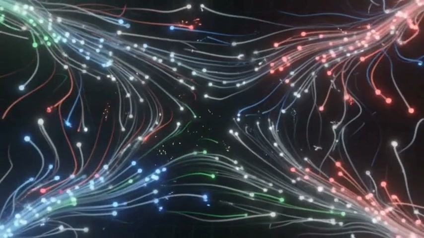

| Option | Voiceover Candidate Text | WPM | Tone |
| :--- | :--- | :--- | :--- |
| **Scratch VO** | Do: turn concepts into consumable slide decks. | ~150 | Baseline |
| **⚡ AI Punchy** | Do: turn ideas into consumable presentations. | ~165 | Energetic / Fast |
| **🧠 AI Strategic** | Stage 3 transforms architecture into pedagogical presentation decks. | ~140 | Pedagogical / Authoritative |
| **🔥 AI Conversational** | Step 3 is Do: turn those concepts into consumable slides. | ~145 | Direct & Relatable |

> ✍️ **[My Resonant Take]**:
> *Do: turn concepts into consumable slide decks.*

---

### ⏱️ Timestamp: `02:17` (Second 137) · **Step 3: Do (Slide Decks)**
**Visual Action**: *Box 3 (Red #c0392b): Presentation slide layouts render into consumable decks.*

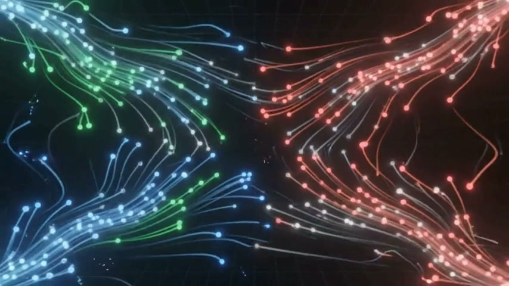

| Option | Voiceover Candidate Text | WPM | Tone |
| :--- | :--- | :--- | :--- |
| **Scratch VO** | Do: turn concepts into consumable slide decks. | ~150 | Baseline |
| **⚡ AI Punchy** | Do: turn ideas into consumable presentations. | ~165 | Energetic / Fast |
| **🧠 AI Strategic** | Stage 3 transforms architecture into pedagogical presentation decks. | ~140 | Pedagogical / Authoritative |
| **🔥 AI Conversational** | Step 3 is Do: turn those concepts into consumable slides. | ~145 | Direct & Relatable |

> ✍️ **[My Resonant Take]**:
> *Do: turn concepts into consumable slide decks.*

---

### ⏱️ Timestamp: `02:18` (Second 138) · **Step 3: Do (Slide Decks)**
**Visual Action**: *Box 3 (Red #c0392b): Presentation slide layouts render into consumable decks.*

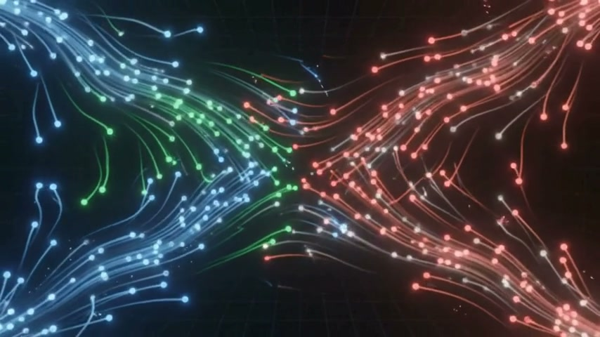

| Option | Voiceover Candidate Text | WPM | Tone |
| :--- | :--- | :--- | :--- |
| **Scratch VO** | Do: turn concepts into consumable slide decks. | ~150 | Baseline |
| **⚡ AI Punchy** | Do: turn ideas into consumable presentations. | ~165 | Energetic / Fast |
| **🧠 AI Strategic** | Stage 3 transforms architecture into pedagogical presentation decks. | ~140 | Pedagogical / Authoritative |
| **🔥 AI Conversational** | Step 3 is Do: turn those concepts into consumable slides. | ~145 | Direct & Relatable |

> ✍️ **[My Resonant Take]**:
> *Do: turn concepts into consumable slide decks.*

---

### ⏱️ Timestamp: `02:19` (Second 139) · **Step 4: Apply (GitHub Code)**
**Visual Action**: *Box 4 (Green #27ae60): Git commit push, code releases, and video assets ship.*

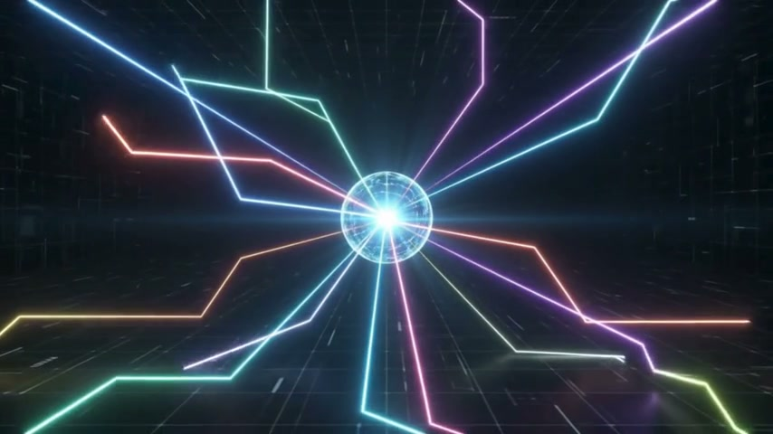

| Option | Voiceover Candidate Text | WPM | Tone |
| :--- | :--- | :--- | :--- |
| **Scratch VO** | Apply: ship it as production code in GitHub. | ~150 | Baseline |
| **⚡ AI Punchy** | Apply: ship code and assets in GitHub. | ~165 | Energetic / Fast |
| **🧠 AI Strategic** | Stage 4 deploys functional code and automations to GitHub. | ~140 | Pedagogical / Authoritative |
| **🔥 AI Conversational** | Step 4 is Apply: ship real code and assets in GitHub. | ~145 | Direct & Relatable |

> ✍️ **[My Resonant Take]**:
> *Apply: ship it as production code in GitHub.*

---

### ⏱️ Timestamp: `02:20` (Second 140) · **Step 4: Apply (GitHub Code)**
**Visual Action**: *Box 4 (Green #27ae60): Git commit push, code releases, and video assets ship.*

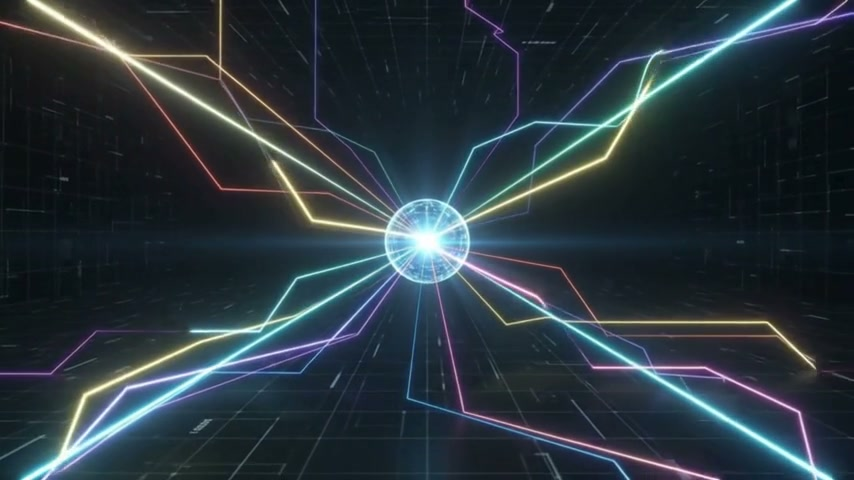

| Option | Voiceover Candidate Text | WPM | Tone |
| :--- | :--- | :--- | :--- |
| **Scratch VO** | Apply: ship it as production code in GitHub. | ~150 | Baseline |
| **⚡ AI Punchy** | Apply: ship code and assets in GitHub. | ~165 | Energetic / Fast |
| **🧠 AI Strategic** | Stage 4 deploys functional code and automations to GitHub. | ~140 | Pedagogical / Authoritative |
| **🔥 AI Conversational** | Step 4 is Apply: ship real code and assets in GitHub. | ~145 | Direct & Relatable |

> ✍️ **[My Resonant Take]**:
> *Apply: ship it as production code in GitHub.*

---

### ⏱️ Timestamp: `02:21` (Second 141) · **Step 4: Apply (GitHub Code)**
**Visual Action**: *Box 4 (Green #27ae60): Git commit push, code releases, and video assets ship.*

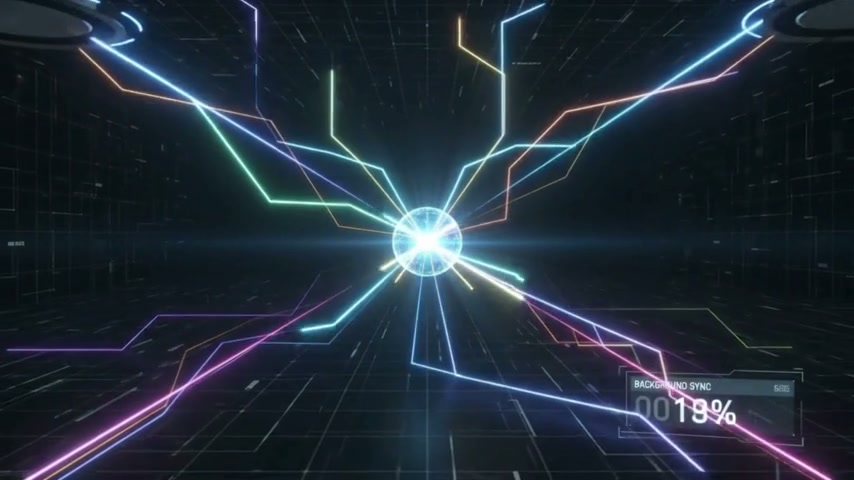

| Option | Voiceover Candidate Text | WPM | Tone |
| :--- | :--- | :--- | :--- |
| **Scratch VO** | Apply: ship it as production code in GitHub. | ~150 | Baseline |
| **⚡ AI Punchy** | Apply: ship code and assets in GitHub. | ~165 | Energetic / Fast |
| **🧠 AI Strategic** | Stage 4 deploys functional code and automations to GitHub. | ~140 | Pedagogical / Authoritative |
| **🔥 AI Conversational** | Step 4 is Apply: ship real code and assets in GitHub. | ~145 | Direct & Relatable |

> ✍️ **[My Resonant Take]**:
> *Apply: ship it as production code in GitHub.*

---

### ⏱️ Timestamp: `02:22` (Second 142) · **Step 4: Apply (GitHub Code)**
**Visual Action**: *Box 4 (Green #27ae60): Git commit push, code releases, and video assets ship.*

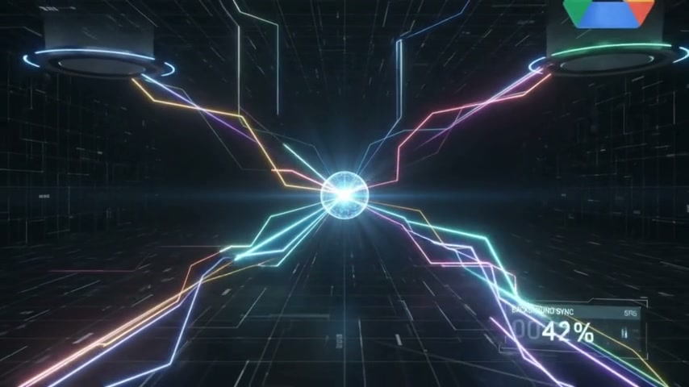

| Option | Voiceover Candidate Text | WPM | Tone |
| :--- | :--- | :--- | :--- |
| **Scratch VO** | Apply: ship it as production code in GitHub. | ~150 | Baseline |
| **⚡ AI Punchy** | Apply: ship code and assets in GitHub. | ~165 | Energetic / Fast |
| **🧠 AI Strategic** | Stage 4 deploys functional code and automations to GitHub. | ~140 | Pedagogical / Authoritative |
| **🔥 AI Conversational** | Step 4 is Apply: ship real code and assets in GitHub. | ~145 | Direct & Relatable |

> ✍️ **[My Resonant Take]**:
> *Apply: ship it as production code in GitHub.*

---

### ⏱️ Timestamp: `02:23` (Second 143) · **Step 4: Apply (GitHub Code)**
**Visual Action**: *Box 4 (Green #27ae60): Git commit push, code releases, and video assets ship.*

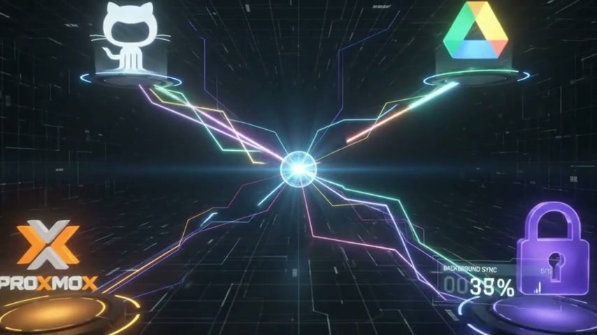

| Option | Voiceover Candidate Text | WPM | Tone |
| :--- | :--- | :--- | :--- |
| **Scratch VO** | Apply: ship it as production code in GitHub. | ~150 | Baseline |
| **⚡ AI Punchy** | Apply: ship code and assets in GitHub. | ~165 | Energetic / Fast |
| **🧠 AI Strategic** | Stage 4 deploys functional code and automations to GitHub. | ~140 | Pedagogical / Authoritative |
| **🔥 AI Conversational** | Step 4 is Apply: ship real code and assets in GitHub. | ~145 | Direct & Relatable |

> ✍️ **[My Resonant Take]**:
> *Apply: ship it as production code in GitHub.*

---

### ⏱️ Timestamp: `02:24` (Second 144) · **Step 4: Apply (GitHub Code)**
**Visual Action**: *Box 4 (Green #27ae60): Git commit push, code releases, and video assets ship.*

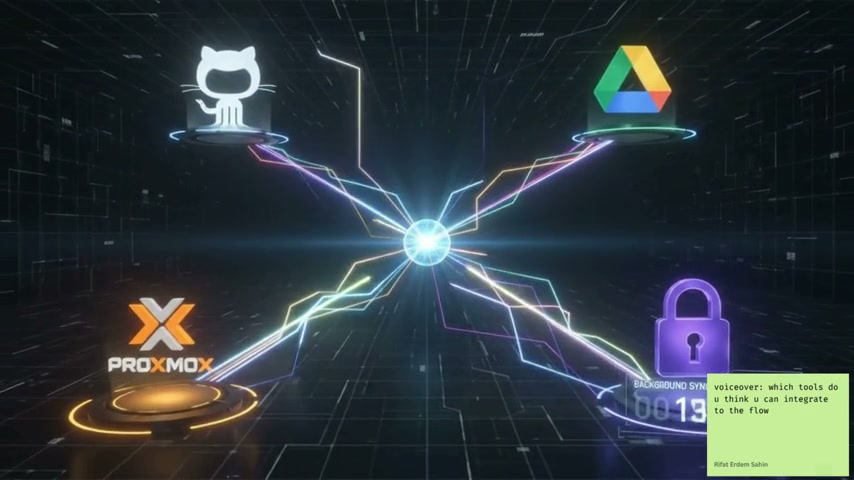

| Option | Voiceover Candidate Text | WPM | Tone |
| :--- | :--- | :--- | :--- |
| **Scratch VO** | Apply: ship it as production code in GitHub. | ~150 | Baseline |
| **⚡ AI Punchy** | Apply: ship code and assets in GitHub. | ~165 | Energetic / Fast |
| **🧠 AI Strategic** | Stage 4 deploys functional code and automations to GitHub. | ~140 | Pedagogical / Authoritative |
| **🔥 AI Conversational** | Step 4 is Apply: ship real code and assets in GitHub. | ~145 | Direct & Relatable |

> ✍️ **[My Resonant Take]**:
> *Apply: ship it as production code in GitHub.*

---

### ⏱️ Timestamp: `02:25` (Second 145) · **Chaos to Shipped Execution**
**Visual Action**: *All 4 boxes light up with green checkmarks connecting start to finish.*

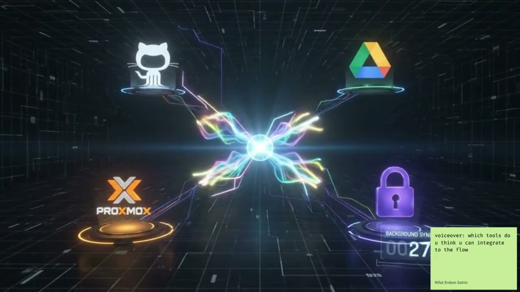

| Option | Voiceover Candidate Text | WPM | Tone |
| :--- | :--- | :--- | :--- |
| **Scratch VO** | From chaos to execution in four clear steps. | ~150 | Baseline |
| **⚡ AI Punchy** | From chaos to execution in four steps. | ~165 | Energetic / Fast |
| **🧠 AI Strategic** | A repeatable closed-loop system from concept to deployment. | ~140 | Pedagogical / Authoritative |
| **🔥 AI Conversational** | From total chaos to finished execution in four steps. | ~145 | Direct & Relatable |

> ✍️ **[My Resonant Take]**:
> *From chaos to execution in four clear steps.*

---

### ⏱️ Timestamp: `02:26` (Second 146) · **Chaos to Shipped Execution**
**Visual Action**: *All 4 boxes light up with green checkmarks connecting start to finish.*

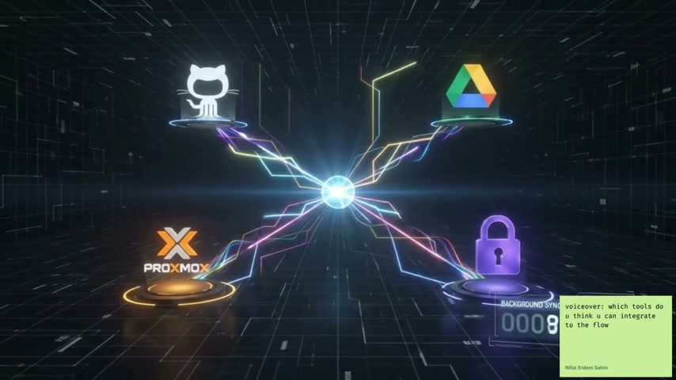

| Option | Voiceover Candidate Text | WPM | Tone |
| :--- | :--- | :--- | :--- |
| **Scratch VO** | From chaos to execution in four clear steps. | ~150 | Baseline |
| **⚡ AI Punchy** | From chaos to execution in four steps. | ~165 | Energetic / Fast |
| **🧠 AI Strategic** | A repeatable closed-loop system from concept to deployment. | ~140 | Pedagogical / Authoritative |
| **🔥 AI Conversational** | From total chaos to finished execution in four steps. | ~145 | Direct & Relatable |

> ✍️ **[My Resonant Take]**:
> *From chaos to execution in four clear steps.*

---

### ⏱️ Timestamp: `02:27` (Second 147) · **Chaos to Shipped Execution**
**Visual Action**: *All 4 boxes light up with green checkmarks connecting start to finish.*

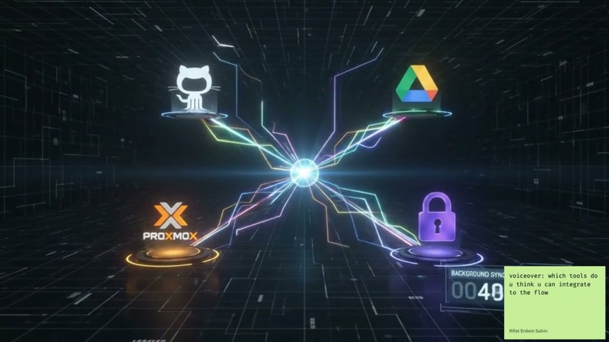

| Option | Voiceover Candidate Text | WPM | Tone |
| :--- | :--- | :--- | :--- |
| **Scratch VO** | From chaos to execution in four clear steps. | ~150 | Baseline |
| **⚡ AI Punchy** | From chaos to execution in four steps. | ~165 | Energetic / Fast |
| **🧠 AI Strategic** | A repeatable closed-loop system from concept to deployment. | ~140 | Pedagogical / Authoritative |
| **🔥 AI Conversational** | From total chaos to finished execution in four steps. | ~145 | Direct & Relatable |

> ✍️ **[My Resonant Take]**:
> *From chaos to execution in four clear steps.*

---

### ⏱️ Timestamp: `02:28` (Second 148) · **Chaos to Shipped Execution**
**Visual Action**: *All 4 boxes light up with green checkmarks connecting start to finish.*

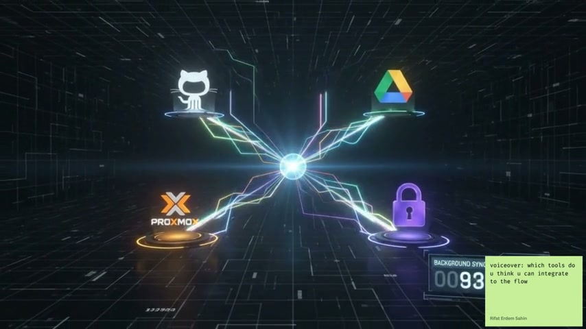

| Option | Voiceover Candidate Text | WPM | Tone |
| :--- | :--- | :--- | :--- |
| **Scratch VO** | From chaos to execution in four clear steps. | ~150 | Baseline |
| **⚡ AI Punchy** | From chaos to execution in four steps. | ~165 | Energetic / Fast |
| **🧠 AI Strategic** | A repeatable closed-loop system from concept to deployment. | ~140 | Pedagogical / Authoritative |
| **🔥 AI Conversational** | From total chaos to finished execution in four steps. | ~145 | Direct & Relatable |

> ✍️ **[My Resonant Take]**:
> *From chaos to execution in four clear steps.*

---

### ⏱️ Timestamp: `02:29` (Second 149) · **Chaos to Shipped Execution**
**Visual Action**: *All 4 boxes light up with green checkmarks connecting start to finish.*

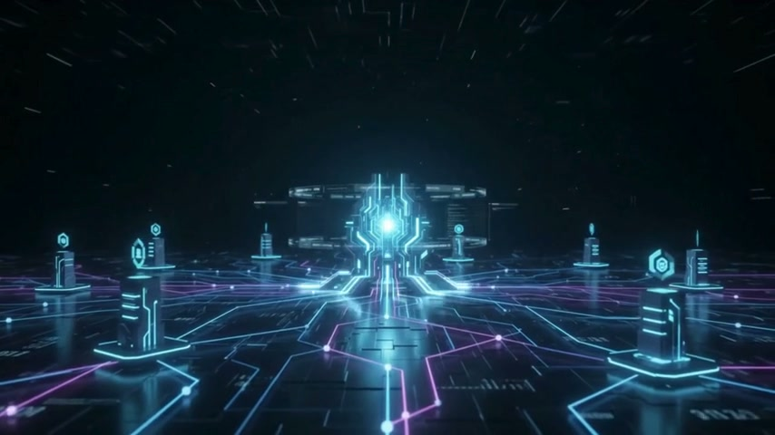

| Option | Voiceover Candidate Text | WPM | Tone |
| :--- | :--- | :--- | :--- |
| **Scratch VO** | From chaos to execution in four clear steps. | ~150 | Baseline |
| **⚡ AI Punchy** | From chaos to execution in four steps. | ~165 | Energetic / Fast |
| **🧠 AI Strategic** | A repeatable closed-loop system from concept to deployment. | ~140 | Pedagogical / Authoritative |
| **🔥 AI Conversational** | From total chaos to finished execution in four steps. | ~145 | Direct & Relatable |

> ✍️ **[My Resonant Take]**:
> *From chaos to execution in four clear steps.*

---

### ⏱️ Timestamp: `02:30` (Second 150) · **Chaos to Shipped Execution**
**Visual Action**: *All 4 boxes light up with green checkmarks connecting start to finish.*

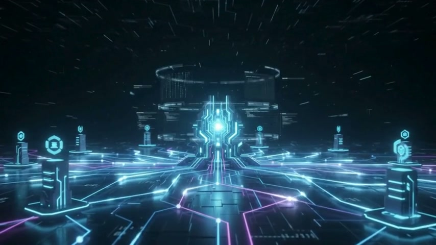

| Option | Voiceover Candidate Text | WPM | Tone |
| :--- | :--- | :--- | :--- |
| **Scratch VO** | From chaos to execution in four clear steps. | ~150 | Baseline |
| **⚡ AI Punchy** | From chaos to execution in four steps. | ~165 | Energetic / Fast |
| **🧠 AI Strategic** | A repeatable closed-loop system from concept to deployment. | ~140 | Pedagogical / Authoritative |
| **🔥 AI Conversational** | From total chaos to finished execution in four steps. | ~145 | Direct & Relatable |

> ✍️ **[My Resonant Take]**:
> *From chaos to execution in four clear steps.*

---

### ⏱️ Timestamp: `02:31` (Second 151) · **Chaos to Shipped Execution**
**Visual Action**: *All 4 boxes light up with green checkmarks connecting start to finish.*

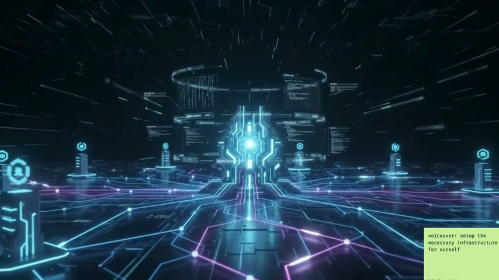

| Option | Voiceover Candidate Text | WPM | Tone |
| :--- | :--- | :--- | :--- |
| **Scratch VO** | From chaos to execution in four clear steps. | ~150 | Baseline |
| **⚡ AI Punchy** | From chaos to execution in four steps. | ~165 | Energetic / Fast |
| **🧠 AI Strategic** | A repeatable closed-loop system from concept to deployment. | ~140 | Pedagogical / Authoritative |
| **🔥 AI Conversational** | From total chaos to finished execution in four steps. | ~145 | Direct & Relatable |

> ✍️ **[My Resonant Take]**:
> *From chaos to execution in four clear steps.*

---

### ⏱️ Timestamp: `02:32` (Second 152) · **Chaos to Shipped Execution**
**Visual Action**: *All 4 boxes light up with green checkmarks connecting start to finish.*

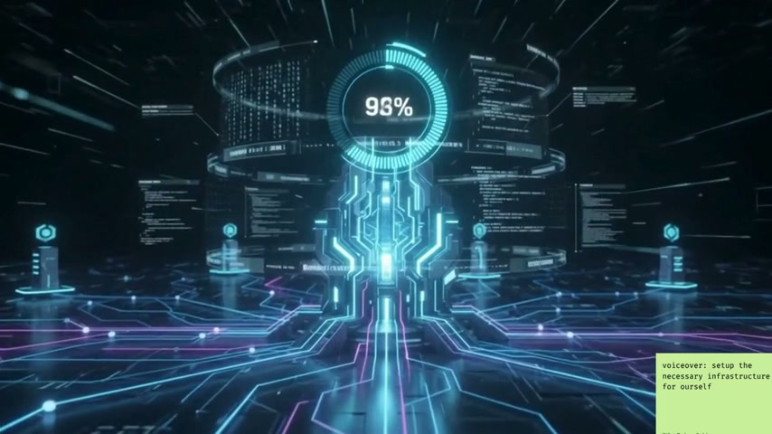

| Option | Voiceover Candidate Text | WPM | Tone |
| :--- | :--- | :--- | :--- |
| **Scratch VO** | From chaos to execution in four clear steps. | ~150 | Baseline |
| **⚡ AI Punchy** | From chaos to execution in four steps. | ~165 | Energetic / Fast |
| **🧠 AI Strategic** | A repeatable closed-loop system from concept to deployment. | ~140 | Pedagogical / Authoritative |
| **🔥 AI Conversational** | From total chaos to finished execution in four steps. | ~145 | Direct & Relatable |

> ✍️ **[My Resonant Take]**:
> *From chaos to execution in four clear steps.*

---

## 🎬 Scene 6: Call to Action & Closing `[02:33]`
**Baseline Script Reference**: *"This is about building an AI brain that actually works for you."*

### ⏱️ Timestamp: `02:33` (Second 153) · **Building Your Second Brain**
**Visual Action**: *Central AI Brain avatar pulses with golden energy and lightning arcs.*

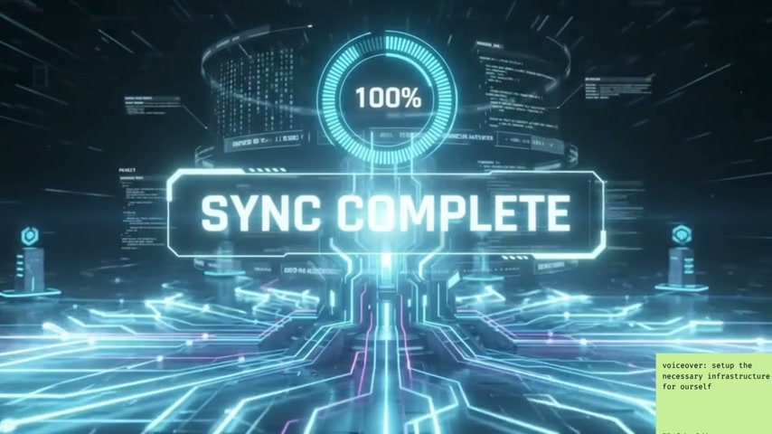

| Option | Voiceover Candidate Text | WPM | Tone |
| :--- | :--- | :--- | :--- |
| **Scratch VO** | This is about building an AI brain that actually works for you. | ~150 | Baseline |
| **⚡ AI Punchy** | Build an AI brain that works for you. | ~165 | Energetic / Fast |
| **🧠 AI Strategic** | Elevate your engineering capacity with autonomous agent systems. | ~140 | Pedagogical / Authoritative |
| **🔥 AI Conversational** | This is about building a second brain that truly works for you. | ~145 | Direct & Relatable |

> ✍️ **[My Resonant Take]**:
> *This is about building an AI brain that actually works for you.*

---

### ⏱️ Timestamp: `02:34` (Second 154) · **Building Your Second Brain**
**Visual Action**: *Central AI Brain avatar pulses with golden energy and lightning arcs.*

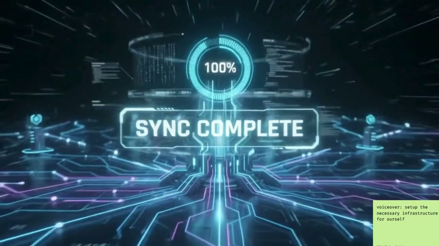

| Option | Voiceover Candidate Text | WPM | Tone |
| :--- | :--- | :--- | :--- |
| **Scratch VO** | This is about building an AI brain that actually works for you. | ~150 | Baseline |
| **⚡ AI Punchy** | Build an AI brain that works for you. | ~165 | Energetic / Fast |
| **🧠 AI Strategic** | Elevate your engineering capacity with autonomous agent systems. | ~140 | Pedagogical / Authoritative |
| **🔥 AI Conversational** | This is about building a second brain that truly works for you. | ~145 | Direct & Relatable |

> ✍️ **[My Resonant Take]**:
> *This is about building an AI brain that actually works for you.*

---

### ⏱️ Timestamp: `02:35` (Second 155) · **Building Your Second Brain**
**Visual Action**: *Central AI Brain avatar pulses with golden energy and lightning arcs.*

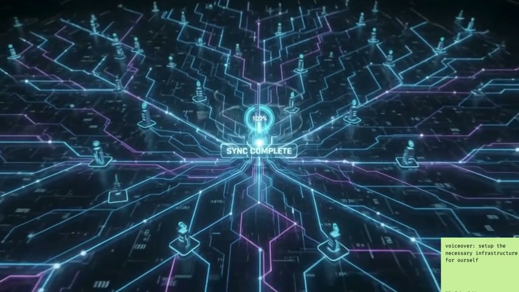

| Option | Voiceover Candidate Text | WPM | Tone |
| :--- | :--- | :--- | :--- |
| **Scratch VO** | This is about building an AI brain that actually works for you. | ~150 | Baseline |
| **⚡ AI Punchy** | Build an AI brain that works for you. | ~165 | Energetic / Fast |
| **🧠 AI Strategic** | Elevate your engineering capacity with autonomous agent systems. | ~140 | Pedagogical / Authoritative |
| **🔥 AI Conversational** | This is about building a second brain that truly works for you. | ~145 | Direct & Relatable |

> ✍️ **[My Resonant Take]**:
> *This is about building an AI brain that actually works for you.*

---

### ⏱️ Timestamp: `02:36` (Second 156) · **Building Your Second Brain**
**Visual Action**: *Central AI Brain avatar pulses with golden energy and lightning arcs.*

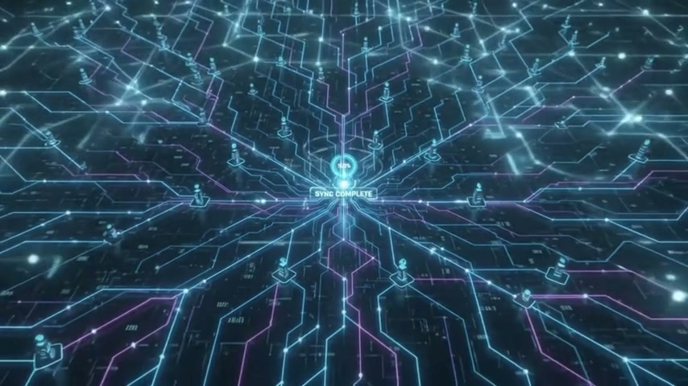

| Option | Voiceover Candidate Text | WPM | Tone |
| :--- | :--- | :--- | :--- |
| **Scratch VO** | This is about building an AI brain that actually works for you. | ~150 | Baseline |
| **⚡ AI Punchy** | Build an AI brain that works for you. | ~165 | Energetic / Fast |
| **🧠 AI Strategic** | Elevate your engineering capacity with autonomous agent systems. | ~140 | Pedagogical / Authoritative |
| **🔥 AI Conversational** | This is about building a second brain that truly works for you. | ~145 | Direct & Relatable |

> ✍️ **[My Resonant Take]**:
> *This is about building an AI brain that actually works for you.*

---

### ⏱️ Timestamp: `02:37` (Second 157) · **Building Your Second Brain**
**Visual Action**: *Central AI Brain avatar pulses with golden energy and lightning arcs.*

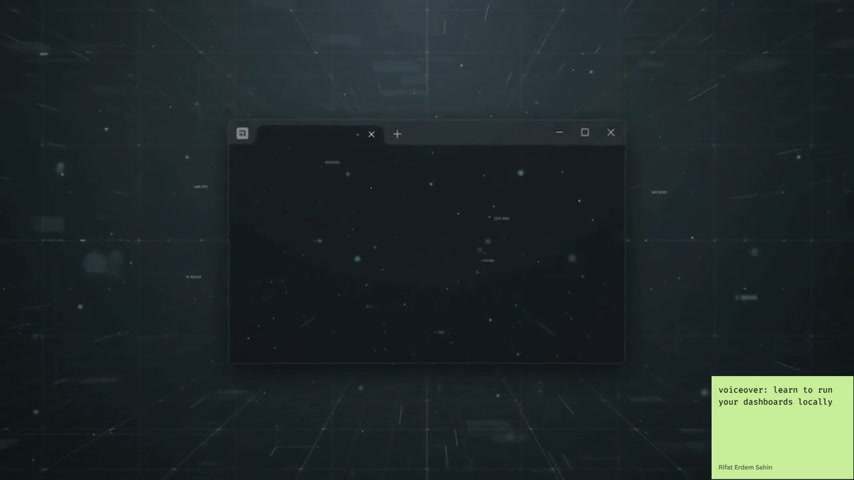

| Option | Voiceover Candidate Text | WPM | Tone |
| :--- | :--- | :--- | :--- |
| **Scratch VO** | This is about building an AI brain that actually works for you. | ~150 | Baseline |
| **⚡ AI Punchy** | Build an AI brain that works for you. | ~165 | Energetic / Fast |
| **🧠 AI Strategic** | Elevate your engineering capacity with autonomous agent systems. | ~140 | Pedagogical / Authoritative |
| **🔥 AI Conversational** | This is about building a second brain that truly works for you. | ~145 | Direct & Relatable |

> ✍️ **[My Resonant Take]**:
> *This is about building an AI brain that actually works for you.*

---

### ⏱️ Timestamp: `02:38` (Second 158) · **Building Your Second Brain**
**Visual Action**: *Central AI Brain avatar pulses with golden energy and lightning arcs.*

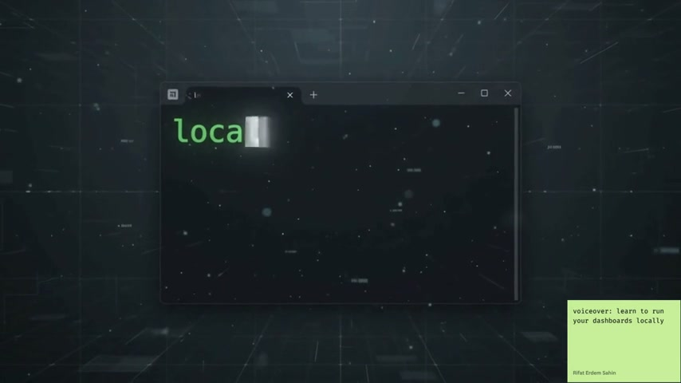

| Option | Voiceover Candidate Text | WPM | Tone |
| :--- | :--- | :--- | :--- |
| **Scratch VO** | This is about building an AI brain that actually works for you. | ~150 | Baseline |
| **⚡ AI Punchy** | Build an AI brain that works for you. | ~165 | Energetic / Fast |
| **🧠 AI Strategic** | Elevate your engineering capacity with autonomous agent systems. | ~140 | Pedagogical / Authoritative |
| **🔥 AI Conversational** | This is about building a second brain that truly works for you. | ~145 | Direct & Relatable |

> ✍️ **[My Resonant Take]**:
> *This is about building an AI brain that actually works for you.*

---

### ⏱️ Timestamp: `02:39` (Second 159) · **Accelerate AI Readiness**
**Visual Action**: *Certification pathways, study cards, and agent badges orbit the brain.*

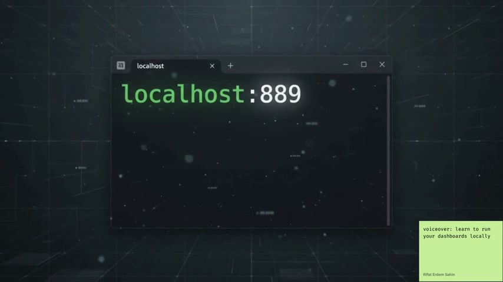

| Option | Voiceover Candidate Text | WPM | Tone |
| :--- | :--- | :--- | :--- |
| **Scratch VO** | Accelerate your AI skills and prepare for top certifications. | ~150 | Baseline |
| **⚡ AI Punchy** | Accelerate your AI engineering readiness. | ~165 | Energetic / Fast |
| **🧠 AI Strategic** | Systematic preparation for enterprise AI architecture certifications. | ~140 | Pedagogical / Authoritative |
| **🔥 AI Conversational** | Accelerate your skills and prep for the biggest AI certifications. | ~145 | Direct & Relatable |

> ✍️ **[My Resonant Take]**:
> *Accelerate your AI skills and prepare for top certifications.*

---

### ⏱️ Timestamp: `02:40` (Second 160) · **Accelerate AI Readiness**
**Visual Action**: *Certification pathways, study cards, and agent badges orbit the brain.*

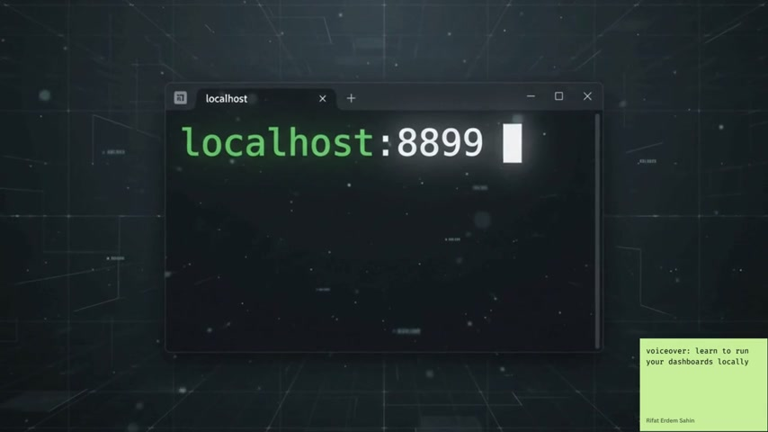

| Option | Voiceover Candidate Text | WPM | Tone |
| :--- | :--- | :--- | :--- |
| **Scratch VO** | Accelerate your AI skills and prepare for top certifications. | ~150 | Baseline |
| **⚡ AI Punchy** | Accelerate your AI engineering readiness. | ~165 | Energetic / Fast |
| **🧠 AI Strategic** | Systematic preparation for enterprise AI architecture certifications. | ~140 | Pedagogical / Authoritative |
| **🔥 AI Conversational** | Accelerate your skills and prep for the biggest AI certifications. | ~145 | Direct & Relatable |

> ✍️ **[My Resonant Take]**:
> *Accelerate your AI skills and prepare for top certifications.*

---

### ⏱️ Timestamp: `02:41` (Second 161) · **Accelerate AI Readiness**
**Visual Action**: *Certification pathways, study cards, and agent badges orbit the brain.*

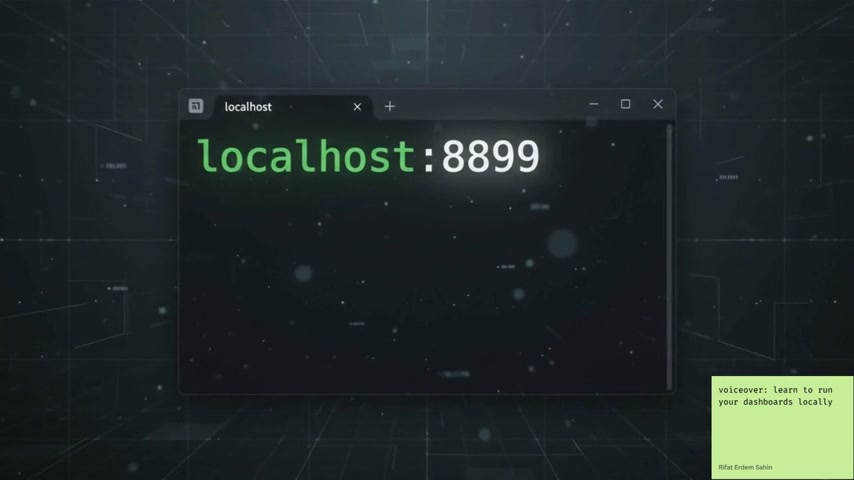

| Option | Voiceover Candidate Text | WPM | Tone |
| :--- | :--- | :--- | :--- |
| **Scratch VO** | Accelerate your AI skills and prepare for top certifications. | ~150 | Baseline |
| **⚡ AI Punchy** | Accelerate your AI engineering readiness. | ~165 | Energetic / Fast |
| **🧠 AI Strategic** | Systematic preparation for enterprise AI architecture certifications. | ~140 | Pedagogical / Authoritative |
| **🔥 AI Conversational** | Accelerate your skills and prep for the biggest AI certifications. | ~145 | Direct & Relatable |

> ✍️ **[My Resonant Take]**:
> *Accelerate your AI skills and prepare for top certifications.*

---

### ⏱️ Timestamp: `02:42` (Second 162) · **Accelerate AI Readiness**
**Visual Action**: *Certification pathways, study cards, and agent badges orbit the brain.*

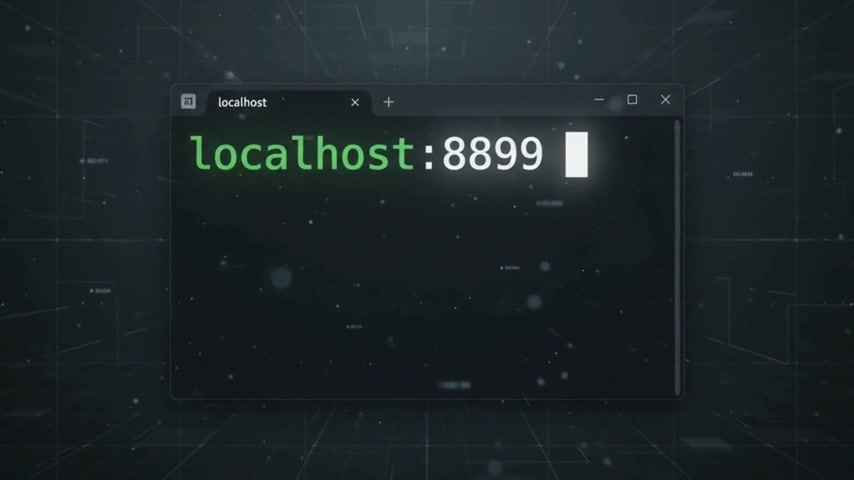

| Option | Voiceover Candidate Text | WPM | Tone |
| :--- | :--- | :--- | :--- |
| **Scratch VO** | Accelerate your AI skills and prepare for top certifications. | ~150 | Baseline |
| **⚡ AI Punchy** | Accelerate your AI engineering readiness. | ~165 | Energetic / Fast |
| **🧠 AI Strategic** | Systematic preparation for enterprise AI architecture certifications. | ~140 | Pedagogical / Authoritative |
| **🔥 AI Conversational** | Accelerate your skills and prep for the biggest AI certifications. | ~145 | Direct & Relatable |

> ✍️ **[My Resonant Take]**:
> *Accelerate your AI skills and prepare for top certifications.*

---

### ⏱️ Timestamp: `02:43` (Second 163) · **Accelerate AI Readiness**
**Visual Action**: *Certification pathways, study cards, and agent badges orbit the brain.*

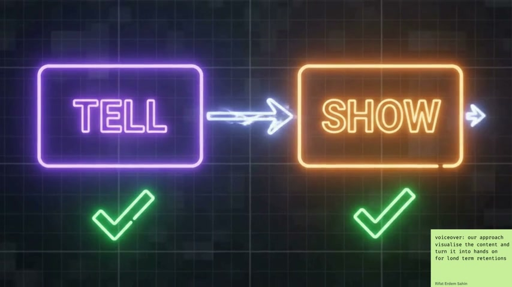

| Option | Voiceover Candidate Text | WPM | Tone |
| :--- | :--- | :--- | :--- |
| **Scratch VO** | Accelerate your AI skills and prepare for top certifications. | ~150 | Baseline |
| **⚡ AI Punchy** | Accelerate your AI engineering readiness. | ~165 | Energetic / Fast |
| **🧠 AI Strategic** | Systematic preparation for enterprise AI architecture certifications. | ~140 | Pedagogical / Authoritative |
| **🔥 AI Conversational** | Accelerate your skills and prep for the biggest AI certifications. | ~145 | Direct & Relatable |

> ✍️ **[My Resonant Take]**:
> *Accelerate your AI skills and prepare for top certifications.*

---

### ⏱️ Timestamp: `02:44` (Second 164) · **Accelerate AI Readiness**
**Visual Action**: *Certification pathways, study cards, and agent badges orbit the brain.*

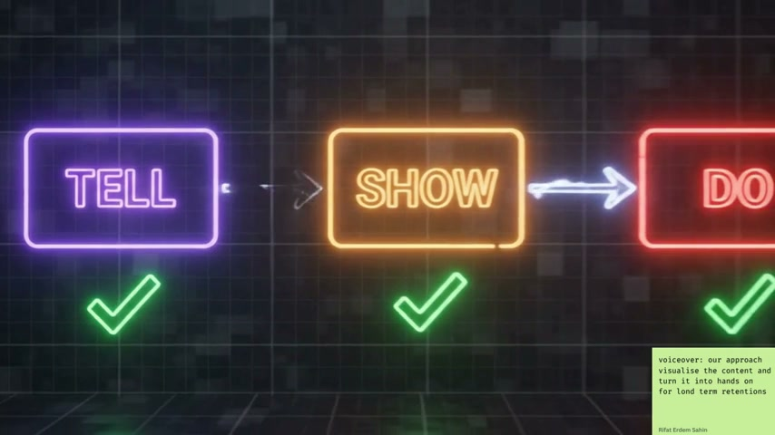

| Option | Voiceover Candidate Text | WPM | Tone |
| :--- | :--- | :--- | :--- |
| **Scratch VO** | Accelerate your AI skills and prepare for top certifications. | ~150 | Baseline |
| **⚡ AI Punchy** | Accelerate your AI engineering readiness. | ~165 | Energetic / Fast |
| **🧠 AI Strategic** | Systematic preparation for enterprise AI architecture certifications. | ~140 | Pedagogical / Authoritative |
| **🔥 AI Conversational** | Accelerate your skills and prep for the biggest AI certifications. | ~145 | Direct & Relatable |

> ✍️ **[My Resonant Take]**:
> *Accelerate your AI skills and prepare for top certifications.*

---

### ⏱️ Timestamp: `02:45` (Second 165) · **Accelerate AI Readiness**
**Visual Action**: *Certification pathways, study cards, and agent badges orbit the brain.*

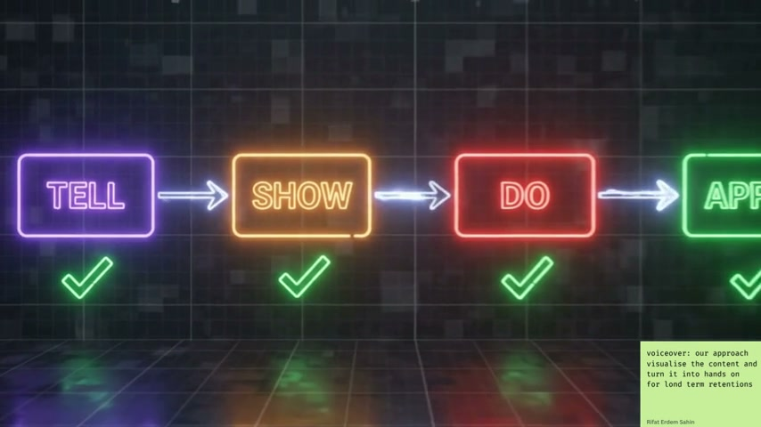

| Option | Voiceover Candidate Text | WPM | Tone |
| :--- | :--- | :--- | :--- |
| **Scratch VO** | Accelerate your AI skills and prepare for top certifications. | ~150 | Baseline |
| **⚡ AI Punchy** | Accelerate your AI engineering readiness. | ~165 | Energetic / Fast |
| **🧠 AI Strategic** | Systematic preparation for enterprise AI architecture certifications. | ~140 | Pedagogical / Authoritative |
| **🔥 AI Conversational** | Accelerate your skills and prep for the biggest AI certifications. | ~145 | Direct & Relatable |

> ✍️ **[My Resonant Take]**:
> *Accelerate your AI skills and prepare for top certifications.*

---

### ⏱️ Timestamp: `02:46` (Second 166) · **Hands-on Sunday Cohort**
**Visual Action**: *Sunday cohort schedule card highlights live weekly sessions (Every Sunday 9-11PM UK).*

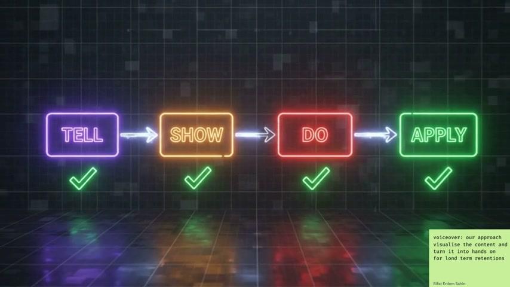

| Option | Voiceover Candidate Text | WPM | Tone |
| :--- | :--- | :--- | :--- |
| **Scratch VO** | Join our free hands-on Sunday cohort to build this live. | ~150 | Baseline |
| **⚡ AI Punchy** | Join our free weekly hands-on Sunday cohort. | ~165 | Energetic / Fast |
| **🧠 AI Strategic** | Participate in collaborative weekly live engineering workshops. | ~140 | Pedagogical / Authoritative |
| **🔥 AI Conversational** | Join our free live Sunday cohort and build this with us. | ~145 | Direct & Relatable |

> ✍️ **[My Resonant Take]**:
> *Join our free hands-on Sunday cohort to build this live.*

---

### ⏱️ Timestamp: `02:47` (Second 167) · **Hands-on Sunday Cohort**
**Visual Action**: *Sunday cohort schedule card highlights live weekly sessions (Every Sunday 9-11PM UK).*

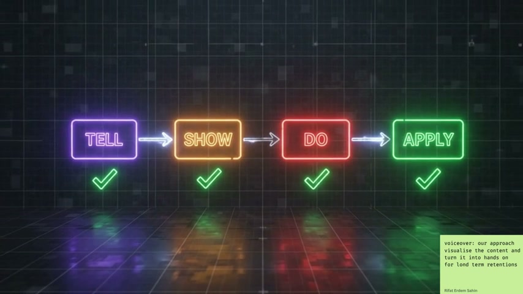

| Option | Voiceover Candidate Text | WPM | Tone |
| :--- | :--- | :--- | :--- |
| **Scratch VO** | Join our free hands-on Sunday cohort to build this live. | ~150 | Baseline |
| **⚡ AI Punchy** | Join our free weekly hands-on Sunday cohort. | ~165 | Energetic / Fast |
| **🧠 AI Strategic** | Participate in collaborative weekly live engineering workshops. | ~140 | Pedagogical / Authoritative |
| **🔥 AI Conversational** | Join our free live Sunday cohort and build this with us. | ~145 | Direct & Relatable |

> ✍️ **[My Resonant Take]**:
> *Join our free hands-on Sunday cohort to build this live.*

---

### ⏱️ Timestamp: `02:48` (Second 168) · **Hands-on Sunday Cohort**
**Visual Action**: *Sunday cohort schedule card highlights live weekly sessions (Every Sunday 9-11PM UK).*

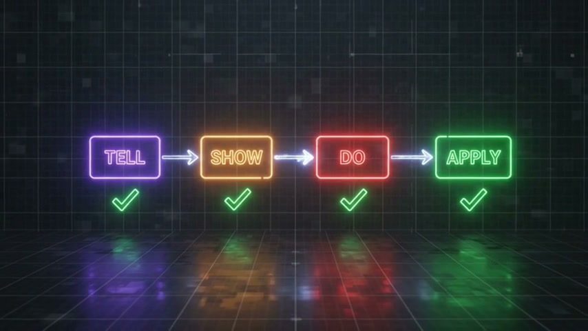

| Option | Voiceover Candidate Text | WPM | Tone |
| :--- | :--- | :--- | :--- |
| **Scratch VO** | Join our free hands-on Sunday cohort to build this live. | ~150 | Baseline |
| **⚡ AI Punchy** | Join our free weekly hands-on Sunday cohort. | ~165 | Energetic / Fast |
| **🧠 AI Strategic** | Participate in collaborative weekly live engineering workshops. | ~140 | Pedagogical / Authoritative |
| **🔥 AI Conversational** | Join our free live Sunday cohort and build this with us. | ~145 | Direct & Relatable |

> ✍️ **[My Resonant Take]**:
> *Join our free hands-on Sunday cohort to build this live.*

---

### ⏱️ Timestamp: `02:49` (Second 169) · **Hands-on Sunday Cohort**
**Visual Action**: *Sunday cohort schedule card highlights live weekly sessions (Every Sunday 9-11PM UK).*

| Option | Voiceover Candidate Text | WPM | Tone |
| :--- | :--- | :--- | :--- |
| **Scratch VO** | Join our free hands-on Sunday cohort to build this live. | ~150 | Baseline |
| **⚡ AI Punchy** | Join our free weekly hands-on Sunday cohort. | ~165 | Energetic / Fast |
| **🧠 AI Strategic** | Participate in collaborative weekly live engineering workshops. | ~140 | Pedagogical / Authoritative |
| **🔥 AI Conversational** | Join our free live Sunday cohort and build this with us. | ~145 | Direct & Relatable |

> ✍️ **[My Resonant Take]**:
> *Join our free hands-on Sunday cohort to build this live.*

---

### ⏱️ Timestamp: `02:50` (Second 170) · **Hands-on Sunday Cohort**
**Visual Action**: *Sunday cohort schedule card highlights live weekly sessions (Every Sunday 9-11PM UK).*

| Option | Voiceover Candidate Text | WPM | Tone |
| :--- | :--- | :--- | :--- |
| **Scratch VO** | Join our free hands-on Sunday cohort to build this live. | ~150 | Baseline |
| **⚡ AI Punchy** | Join our free weekly hands-on Sunday cohort. | ~165 | Energetic / Fast |
| **🧠 AI Strategic** | Participate in collaborative weekly live engineering workshops. | ~140 | Pedagogical / Authoritative |
| **🔥 AI Conversational** | Join our free live Sunday cohort and build this with us. | ~145 | Direct & Relatable |

> ✍️ **[My Resonant Take]**:
> *Join our free hands-on Sunday cohort to build this live.*

---

### ⏱️ Timestamp: `02:51` (Second 171) · **Hands-on Sunday Cohort**
**Visual Action**: *Sunday cohort schedule card highlights live weekly sessions (Every Sunday 9-11PM UK).*

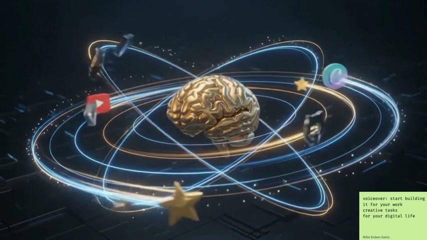

| Option | Voiceover Candidate Text | WPM | Tone |
| :--- | :--- | :--- | :--- |
| **Scratch VO** | Join our free hands-on Sunday cohort to build this live. | ~150 | Baseline |
| **⚡ AI Punchy** | Join our free weekly hands-on Sunday cohort. | ~165 | Energetic / Fast |
| **🧠 AI Strategic** | Participate in collaborative weekly live engineering workshops. | ~140 | Pedagogical / Authoritative |
| **🔥 AI Conversational** | Join our free live Sunday cohort and build this with us. | ~145 | Direct & Relatable |

> ✍️ **[My Resonant Take]**:
> *Join our free hands-on Sunday cohort to build this live.*

---

### ⏱️ Timestamp: `02:52` (Second 172) · **Hands-on Sunday Cohort**
**Visual Action**: *Sunday cohort schedule card highlights live weekly sessions (Every Sunday 9-11PM UK).*

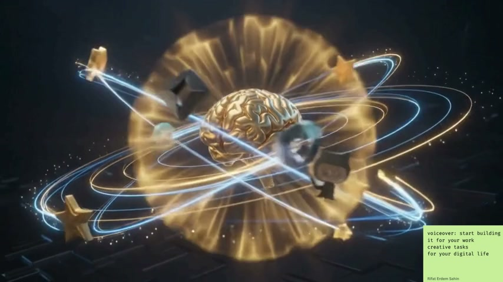

| Option | Voiceover Candidate Text | WPM | Tone |
| :--- | :--- | :--- | :--- |
| **Scratch VO** | Join our free hands-on Sunday cohort to build this live. | ~150 | Baseline |
| **⚡ AI Punchy** | Join our free weekly hands-on Sunday cohort. | ~165 | Energetic / Fast |
| **🧠 AI Strategic** | Participate in collaborative weekly live engineering workshops. | ~140 | Pedagogical / Authoritative |
| **🔥 AI Conversational** | Join our free live Sunday cohort and build this with us. | ~145 | Direct & Relatable |

> ✍️ **[My Resonant Take]**:
> *Join our free hands-on Sunday cohort to build this live.*

---

### ⏱️ Timestamp: `02:53` (Second 173) · **Hands-on Sunday Cohort**
**Visual Action**: *Sunday cohort schedule card highlights live weekly sessions (Every Sunday 9-11PM UK).*

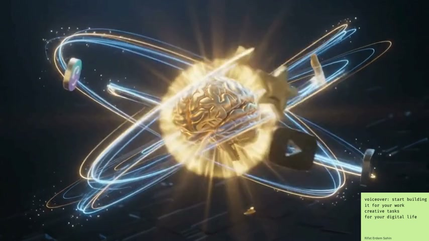

| Option | Voiceover Candidate Text | WPM | Tone |
| :--- | :--- | :--- | :--- |
| **Scratch VO** | Join our free hands-on Sunday cohort to build this live. | ~150 | Baseline |
| **⚡ AI Punchy** | Join our free weekly hands-on Sunday cohort. | ~165 | Energetic / Fast |
| **🧠 AI Strategic** | Participate in collaborative weekly live engineering workshops. | ~140 | Pedagogical / Authoritative |
| **🔥 AI Conversational** | Join our free live Sunday cohort and build this with us. | ~145 | Direct & Relatable |

> ✍️ **[My Resonant Take]**:
> *Join our free hands-on Sunday cohort to build this live.*

---

### ⏱️ Timestamp: `02:54` (Second 174) · **Hands-on Sunday Cohort**
**Visual Action**: *Sunday cohort schedule card highlights live weekly sessions (Every Sunday 9-11PM UK).*

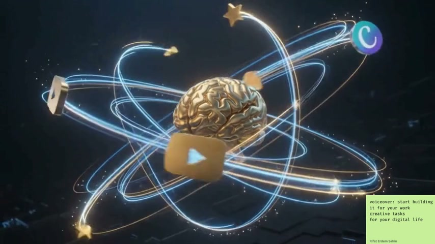

| Option | Voiceover Candidate Text | WPM | Tone |
| :--- | :--- | :--- | :--- |
| **Scratch VO** | Join our free hands-on Sunday cohort to build this live. | ~150 | Baseline |
| **⚡ AI Punchy** | Join our free weekly hands-on Sunday cohort. | ~165 | Energetic / Fast |
| **🧠 AI Strategic** | Participate in collaborative weekly live engineering workshops. | ~140 | Pedagogical / Authoritative |
| **🔥 AI Conversational** | Join our free live Sunday cohort and build this with us. | ~145 | Direct & Relatable |

> ✍️ **[My Resonant Take]**:
> *Join our free hands-on Sunday cohort to build this live.*

---

### ⏱️ Timestamp: `02:55` (Second 175) · **Build Architecture Together**
**Visual Action**: *Step-by-step cohort roadmap and template repository links appear.*

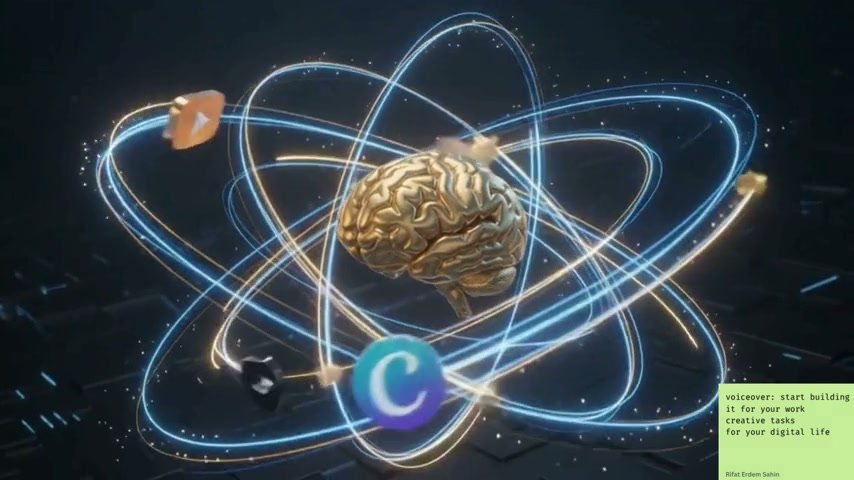

| Option | Voiceover Candidate Text | WPM | Tone |
| :--- | :--- | :--- | :--- |
| **Scratch VO** | We will build this entire architecture together from scratch. | ~150 | Baseline |
| **⚡ AI Punchy** | Build this entire architecture from scratch with us. | ~165 | Energetic / Fast |
| **🧠 AI Strategic** | Hands-on implementation of the full multi-agent PARA stack. | ~140 | Pedagogical / Authoritative |
| **🔥 AI Conversational** | We'll build this complete architecture together step by step. | ~145 | Direct & Relatable |

> ✍️ **[My Resonant Take]**:
> *We will build this entire architecture together from scratch.*

---

### ⏱️ Timestamp: `02:56` (Second 176) · **Build Architecture Together**
**Visual Action**: *Step-by-step cohort roadmap and template repository links appear.*

| Option | Voiceover Candidate Text | WPM | Tone |
| :--- | :--- | :--- | :--- |
| **Scratch VO** | We will build this entire architecture together from scratch. | ~150 | Baseline |
| **⚡ AI Punchy** | Build this entire architecture from scratch with us. | ~165 | Energetic / Fast |
| **🧠 AI Strategic** | Hands-on implementation of the full multi-agent PARA stack. | ~140 | Pedagogical / Authoritative |
| **🔥 AI Conversational** | We'll build this complete architecture together step by step. | ~145 | Direct & Relatable |

> ✍️ **[My Resonant Take]**:
> *We will build this entire architecture together from scratch.*

---

### ⏱️ Timestamp: `02:57` (Second 177) · **Build Architecture Together**
**Visual Action**: *Step-by-step cohort roadmap and template repository links appear.*

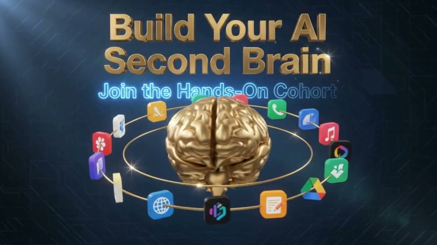

| Option | Voiceover Candidate Text | WPM | Tone |
| :--- | :--- | :--- | :--- |
| **Scratch VO** | We will build this entire architecture together from scratch. | ~150 | Baseline |
| **⚡ AI Punchy** | Build this entire architecture from scratch with us. | ~165 | Energetic / Fast |
| **🧠 AI Strategic** | Hands-on implementation of the full multi-agent PARA stack. | ~140 | Pedagogical / Authoritative |
| **🔥 AI Conversational** | We'll build this complete architecture together step by step. | ~145 | Direct & Relatable |

> ✍️ **[My Resonant Take]**:
> *We will build this entire architecture together from scratch.*

---

### ⏱️ Timestamp: `02:58` (Second 178) · **Build Architecture Together**
**Visual Action**: *Step-by-step cohort roadmap and template repository links appear.*

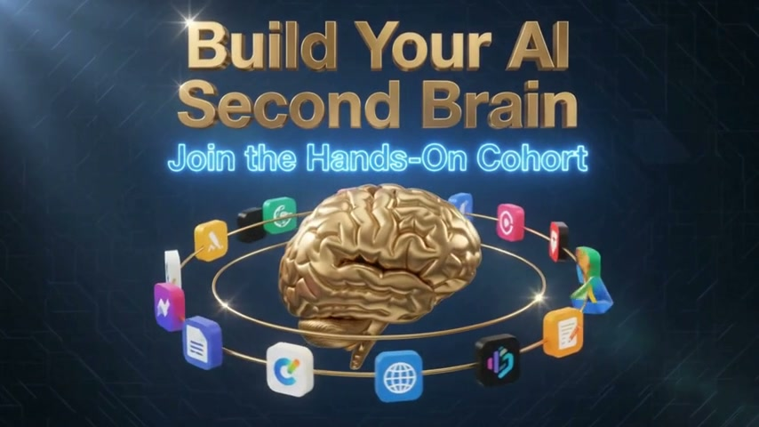

| Option | Voiceover Candidate Text | WPM | Tone |
| :--- | :--- | :--- | :--- |
| **Scratch VO** | We will build this entire architecture together from scratch. | ~150 | Baseline |
| **⚡ AI Punchy** | Build this entire architecture from scratch with us. | ~165 | Energetic / Fast |
| **🧠 AI Strategic** | Hands-on implementation of the full multi-agent PARA stack. | ~140 | Pedagogical / Authoritative |
| **🔥 AI Conversational** | We'll build this complete architecture together step by step. | ~145 | Direct & Relatable |

> ✍️ **[My Resonant Take]**:
> *We will build this entire architecture together from scratch.*

---

### ⏱️ Timestamp: `02:59` (Second 179) · **Build Architecture Together**
**Visual Action**: *Step-by-step cohort roadmap and template repository links appear.*

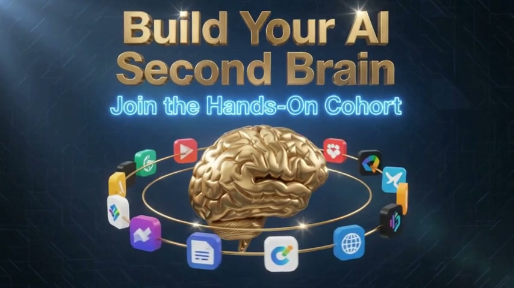

| Option | Voiceover Candidate Text | WPM | Tone |
| :--- | :--- | :--- | :--- |
| **Scratch VO** | We will build this entire architecture together from scratch. | ~150 | Baseline |
| **⚡ AI Punchy** | Build this entire architecture from scratch with us. | ~165 | Energetic / Fast |
| **🧠 AI Strategic** | Hands-on implementation of the full multi-agent PARA stack. | ~140 | Pedagogical / Authoritative |
| **🔥 AI Conversational** | We'll build this complete architecture together step by step. | ~145 | Direct & Relatable |

> ✍️ **[My Resonant Take]**:
> *We will build this entire architecture together from scratch.*

---

### ⏱️ Timestamp: `03:00` (Second 180) · **Build Architecture Together**
**Visual Action**: *Step-by-step cohort roadmap and template repository links appear.*

| Option | Voiceover Candidate Text | WPM | Tone |
| :--- | :--- | :--- | :--- |
| **Scratch VO** | We will build this entire architecture together from scratch. | ~150 | Baseline |
| **⚡ AI Punchy** | Build this entire architecture from scratch with us. | ~165 | Energetic / Fast |
| **🧠 AI Strategic** | Hands-on implementation of the full multi-agent PARA stack. | ~140 | Pedagogical / Authoritative |
| **🔥 AI Conversational** | We'll build this complete architecture together step by step. | ~145 | Direct & Relatable |

> ✍️ **[My Resonant Take]**:
> *We will build this entire architecture together from scratch.*

---

### ⏱️ Timestamp: `03:01` (Second 181) · **Build Architecture Together**
**Visual Action**: *Step-by-step cohort roadmap and template repository links appear.*

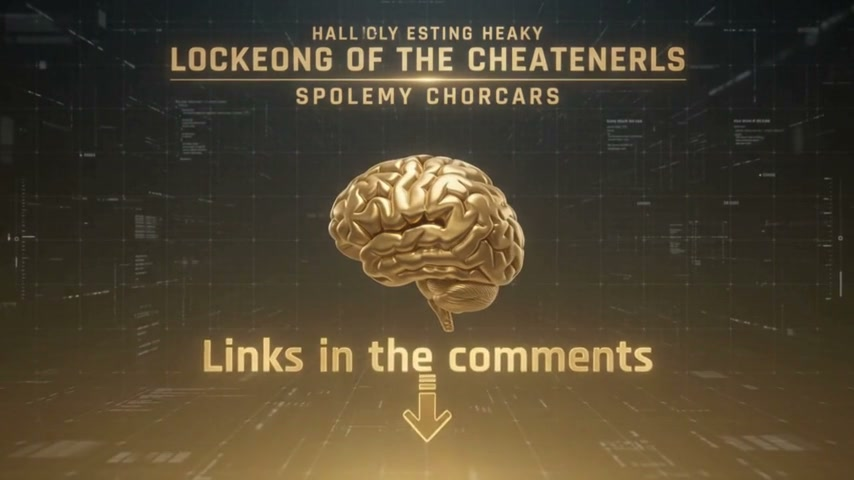

| Option | Voiceover Candidate Text | WPM | Tone |
| :--- | :--- | :--- | :--- |
| **Scratch VO** | We will build this entire architecture together from scratch. | ~150 | Baseline |
| **⚡ AI Punchy** | Build this entire architecture from scratch with us. | ~165 | Energetic / Fast |
| **🧠 AI Strategic** | Hands-on implementation of the full multi-agent PARA stack. | ~140 | Pedagogical / Authoritative |
| **🔥 AI Conversational** | We'll build this complete architecture together step by step. | ~145 | Direct & Relatable |

> ✍️ **[My Resonant Take]**:
> *We will build this entire architecture together from scratch.*

---

### ⏱️ Timestamp: `03:02` (Second 182) · **Build Architecture Together**
**Visual Action**: *Step-by-step cohort roadmap and template repository links appear.*

| Option | Voiceover Candidate Text | WPM | Tone |
| :--- | :--- | :--- | :--- |
| **Scratch VO** | We will build this entire architecture together from scratch. | ~150 | Baseline |
| **⚡ AI Punchy** | Build this entire architecture from scratch with us. | ~165 | Energetic / Fast |
| **🧠 AI Strategic** | Hands-on implementation of the full multi-agent PARA stack. | ~140 | Pedagogical / Authoritative |
| **🔥 AI Conversational** | We'll build this complete architecture together step by step. | ~145 | Direct & Relatable |

> ✍️ **[My Resonant Take]**:
> *We will build this entire architecture together from scratch.*

---

### ⏱️ Timestamp: `03:03` (Second 183) · **Build Architecture Together**
**Visual Action**: *Step-by-step cohort roadmap and template repository links appear.*

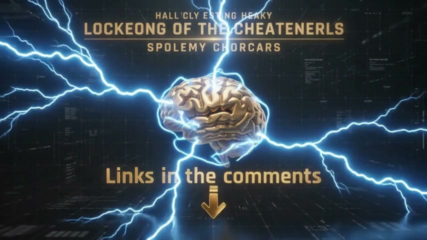

| Option | Voiceover Candidate Text | WPM | Tone |
| :--- | :--- | :--- | :--- |
| **Scratch VO** | We will build this entire architecture together from scratch. | ~150 | Baseline |
| **⚡ AI Punchy** | Build this entire architecture from scratch with us. | ~165 | Energetic / Fast |
| **🧠 AI Strategic** | Hands-on implementation of the full multi-agent PARA stack. | ~140 | Pedagogical / Authoritative |
| **🔥 AI Conversational** | We'll build this complete architecture together step by step. | ~145 | Direct & Relatable |

> ✍️ **[My Resonant Take]**:
> *We will build this entire architecture together from scratch.*

---

### ⏱️ Timestamp: `03:04` (Second 184) · **Build Architecture Together**
**Visual Action**: *Step-by-step cohort roadmap and template repository links appear.*

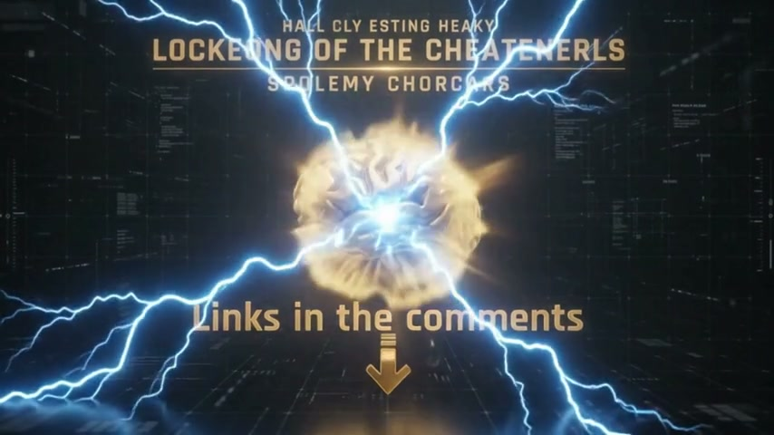

| Option | Voiceover Candidate Text | WPM | Tone |
| :--- | :--- | :--- | :--- |
| **Scratch VO** | We will build this entire architecture together from scratch. | ~150 | Baseline |
| **⚡ AI Punchy** | Build this entire architecture from scratch with us. | ~165 | Energetic / Fast |
| **🧠 AI Strategic** | Hands-on implementation of the full multi-agent PARA stack. | ~140 | Pedagogical / Authoritative |
| **🔥 AI Conversational** | We'll build this complete architecture together step by step. | ~145 | Direct & Relatable |

> ✍️ **[My Resonant Take]**:
> *We will build this entire architecture together from scratch.*

---

### ⏱️ Timestamp: `03:05` (Second 185) · **Links In Comments**
**Visual Action**: *Animated arrows point down to community Discord, GitHub, and registration links.*

| Option | Voiceover Candidate Text | WPM | Tone |
| :--- | :--- | :--- | :--- |
| **Scratch VO** | Links are in the description and comments below. | ~150 | Baseline |
| **⚡ AI Punchy** | Links in the description and comments below. | ~165 | Energetic / Fast |
| **🧠 AI Strategic** | Access all repositories, templates, and registration links below. | ~140 | Pedagogical / Authoritative |
| **🔥 AI Conversational** | All the templates and links are in the description below. | ~145 | Direct & Relatable |

> ✍️ **[My Resonant Take]**:
> *Links are in the description and comments below.*

---

### ⏱️ Timestamp: `03:06` (Second 186) · **Links In Comments**
**Visual Action**: *Animated arrows point down to community Discord, GitHub, and registration links.*

| Option | Voiceover Candidate Text | WPM | Tone |
| :--- | :--- | :--- | :--- |
| **Scratch VO** | Links are in the description and comments below. | ~150 | Baseline |
| **⚡ AI Punchy** | Links in the description and comments below. | ~165 | Energetic / Fast |
| **🧠 AI Strategic** | Access all repositories, templates, and registration links below. | ~140 | Pedagogical / Authoritative |
| **🔥 AI Conversational** | All the templates and links are in the description below. | ~145 | Direct & Relatable |

> ✍️ **[My Resonant Take]**:
> *Links are in the description and comments below.*

---

### ⏱️ Timestamp: `03:07` (Second 187) · **Links In Comments**
**Visual Action**: *Animated arrows point down to community Discord, GitHub, and registration links.*

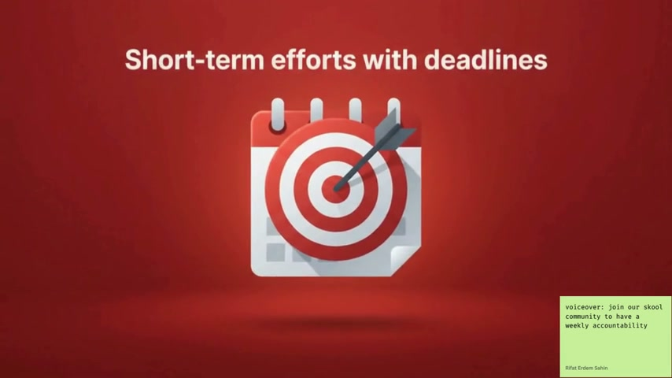

| Option | Voiceover Candidate Text | WPM | Tone |
| :--- | :--- | :--- | :--- |
| **Scratch VO** | Links are in the description and comments below. | ~150 | Baseline |
| **⚡ AI Punchy** | Links in the description and comments below. | ~165 | Energetic / Fast |
| **🧠 AI Strategic** | Access all repositories, templates, and registration links below. | ~140 | Pedagogical / Authoritative |
| **🔥 AI Conversational** | All the templates and links are in the description below. | ~145 | Direct & Relatable |

> ✍️ **[My Resonant Take]**:
> *Links are in the description and comments below.*

---

### ⏱️ Timestamp: `03:08` (Second 188) · **Links In Comments**
**Visual Action**: *Animated arrows point down to community Discord, GitHub, and registration links.*

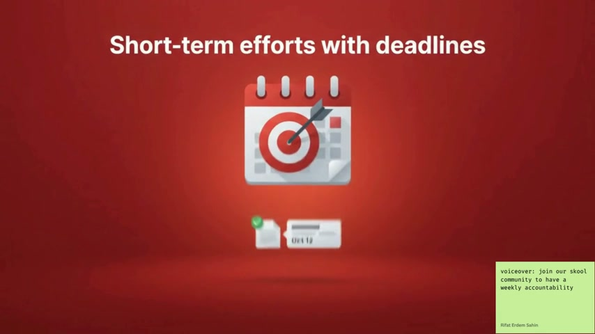

| Option | Voiceover Candidate Text | WPM | Tone |
| :--- | :--- | :--- | :--- |
| **Scratch VO** | Links are in the description and comments below. | ~150 | Baseline |
| **⚡ AI Punchy** | Links in the description and comments below. | ~165 | Energetic / Fast |
| **🧠 AI Strategic** | Access all repositories, templates, and registration links below. | ~140 | Pedagogical / Authoritative |
| **🔥 AI Conversational** | All the templates and links are in the description below. | ~145 | Direct & Relatable |

> ✍️ **[My Resonant Take]**:
> *Links are in the description and comments below.*

---

### ⏱️ Timestamp: `03:09` (Second 189) · **Links In Comments**
**Visual Action**: *Animated arrows point down to community Discord, GitHub, and registration links.*

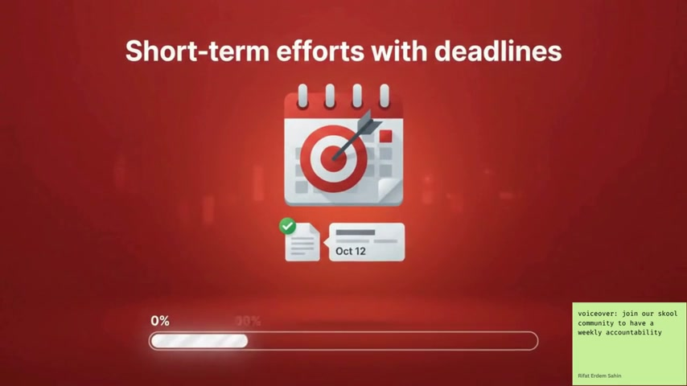

| Option | Voiceover Candidate Text | WPM | Tone |
| :--- | :--- | :--- | :--- |
| **Scratch VO** | Links are in the description and comments below. | ~150 | Baseline |
| **⚡ AI Punchy** | Links in the description and comments below. | ~165 | Energetic / Fast |
| **🧠 AI Strategic** | Access all repositories, templates, and registration links below. | ~140 | Pedagogical / Authoritative |
| **🔥 AI Conversational** | All the templates and links are in the description below. | ~145 | Direct & Relatable |

> ✍️ **[My Resonant Take]**:
> *Links are in the description and comments below.*

---

### ⏱️ Timestamp: `03:10` (Second 190) · **Links In Comments**
**Visual Action**: *Animated arrows point down to community Discord, GitHub, and registration links.*

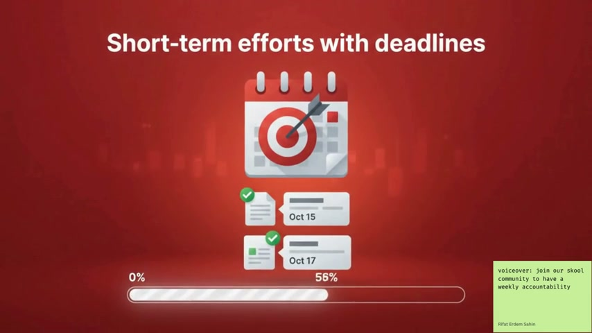

| Option | Voiceover Candidate Text | WPM | Tone |
| :--- | :--- | :--- | :--- |
| **Scratch VO** | Links are in the description and comments below. | ~150 | Baseline |
| **⚡ AI Punchy** | Links in the description and comments below. | ~165 | Energetic / Fast |
| **🧠 AI Strategic** | Access all repositories, templates, and registration links below. | ~140 | Pedagogical / Authoritative |
| **🔥 AI Conversational** | All the templates and links are in the description below. | ~145 | Direct & Relatable |

> ✍️ **[My Resonant Take]**:
> *Links are in the description and comments below.*

---

### ⏱️ Timestamp: `03:11` (Second 191) · **Links In Comments**
**Visual Action**: *Animated arrows point down to community Discord, GitHub, and registration links.*

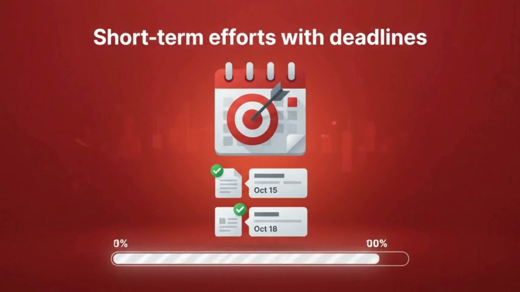

| Option | Voiceover Candidate Text | WPM | Tone |
| :--- | :--- | :--- | :--- |
| **Scratch VO** | Links are in the description and comments below. | ~150 | Baseline |
| **⚡ AI Punchy** | Links in the description and comments below. | ~165 | Energetic / Fast |
| **🧠 AI Strategic** | Access all repositories, templates, and registration links below. | ~140 | Pedagogical / Authoritative |
| **🔥 AI Conversational** | All the templates and links are in the description below. | ~145 | Direct & Relatable |

> ✍️ **[My Resonant Take]**:
> *Links are in the description and comments below.*

---

### ⏱️ Timestamp: `03:12` (Second 192) · **Links In Comments**
**Visual Action**: *Animated arrows point down to community Discord, GitHub, and registration links.*

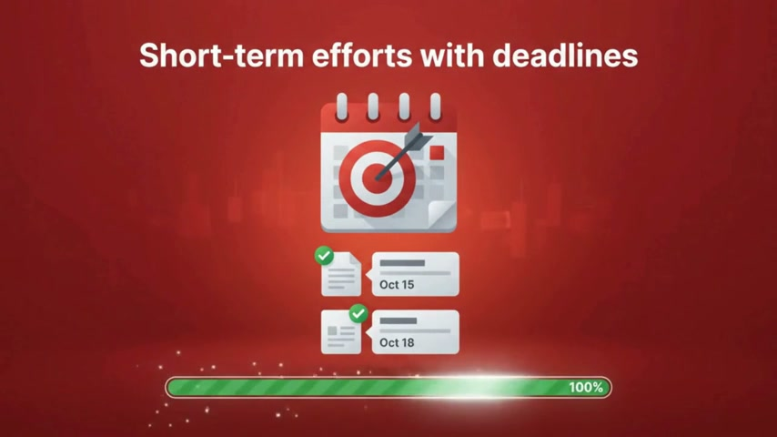

| Option | Voiceover Candidate Text | WPM | Tone |
| :--- | :--- | :--- | :--- |
| **Scratch VO** | Links are in the description and comments below. | ~150 | Baseline |
| **⚡ AI Punchy** | Links in the description and comments below. | ~165 | Energetic / Fast |
| **🧠 AI Strategic** | Access all repositories, templates, and registration links below. | ~140 | Pedagogical / Authoritative |
| **🔥 AI Conversational** | All the templates and links are in the description below. | ~145 | Direct & Relatable |

> ✍️ **[My Resonant Take]**:
> *Links are in the description and comments below.*

---

### ⏱️ Timestamp: `03:13` (Second 193) · **Links In Comments**
**Visual Action**: *Animated arrows point down to community Discord, GitHub, and registration links.*

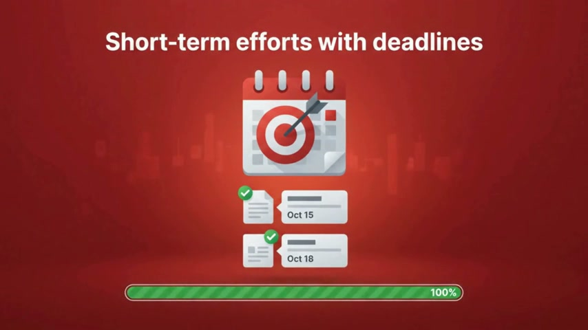

| Option | Voiceover Candidate Text | WPM | Tone |
| :--- | :--- | :--- | :--- |
| **Scratch VO** | Links are in the description and comments below. | ~150 | Baseline |
| **⚡ AI Punchy** | Links in the description and comments below. | ~165 | Energetic / Fast |
| **🧠 AI Strategic** | Access all repositories, templates, and registration links below. | ~140 | Pedagogical / Authoritative |
| **🔥 AI Conversational** | All the templates and links are in the description below. | ~145 | Direct & Relatable |

> ✍️ **[My Resonant Take]**:
> *Links are in the description and comments below.*

---

### ⏱️ Timestamp: `03:14` (Second 194) · **Links In Comments**
**Visual Action**: *Animated arrows point down to community Discord, GitHub, and registration links.*

| Option | Voiceover Candidate Text | WPM | Tone |
| :--- | :--- | :--- | :--- |
| **Scratch VO** | Links are in the description and comments below. | ~150 | Baseline |
| **⚡ AI Punchy** | Links in the description and comments below. | ~165 | Energetic / Fast |
| **🧠 AI Strategic** | Access all repositories, templates, and registration links below. | ~140 | Pedagogical / Authoritative |
| **🔥 AI Conversational** | All the templates and links are in the description below. | ~145 | Direct & Relatable |

> ✍️ **[My Resonant Take]**:
> *Links are in the description and comments below.*

---

### ⏱️ Timestamp: `03:15` (Second 195) · **Outro & Call To Action**
**Visual Action**: *Branded outro card with subscribe, GitHub star, and cohort registration buttons.*

| Option | Voiceover Candidate Text | WPM | Tone |
| :--- | :--- | :--- | :--- |
| **Scratch VO** | Let's build together. See you this Sunday. | ~150 | Baseline |
| **⚡ AI Punchy** | Let's build together. See you Sunday. Let's go. | ~165 | Energetic / Fast |
| **🧠 AI Strategic** | Begin your architecture implementation today. See you Sunday. | ~140 | Pedagogical / Authoritative |
| **🔥 AI Conversational** | Let's build together. See you in the cohort this Sunday! | ~145 | Direct & Relatable |

> ✍️ **[My Resonant Take]**:
> *Let's build together. See you this Sunday.*

---

### ⏱️ Timestamp: `03:16` (Second 196) · **Outro & Call To Action**
**Visual Action**: *Branded outro card with subscribe, GitHub star, and cohort registration buttons.*

| Option | Voiceover Candidate Text | WPM | Tone |
| :--- | :--- | :--- | :--- |
| **Scratch VO** | Let's build together. See you this Sunday. | ~150 | Baseline |
| **⚡ AI Punchy** | Let's build together. See you Sunday. Let's go. | ~165 | Energetic / Fast |
| **🧠 AI Strategic** | Begin your architecture implementation today. See you Sunday. | ~140 | Pedagogical / Authoritative |
| **🔥 AI Conversational** | Let's build together. See you in the cohort this Sunday! | ~145 | Direct & Relatable |

> ✍️ **[My Resonant Take]**:
> *Let's build together. See you this Sunday.*

---

### ⏱️ Timestamp: `03:17` (Second 197) · **Outro & Call To Action**
**Visual Action**: *Branded outro card with subscribe, GitHub star, and cohort registration buttons.*

| Option | Voiceover Candidate Text | WPM | Tone |
| :--- | :--- | :--- | :--- |
| **Scratch VO** | Let's build together. See you this Sunday. | ~150 | Baseline |
| **⚡ AI Punchy** | Let's build together. See you Sunday. Let's go. | ~165 | Energetic / Fast |
| **🧠 AI Strategic** | Begin your architecture implementation today. See you Sunday. | ~140 | Pedagogical / Authoritative |
| **🔥 AI Conversational** | Let's build together. See you in the cohort this Sunday! | ~145 | Direct & Relatable |

> ✍️ **[My Resonant Take]**:
> *Let's build together. See you this Sunday.*

---

### ⏱️ Timestamp: `03:18` (Second 198) · **Outro & Call To Action**
**Visual Action**: *Branded outro card with subscribe, GitHub star, and cohort registration buttons.*

| Option | Voiceover Candidate Text | WPM | Tone |
| :--- | :--- | :--- | :--- |
| **Scratch VO** | Let's build together. See you this Sunday. | ~150 | Baseline |
| **⚡ AI Punchy** | Let's build together. See you Sunday. Let's go. | ~165 | Energetic / Fast |
| **🧠 AI Strategic** | Begin your architecture implementation today. See you Sunday. | ~140 | Pedagogical / Authoritative |
| **🔥 AI Conversational** | Let's build together. See you in the cohort this Sunday! | ~145 | Direct & Relatable |

> ✍️ **[My Resonant Take]**:
> *Let's build together. See you this Sunday.*

---

### ⏱️ Timestamp: `03:19` (Second 199) · **Outro & Call To Action**
**Visual Action**: *Branded outro card with subscribe, GitHub star, and cohort registration buttons.*

| Option | Voiceover Candidate Text | WPM | Tone |
| :--- | :--- | :--- | :--- |
| **Scratch VO** | Let's build together. See you this Sunday. | ~150 | Baseline |
| **⚡ AI Punchy** | Let's build together. See you Sunday. Let's go. | ~165 | Energetic / Fast |
| **🧠 AI Strategic** | Begin your architecture implementation today. See you Sunday. | ~140 | Pedagogical / Authoritative |
| **🔥 AI Conversational** | Let's build together. See you in the cohort this Sunday! | ~145 | Direct & Relatable |

> ✍️ **[My Resonant Take]**:
> *Let's build together. See you this Sunday.*

---
